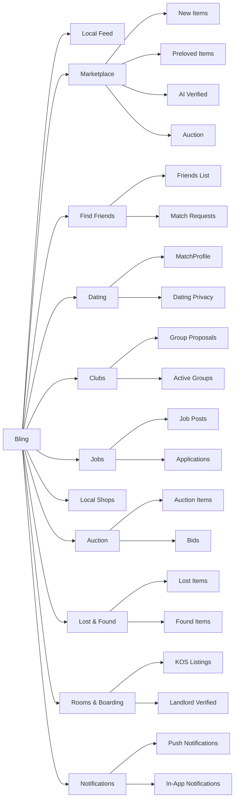

# 2_01. Bling_Project_Overview

---

## 📌 Bling 개요

- Bling은 Kelurahan 기반 지역 커뮤니티 + 마켓 + 로컬 서비스 슈퍼앱
    
- 핵심 철학: 신뢰, 실생활 유용성, 지역성 강화

---

## ✅ Core Concept

1️⃣ **Neighborhood-Based Trust (Nextdoor)**

- Keluhara(Kel.) verified user base
    
- TrustLevel system to manage credibility
    
- Local feed for announcements, lost & found, community talks
    
- Integrated Nearby, Neighbors, Messages, Notifications
    

2️⃣ **Super-App Launcher (Gojek Style)**

- Top sliding tab launcher menu:
    
    - `Local News`
        
    - `Marketplace`
        
    - `Find Friend`
        
    - `Club`
        
    - `Jobs`
        
    - `Local Shops`
        
    - `Auction`
        
    - `POM` (Short Videos)
        
    -  Lost & Found (분실물/습득물)
    
	- Rooms & Boarding (KOS, 월세, 하숙집)
        

3️⃣ **Key Modules**

- AI-verified transactions & secure trade mode ( preLoved items & Auction)
    
- Keluhara(Kel.) verified auctions (Lelang)
    
- Local short-form video sharing (POM)
    
- Local shops and clubs integration
    

---

## ✅ Key Goals

- **Trust First**: Verified neighborhood + TrustLevel for safe community & transactions
    
- **Hyperlocal**: User’s neighborhood → Nearby areas → Kota-level
    
- **Scalable**: Expand from feed to market, shorts, local news, jobs, communities
    
- **Unified UX**: One-screen launcher like Gojek
    

---

## 📌 신뢰 & 운영 시스템

- TrustLevel 등급제
    
- 신고/차단/Privacy Center
    
- AI 검수, Verified Badge, Singkatan DropDown 주소
    
- Firestore + Cloud Function + FCM 연계
    

## 📌 사용자 데이터 구조

- `/users`: PublicProfile, MatchProfile, TrustLevel, 신고이력, blockList, 찜목록
    
- `/posts`, `/products`, `/clubs`, `/jobs`, `/shops`, `/auctions`, `/lost_items`, `/rooms_listings`
    
- `/chats`, `/notifications`, `/reports`
    

## 📌 기술 스택

- Flutter, Firebase Firestore, Storage, Auth
    
- Cloud Function: 자동 프로세스 (게시물 숨김, 경매 마감 등)
    
- Google Maps API 연동
    

## 📌 Monetization

- 유료: 상단 고정, Verified 배지, 광고 클릭 과금, 배너/스폰서 노출
    
- B2B 연계: Kos 운영자, 소상공인, 중개사 협회 등
    

## 📌 확장성

- AI 이미지 분석, 추천 알고리즘, QR코드 연동
    
- 계약서 PDF, 영상 투어, POS/배달 연동
    
- 지역 커뮤니티 광고 + 공공기관 파트너십
    

Bling은 지역 기반 사용자 신뢰를 바탕으로 모든 로컬 커뮤니티의 실질적 허브가 되는 것을 목표로 합니다.





## ✅ Related Docs

- [[2_04. Bling_MainScreen_Structure]]
    
- [[6_03. Bling_Local_Feed_Policy & To-Do 목록]]
    
- [[7_04. Bling_Marketplace_Policy]]
    
- [[8_09_0. Bling_Auction_Policy & To-Do 목록]]
    
- [[8_10. Bling_POM_Policy & To-Do 목록]]
    
- [[2_02. Project_FolderTree]]
    
- [[4_21. User_Field_Standard]]
    
- [[3_18_2. TrustLevel_Policy]]
    

---

## ✅ Conclusion

Bling aims to merge **Nextdoor’s local feed**, **Gojek’s launcher UX**,  
and Keluhara(Kel.) trust system into a unified **hyperlocal super-app** for Indonesia.


# 2_02. Project_FolderTree

---

## ✅ 폴더트리 개요

Bling은  Keluharan(Kel.)  기반 지역 슈퍼앱으로,  
모든 모듈을 **기능별 폴더 구조**로 관리해  
**토큰 리밋/세션 리셋에도 일관된 개발/배포 흐름**을 유지합니다.

---

## ✅ 핵심 원칙

- `features/` 폴더 → 기능별 모듈화 (Feed, Marketplace, POM 등)
- `core/` 폴더 → 공통 모델, 상수, 헬퍼 관리
- `shared/` → 공통 컨트롤러 및 유틸
- Localization은 `i18n/`에 통합
- `assets/` → 아이콘, JSON, 샘플 데이터 별도 분리
- 주소 화면  표기 원칙 (Kel. Kec. 만)

---

## ✅ 최종 폴더트리 2025년 7월 4일 현재

```plaintext
assets
├── icons
│   └── google_logo.png
├── lang
│   ├── en.json
│   ├── id.json
│   ├── ko.json
├── sounds
│   └── send_sound.mp3
├── data
│   └── sample_posts.json
lib
├── api_keys.dart
├── core
│   ├── constants
│   │   └── app_categories.dart
│   ├── models
│   │   ├── comment_model.dart
│   │   ├── feed_item_model.dart
│   │   ├── page_data.dart
│   │   ├── post_category_model.dart
│   │   ├── post_model.dart
│   │   ├── product_model.dart
│   │   ├── reply_model.dart
│   │   └── user_model.dart
│   └── utils
│       └── address_formatter.dart
├── features
│   ├── admin
│   │   └── screens
│   │       └── data_uploader_screen.dart
│   ├── auction
│   │   └── screens
│   │       └── auction_screen.dart
│   ├── auth
│   │   └── screens
│   │       ├── auth_gate.dart
│   │       ├── login_screen.dart
│   │       ├── profile_edit_screen.dart
│   │       └── signup_screen.dart
│   ├── categories
│   │   ├── domain
│   │   │   └── category.dart
│   │   └── screens
│   │       ├── parent_category_screen.dart
│   │       └── sub_category_screen.dart
│   ├── chat
│   │   ├── domain
│   │   │   ├── chat_message.dart
│   │   │   ├── chat_room.dart
│   │   │   └── chat_utils.dart
│   │   └── screens
│   │       ├── chat_list_screen.dart
│   │       └── chat_room_screen.dart
│   ├── clubs
│   │   └── screens
│   │       └── clubs_screen.dart
│   ├── community
│   │   └── screens
│   │       └── community_screen.dart
│   ├── feed
│   │   ├── data
│   │   │   └── feed_repository.dart
│   │   ├── screens
│   │   │   ├── feed_screen.dart
│   │   │   └── local_feed_screen.dart
│   │   └── widgets
│   │       └── post_card.dart
│   ├── find_friends
│   │   └── screens
│   │       └── find_friends_screen.dart
│   ├── jobs
│   │   └── screens
│   │       └── jobs_screen.dart
│   ├── local_news
│   │   └── screens
│   │       └── local_news_screen.dart
│   ├── local_stores
│   │   └── screens
│   │       └── local_stores_screen.dart
│   ├── location
│   │   └── screens
│   │       ├── location_search_screen.dart
│   │       ├── location_setting_screen.dart
│   │       └── neighborhood_prompt_screen.dart
│   ├── main_screen
│   │   └── home_screen.dart
│   ├── marketplace
│   │   ├── domain
│   │   │   └── product_model.dart
│   │   ├── screens
│   │   │   ├── marketplace_screen.dart
│   │   │   ├── product_detail_screen.dart
│   │   │   ├── product_edit_screen.dart
│   │   │   └── product_registration_screen.dart
│   │   └── widgets
│   │       └── product_card.dart
│   ├── my_bling
│   │   ├── screens
│   │   │   └── my_bling_screen.dart
│   │   └── widgets
│   │       ├── user_bookmark_list.dart
│   │       ├── user_post_list.dart
│   │       └── user_product_list.dart
│   ├── pom
│   │   └── screens
│   │       └── pom_screen.dart
│   ├── post
│   │   ├── screens
│   │   │   ├── create_post_screen.dart
│   │   │   └── post_detail_screen.dart
│   │   └── widgets
│   │       ├── comment_input_field.dart
│   │       ├── comment_list_view.dart
│   │       ├── reply_input_field.dart
│   │       └── reply_list_view.dart
│   ├── real_estate
│   │   └── screens
│   │       └── real_estate_screen.dart
│   └── shared
│       └── controllers
│           └── locale_controller.dart
├── firebase_options.dart
└── main.dart
pubspec.yaml
````

---

## ✅ 연계 포인트

- Feed는 Post 모델 불러와 목록 출력
    
- Post는 상세/작성/수정 
    
- 댓글/대댓글은 Feed 종속 → `posts` 컬렉션 하위에 저장
    
-  Keluharan(Kel.)  + TrustLevel → Feed/Post 쿼리 공통 구조
    
- Copilot/Gemini → 이 구조 기반 자동 제안
    

---

## ✅ 연계 문서

- [[2_01. Bling_Project_Overview]]
    
- [[4_21. User_Field_Standard]]
    

---

## ✅ 결론

Bling 폴더트리는 Nextdoor + Gojek UX를  
 Keluharan(Kel.) 기반 구조에 맞게 정리한 **기능 중심 표준 구조**로,  
**Obsidian, GitHub, Copilot** 연계로 버전이 계속 이어집니다.


### ✅ 구성 핵심
- 기능별 `features/`main Feed → Local News, Marketplace, POM, Auction 등
- 모델, 상수, 유틸 → `core/` + `shared/`에 분리
- `assets/` → lang, 아이콘, 샘플 데이터 모듈화


# 2_19. Repo_README

---

## ✅ Bling Repo 개요

이 저장소는 **Bling 슈퍼앱 프로젝트**의 모든 코드, 설계, 정책 문서를 관리하는  
 Keluharan(Kel.)  기반 Nextdoor + Gojek 하이브리드 로컬 슈퍼앱**의 메인 Repo입니다.

---

## ✅ 핵심 컨셉

- Kelurahan(Kec.)  기반 TrustLevel 시스템
    
- Local Feed, Marketplace, Find Friend, Club, Jobs 등 지역 모듈
    
- AI 검수, 다국어(Localization) 통합
    
- Gojek 스타일 런처 UX → 상단 슬라이드 탭 구성
      
- 모든 주소 표기는 인도네시아 공공 행정 표준 Singkatan(약어)을 사용합니다.
    
- Kecamatan → Kec.
    
- Kelurahan → Kel.
    
- Kabupaten → Kab.
    
- Provinsi → Prov.

---


---

## ✅ Firestore 핵심 컬렉션

| 컬렉션             | 설명          |
| --------------- | ----------- |
| `posts`         | Local Feed  |
| `products`      | Marketplace |
| `shorts`        | POM (쇼츠)    |
| `auctions`      | Auction 경매  |
| `jobs`          | 구인구직        |
| `shops`         | Local Shops |
| `clubs`         | Club 모임     |
| `users`         | 사용자 정보      |
| `chats`         | 공통 채팅       |
| `notifications` | 알림          |

---

## ✅ 주요 정책 문서

- 📄 Bling_Project_Overview.md
    
- 📄 Bling_MainScreen_Structure.md
    
- 📄 Bling_Local_Feed_Policy.md
    
- 📄 Bling_Marketplace_Policy.md
    
- 📄 Bling_Find_Friend_Policy.md
    
- 📄 Bling_Club_Policy.md
    
- 📄 Bling_Jobs_Policy.md
    
- 📄 Bling_LocalShops_Policy.md
    
- 📄 Bling_Auction_Policy.md
    
- 📄 Bling_POM_Policy.md
    
- 📄 Bling_User_Field_Standard.md
    
- 📄 Bling_TrustLevel_Policy.md
    
- 📄 Bling_Localization_Policy.md
    
- 📄 Bling_Design_Guide.md
    
- 📄 Bling_UIUX_Guide.md
    
- 📄 Bling_Development_Step_Plan.md
    
- 📄 Bling_Development_Checklist.md
    
- 📄 Bling_Project_FolderTree.md
     
- 📄[[1_99. 📌 Bling 인도네시아 주소 표기 & DropDown 정책]].md

---

## ✅ 연계 문서

- [[2_01. Bling_Project_Overview]]
    
- [[2_02. Project_FolderTree]]
    
- [[4_21. User_Field_Standard]]
    

---

## ✅ 결론

**Bling-Repo**는  Keluharan(Kel.)  기반 지역 커뮤니티 신뢰 구조와  
슈퍼앱 런처 UX, 다국어, AI 검수를 하나로 통합한  
**인도네시아형 로컬 슈퍼앱 프로젝트**의 표준 저장소입니다.

---


