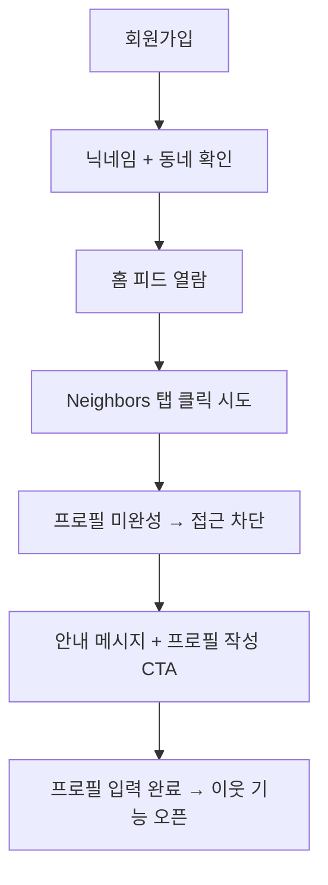
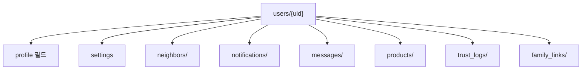

# 3_18_1. 지연된 프로필 활성화 정책(Delayed_Profile_Activation)

---

## ✅ 정책 개요

Bling은  Keluharan(Kel.) 기반 커뮤니티 신뢰 구조를 유지하면서도  
신규 사용자의 진입 장벽을 낮추기 위해  
**Delayed Profile Activation (지연된 프로필 활성화 정책)** 을 도입합니다.

---

## ✅ 핵심 개념

| 단계            | 설명                                |
| ------------- | --------------------------------- |
| 1️⃣ 가입 직후     | 닉네임 + 동네 자동 설정(거부시) → 콘텐츠 열람 가능   |
| 2️⃣ 탐색 중심 사용  | 홈피드, 피드 콘텐츠 소비 가능 (댓글/좋아요는 제한)    |
| 3️⃣ 이웃 탐색 시도  | Neighbors 탭 클릭 시 조건 확인            |
| 4️⃣ 정보 미충족    | “이웃을 만나려면 본인 소개를 먼저 작성해주세요” 안내    |
| 5️⃣ 프로필 입력 유도 | 프로필 사진, 자기소개, 관심사 최소 1개           |
| 6️⃣ 이웃 기능 활성화 | 입력 완료 시 Neighbors, 친구찾기, DM 기능 해제 |

---

## ✅ UI 흐름 예시




## ✅ Firestore 필드 예시


```json
{
  "nickname": "Dika",
  "locationName": "RW 05 - Bekasi",
  "profileCompleted": false,
  "photoUrl": null,
  "bio": "",
  "interests": [],
  "trustLevel": "normal"
}
```


---

## ✅ 필수 입력 조건

| 기능           | 조건                    |
| ------------ | --------------------- |
| 피드 열람        | 닉네임 + 동네              |
| Neighbors 열람 | 프로필 사진 + 자기소개         |
| 친구찾기 추천      | 관심사 1개 이상             |
| DM           | TrustLevel ≥ verified |

---

## ✅ 장점

|항목|설명|
|---|---|
|🔄 자발적 정보 입력|강제 입력 대신 동기 부여|
|🧱 신뢰 정보 확장|공개 프로필로 신뢰 기반 강화|
|📊 행동 분석|입력 시점, 경로 분석 → 리텐션 데이터 확보|
|✅ 단계별 설계|기능 제한 → 작성 완료 → 해제 순서 명확|

---

## ✅ 리스크 & 대응

|리스크|대응 방안|
|---|---|
|이탈 위험|피드 탐색만은 자유롭게 허용|
|강제 입력 부담|“이웃 연결을 위해 필요한 최소 정보” 강조|
|UX 불편|관심사 자동완성, 이미지 빠른 업로드로 진입 장벽 최소화|

---

## ✅ 연계 문서

- [[4_21. User_Field_Standard]]
    
- [[3_18_2. TrustLevel_Policy]]
    
- [[24. Bling_MyProfile_Structure]]
    

---

## ✅ 결론

Bling은 지연된 프로필 활성화 정책으로  
**가입 → 탐색 → 정보 입력 → 이웃 연결** 단계를 자연스럽게 설계해   Keluharan(Kel.) 기반 지역 신뢰 구조를 유지하면서도  
신규 사용자의 이탈을 최소화합니다.

---

### ✅ 구성 핵심

- 단계별 흐름 → 회원가입 → 탐색 → 프로필 작성 → Neighbors 오픈
    
- Firestore 구조 → `profileCompleted` 플래그 활용
    
- Obsidian 연계 문서 링크 표준
    

---


# 3_18_2. TrustLevel_Policy
# ✅ TrustLevel_정책.md

---

## ✅ 목적

TrustLevel은  Keluharan(Kel.) 인증, 위치, 활동 지표로 자동 계산되어
게시글 작성 권한과 이웃 검색 가능 범위를 결정합니다.

---

## ✅ 자동 등급 정책

| 등급 | 조건                          |
| ------ | --------------------------- |
| 🟢 일반 | 닉네임만 등록                     |
| 🟡 인증 |  Keluharan(Kel.)  인증, 전화번호 인증 |
| 🔵 고신뢰 | 인증 + 활동점수 + 신고 없음           

- 신고/활동내역으로 자동 하향/상향
- Dart 모델: `trustLevel` 필드 + `calculateTrustScore()` 로직 적용

---

## ✅ 프로필 지연 활성화

- 회원가입 후 즉시 프로필 100% 입력하지 않아도 기본 피드 열람 가능
- 이웃/검색/메시지 기능은 최소 TrustLevel 달성 후 활성화
- 단계별 프로필 작성 알림 제공

---

## ✅ 결론

TrustLevel 정책은 자동화 + 단계별 프로필 활성화로
안전한 동네 커뮤니티를 보장합니다.


# 3_19. User_Info_TrustLevel_Policy


## ✅ 사용자 정보 & 신뢰등급 정책 개요

Bling은  Keluharan(Kel.)  기반 슈퍼앱으로, 사용자 정보(User Info)와 TrustLevel은  
지역 커뮤니티의 **신뢰 구조를 유지하는 핵심 요소**입니다.

---

## ✅ 사용자(User) 필드 표준 구조

| 필드명              | 타입        | 설명                                             |
| ---------------- | --------- | ---------------------------------------------- |
| uid              | String    | Firebase UID                                   |
| nickname         | String    | 닉네임                                            |
| trustLevel       | String    | normal, verified, trusted                      |
| locationName     | String    | Singkatan 포함 전체 주소 표시 (예: Kel., Kec., Kab.)    |
| locationParts    | Map       | 단계별 주소 구조 (Kabupaten → Kec. → Kel. → RT/RW 옵션) |
| geoPoint         | GeoPoint  | 좌표                                             |
| photoUrl         | String    | 프로필 이미지                                        |
| bio              | String    | 자기소개                                           |
| interests        | List      | 관심사                                            |
| privacySettings  | Map       | 개인정보 공개 설정                                     |
| thanksReceived   | int       | 감사 수                                           |
| reportCount      | int       | 신고 수                                           |
| isBanned         | Boolean   | 정지 여부                                          |
| blockedUsers     | List      | 차단 목록                                          |
| profileCompleted | Boolean   | 지연 활성화 여부                                      |
| createdAt        | Timestamp | 가입일                                            |
|                  |           |                                                |

---

## ✅ TrustLevel 정책 구조

|등급| 조건                         |주요 특징|
| ----------- | -------------------------- | --------------------- |
|🟢 normal| 닉네임만 등록                    |기본 기능 사용|
|🟡 verified| Keluharan(Kec.) 인증 + 전화번호 인증 |댓글/이웃 탐색 활성화|
|🔵 trusted| 일정 활동점수 + 감사 + 무신고 상태      |Feed/Market 상단 노출 우선권|

- TrustLevel은 `trustScore`, `thanksReceived`, `reportCount` 등으로 자동 계산됩니다.
    
- 신고 누적 시 등급 자동 하향 가능.
    

---

## ✅ 등급 계산 예시 로직

```dart
String getTrustLevel(User user) {
  if (user.trustScore >= 70 && user.thanksReceived >= 5 && user.reportCount <= 1) {
    return 'trusted';
  } else if (user.realName != null && user.verifiedNeighborhood == true) {
    return 'verified';
  } else {
    return 'normal';
  }
}
```


## ✅ 적용 흐름 요약

| 단계                                         | 설명  |
| ------------------------------------------ | --- |
| 1️⃣ 회원가입 → Keluharan(Kel.)  인증 → 닉네임 필수 등록 |     |
| 2️⃣ 활동 → 글/댓글/참여 기록 축적                     |     |
| 3️⃣ 감사 수신/신고 없음 → `trusted` 등급 자동 상승       |     |
| 4️⃣ 신고 누적 → 등급 자동 하향                       |     |
| 5️⃣ TrustLevel에 따라 기능/공개 범위 차등             |     |

---

## ✅ 연계 문서

- [[4_21. User_Field_Standard]]
    
- [[3_18_2. TrustLevel_Policy]]
    
- [[3_18_1. 지연된 프로필 활성화 정책(Delayed_Profile_Activation)]]
    

---

## ✅ 결론

Bling의 사용자 정보 & TrustLevel 정책은  
 Keluharan(Kel.)  인증 + 활동 지표 + 단계별 자동화**로  
지역 커뮤니티의 신뢰도를 유지하고,  
Feed, Marketplace, Club 등 모든 모듈과 연결됩니다.


---

### ✅ 구성 핵심

- 사용자 필드 구조 →  Keluharan(Kel.)  + Geo + 관심사까지 포함
    
- TrustLevel 단계별 조건과 자동 등급 로직 포함
    
- Obsidian 문서 연계로 `User_Field_Standard`, `TrustLevel_Policy`와 연결
    

---


# 3_20.  user_Field_컬렉션_구조_제안
# 📂  user_Field_컬렉션_구조_제안

## ✅ 목적

Ayo 프로젝트는 Nextdoor 구조를 현지화하여  
  Keluharan(Kel.) 기반 지역성, 이웃, 알림, 메시지, 마켓, 지도 노출 등을 통합한다.  
이를 위해 **Firestore 상위 컬렉션과 하위 컬렉션을 구분**하여  
검색 효율, 보안, 관리성을 최적화한다.

---

## 🔑 최상위 필드 (users/{uid})

| 필드명 | 설명                                     |
|--------|------|
| uid | 고유 Firebase Auth UID                   |
| nickname | 닉네임                                    |
| trustLevel | regular / verified / trusted / flagged |
| createdAt | 가입 시각                                  |
| lastActive | 마지막 활동 시각                              |
| locationName | Keluharan(Kel.) + Kecamatan            |
| photoUrl | 프로필 사진                                 |
| bio | 한 줄 소개                                 |
| interests | 관심사                                    |
| isProfilePublic | 프로필 공개 여부                              |
| isMapVisible | 지도 공개 여부                               |

---

## 🗂️ 하위 컬렉션

| 컬렉션 | 목적 | 예시 |
|--------|------|------|
| neighbors/ | 즐겨찾기/차단 관리 | `users/{uid}/neighbors/{neighborId}` |
| notifications/ | 알림 관리 | `users/{uid}/notifications/{notifId}` |
| messages/ | 채팅방 관리 | `users/{uid}/messages/{roomId}` |
| products/ | 마켓 판매글 | `users/{uid}/products/{productId}` |
| trust_logs/ | 신뢰도 변경 로그 | `users/{uid}/trust_logs/{logId}` |
| family_links/ | 가족 관계 | `users/{uid}/family_links/{linkedUid}` |
| settings | 알림 on/off 등 | `users/{uid}/settings` |

---

## 🔄 상위-하위 흐름 구조



---

## 🔍 쿼리 흐름 예시

| 시나리오 | 쿼리 |
|----------|------|
| Feed 게시물 작성자 정보 | `users/{uid}` → nickname, photoUrl |
| 댓글 작성자 정보 | `users/{uid}` |
| 이웃 목록 | `users/{uid}/neighbors/` |
| 알림 조회 | `users/{uid}/notifications/` |
| 메시지 목록 | `users/{uid}/messages/` |
| 판매상품 조회 | `users/{uid}/products/` |
| 가족 연결 확인 | `users/{uid}/family_links/` |

---

## 🔐 설계 원칙

- 핵심키(`uid`, `trustLevel`, `nickname`)는 최상위 → 쿼리/참조 필수
- 자주 추가/삭제되는 데이터는 하위 컬렉션으로 → Firestore 비용 최적화
- Cloud Function 또는 Transaction으로 UID 기반 동기화 유지

---

## 📌 적용 예시

| 예시 | 구조 |
|------|------|
| 이웃 즐겨찾기 추가 | `users/{uid}/neighbors/{neighborId}` |
| 알림 읽음 처리 | `users/{uid}/notifications/{notifId}` → `read: true` |
| 메시지 방 생성 | `users/{uid}/messages/{roomId}` |
| RT 공지 발송 | `users/{uid}/notifications/` + `locationName` 필드 기반 대상 필터링 |

---

## 🔄 필드-기능 매핑 예시

| 기능            | 관련 필드                                 |
| ------------- | ------------------------------------- |
| 이웃 즐겨찾기/차단    | neighbors/ + blockedUsers             |
| 알림 수신/읽음      | notifications/ + notificationSettings |
| 메시지 사용 조건     | messages/ + trustLevel + blockedUsers |
| TrustLevel 인증 | trustLevel + trust_logs/              |
| 가족 공유         | family_links/ + isMapVisible          |
| 지도 노출 범위      | isMapVisible + locationName           |
| 마켓 판매글 관리     | products/                             |

---
## 📁 연관 문서

- [[Bling_TrustLevel_정책_설계안]]
- [[Nextdoor_Profile_탭_분석_Ayo적용안]]
- [[30. Bling_Notifications_탭_현지화_구성안]]
- [[neighbors_screen_탐색UI_설계안]]

---

## 🔐 관리 원칙

- 상위는 UID, nickname, trustLevel 등 자주 참조 필수 값만.
- neighbors, notifications, messages는 하위 컬렉션으로 개별 관리.
- RT Pengumuman, Ketua RT 인증 등 현지 특화 흐름은 locationName 필드와 연계.

---
## ✅ 결론

Bling_user_Field_컬렉션_구조는  
**"상위 필수 키값 + 기능별 하위 컬렉션 + Obsidian 문서 연결 인덱스"**로  
모든 기능 흐름과 신뢰/보안/확장성을 연동한다.


# 3_21. users {uid}
users/{uid}

**1. Firestore `users/{uid}` 최종 필드 구조:**

| 필드명                | 데이터 타입         | 설명                                      | 근거 문서                    |
| ------------------ | -------------- | --------------------------------------- | ------------------------ |
| `uid`              | `String`       | Firebase Authentication UID             | my_profile_screen_설계안.md |
| `nickname`         | `String`       | 앱에서 사용할 공개 닉네임                          |                          |
| `email`            | `String`       | 로그인 시 사용하는 이메일                          |                          |
| `photoUrl`         | `String`       | 프로필 사진 이미지 URL                          |                          |
| `bio`              | `String`       | 자기소개 (선택)                               |                          |
| `trustLevel`       | `String`       | 신뢰등급 ('regular', 'verified', 'trusted') |                          |
| `locationName`     | `String`       | 대표 위치명 (예: RW 05 - Panunggangan)        |                          |
| `locationParts`    | `Map`          | 상세 주소 (rt, rw, kelurahan 등)             |                          |
| `geoPoint`         | `GeoPoint`     | 지도 검색을 위한 좌표값                           |                          |
| `interests`        | `List<String>` | 관심사 태그 배열                               |                          |
| `privacySettings`  | `Map`          | 개인정보 공개 설정 (지도 노출 동의 등)                 |                          |
| `profileCompleted` | `Boolean`      | 프로필 필수 정보 입력 여부 (지연된 활성화용)              |                          |
| `createdAt`        | `Timestamp`    | 계정 생성일                                  |                          |

```dart
// lib/core/models/user_model.dart

import 'package:cloud_firestore/cloud_firestore.dart';

class UserModel {
  final String uid;
  final String nickname;
  final String email;
  final String? photoUrl;
  final String? bio;
  final String trustLevel;
  final String? locationName;
  // locationParts, privacySettings 등 Map 타입 필드 추가
  final List<String>? interests;
  final bool profileCompleted;
  final Timestamp createdAt;

  UserModel({
    required this.uid,
    required this.nickname,
    required this.email,
    this.photoUrl,
    this.bio,
    required this.trustLevel,
    this.locationName,
    this.interests,
    required this.profileCompleted,
    required this.createdAt,
  });

  factory UserModel.fromFirestore(DocumentSnapshot<Map<String, dynamic>> doc) {
    final data = doc.data()!;
    return UserModel(
      uid: data['uid'] ?? '',
      nickname: data['nickname'] ?? '',
      email: data['email'] ?? '',
      photoUrl: data['photoUrl'],
      bio: data['bio'],
      trustLevel: data['trustLevel'] ?? 'regular',
      locationName: data['locationName'],
      interests: data['interests'] != null ? List<String>.from(data['interests']) : null,
      profileCompleted: data['profileCompleted'] ?? false,
      createdAt: data['createdAt'] ?? Timestamp.now(),
    );
  }
}
```


# 3_22. 메시지 조건 제어 로직 설계안

다음은  앱에서 메시지 기능을 사용할 수 있는지 판단하는 조건 제어 로직 설계안**입니다.  
이 로직은 `message_button_guard.dart` 또는 `canSendMessage(User user)` 함수 등으로 구현될 수 있습니다.

---

# 🔐 Bling 메시지 조건 제어 로직 설계안

## ✅ 설계 목적

다음 조건을 만족한 사용자에게만 메시지 기능을 제공하여,  
**불특정 다수에게 메시지 남발을 방지**하고,  
**신뢰 기반 커뮤니케이션 구조**를 유지하기 위함입니다.

---

## 🔍 기본 조건 로직 (Pseudocode)

```dart
bool canSendMessage({
  required User viewer,
  required User target,
}) {
  if (!viewer.profileCompleted) return false;

  if (target.isProfilePublic == false) return false;

  if (viewer.trustLevel != 'trusted') return false;

  if (viewer.blockedUsers.contains(target.uid)) return false;

  if (target.blockedUsers.contains(viewer.uid)) return false;

  return true;
}
```

---

## 📋 제어 조건 상세 요약

| 조건 항목         | 설명                                | 예시                 |
| ------------- | --------------------------------- | ------------------ |
| 🔵 프로필 완성     | `viewer.profileCompleted == true` | → 지연된 프로필 정책 연동    |
| 🟡 TrustLevel | `viewer.trustLevel == 'trusted'`  | → 인증회원 이상으로 제한 가능  |
| 🔒 상대 프로필 공개  | `target.isProfilePublic == true`  | → 비공개 유저에게는 메시지 불가 |
| 🚫 차단 관계 확인   | 쌍방 `blockedUsers` 목록 포함 여부        | → 대화 불가            |

---

## 🛠️ 메시지 버튼 Guard 예시

```dart
Widget buildMessageButton(User viewer, User target) {
  final allowed = canSendMessage(viewer: viewer, target: target);

  if (!allowed) {
    return Text(
      "메시지 기능은 신뢰회원만 사용할 수 있어요",
      style: TextStyle(color: Colors.grey),
    );
  }

  return ElevatedButton.icon(
    onPressed: () {
      // 메시지 대화방 이동
      Navigator.push(context, MaterialPageRoute(
        builder: (_) => ChatRoomScreen(
          currentUser: viewer,
          targetUser: target,
        ),
      ));
    },
    icon: Icon(Icons.message),
    label: Text("메시지 보내기"),
  );
}
```

---

## 🔐 Firestore 연동 필드 참고 구조

```json
{
  "uid": "abc123",
  "nickname": "Dika",
  "trustLevel": "trusted",
  "profileCompleted": true,
  "isProfilePublic": true,
  "blockedUsers": ["xyz789"],
  "favoriteNeighbors": ["uidA", "uidB"]
}
```

---

## 📦 구성 파일 제안

|파일명|역할|
|---|---|
|`message_button_guard.dart`|메시지 사용 조건을 판단하는 유틸|
|`chat_permission_util.dart`|전체 메시지 허용 여부 처리 로직|
|`chat_room_screen.dart`|실질적인 메시지 UI|
|`user_model.dart`|관련 필드 포함 (`trustLevel`, `blockedUsers`, etc.)|

---


# 3_25. 알림 정책
# Notification_Policy

---

## ✅ Notification 정책 개요

Bling은 Keluharan(Kel.)  로컬 슈퍼앱으로,  실시간 Push 알림과 In-App 알림을 통해  
지역 피드, Marketplace, 채팅, 이웃 요청 등  **모든 핵심 모듈과 사용자를 연결**합니다.

---

## ✅ 핵심 알림 트리거

| 모듈          | 트리거 예시        |
| ----------- | ------------- |
| Feed        | 내 글 댓글/좋아요    |
| Marketplace | 상품 문의, 거래 제안  |
| Find Friend | 이웃 요청 승인/거절   |
| Club        | 새로운 멤버 가입, 공지 |
| Jobs        | 지원자 메시지       |
| Auction     | 입찰 업데이트, 낙찰   |
| POM         | 댓글, 좋아요       |
| TrustLevel  | 등급 변경 알림      |

---

## ✅ 기술 구조

- Firebase Cloud Messaging (FCM) 기반
    
- Flutter `firebase_messaging` 연동
    
- App Foreground → In-App 알림 처리
    
- App Background → Push Notification
    

---

## ✅ 사용자 설정

- 사용자별 알림 ON/OFF 스위치
    
- 카테고리별 구독 설정:
    
    - Feed 알림 수신 여부
        
    - Marketplace 거래 알림
        
    - 친구찾기/이웃 요청 알림
        
    - 광고/프로모션 알림 (선택)
        

---

## ✅ Firestore 연계

| 컬렉션                         | 설명                  |
| --------------------------- | ------------------- |
| `notifications`             | 개별 알림 기록            |
| `users/{uid}/notifications` | 사용자별 읽음/미확인 상태 저장   |
| `chats`                     | Chat 알림은 별도 Trigger |

---

## ✅ UI/UX 규칙

- 알림 Badge → BottomNav / AppBar 표시
    
- 새 알림 → 알림 리스트 상단
    
- 읽음 처리 → 클릭 시 `isRead` → true
    
- 중요 알림 → AppBar 강조 표시
    

---

## ✅ 연계 문서

- [[4_21. User_Field_Standard]]
    
- [[3_18_2. TrustLevel_Policy]]
    
- [[2_02. Project_FolderTree]]
    

---

## ✅ 결론

Bling Notification은  Keluharan(Kel.)  기반 지역성과  
모듈별 실시간 연결성을 유지하는 **핵심 UX**로,  
Firebase Cloud Messaging과 연동하여 안정적으로 관리됩니다.


### ✅ 구성 핵심

- Push + In-App 알림 기술 흐름 → Firebase 기준
    
- 사용자가 직접 알림 카테고리별 설정 가능
    
- `notifications` 컬렉션 구조 간단 표로 정리
    
- [[21]], [[33]]로 User 필드/TrustLevel 연계 안내


