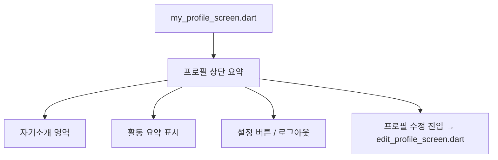

# 4_21. User_Field_Standard

---

## ✅ User 필드 표준 개요

Bling은 Keluharan 기반 지역 슈퍼앱으로, 사용자(User) 정보는  
**위치 기반 인증, 신뢰 등급(TrustLevel), 관심사, 활동 히스토리**를 통합해  
모든 기능과 연동됩니다.

---
# 📌 Bling User Field Standard (Ver.0.4)

## ✅ 사용자 기본 필드 구조

| 필드명              | 타입        | 설명                                               |     |     |
| ---------------- | --------- | ------------------------------------------------ | --- | --- |
| uid              | String    | Firebase UID                                     |     |     |
| nickname         | String    | 닉네임                                              |     |     |
| trustLevel       | String    | normal, verified, trusted                        |     |     |
| locationName     | String    | Singkatan 포함 전체 주소 표시 (예: Kel., Kec., Kab.)      |     |     |
| locationParts    | Map       | 단계별 주소 구조 (Kabupaten → Kec. → Kel. → 옵션: RT/RW ) |     |     |
| geoPoint         | GeoPoint  | 좌표                                               |     |     |
| photoUrl         | String    | 프로필 이미지                                          |     |     |
| bio              | String    | 자기소개                                             |     |     |
| interests        | List      | 관심사                                              |     |     |
| privacySettings  | Map       | 개인정보 공개 설정                                       |     |     |
| thanksReceived   | int       | 감사 수                                             |     |     |
| reportCount      | int       | 신고 수                                             |     |     |
| isBanned         | Boolean   | 정지 여부                                            |     |     |
| blockedUsers     | List      | 차단 목록                                            |     |     |
| profileCompleted | Boolean   | 지연 활성화 여부                                        |     |     |
| createdAt        | Timestamp | 가입일                                              |     |     |

## ✅ locationParts 저장 예시

```json
"locationParts": {
  "kabupaten": "Kab. Tangerang",
  "kecamatan": "Kec. Cibodas",
  "kelurahan": "Kel. Panunggangan Barat",
  "rt": "RT.03",
  "rw": "RW.05"
}
```

## ✅ 주소 표기 원칙

- 항상 Singkatan 적용 (Kel., Kec., Kab., Prov.)
    
- DropDown 흐름: Kabupaten → Kec. → Kel. → RT/RW (옵션)
    

## ✅ 연계 흐름

- 모든 Feed/Post/Marketplace는 locationName 기준으로 출력
    
- 쿼리 시작은 Kabupaten 기준
    
- RT/RW는 선택적 필터로만 사용
    

## ✅ 연계 문서

- `📌 Bling_Location_Singkat_And_Dropdown_Policy`
    
- `📌 Bling_Local_Feed_Policy`
    
- `📌 Bling_Development_Roadmap`


## ✅ 하위 컬렉션 구조

|컬렉션|내용|
|---|---|
|`posts`|사용자가 작성한 글|
|`comments`|사용자가 작성한 댓글|
|`wishlist`|찜한 상품/글|
|`auctions`|경매 등록/참여 기록|
|`shorts`|POM 쇼츠 업로드 기록|
|`jobs`|구인구직 공고 등록 기록|
|`shops`|소유한 상점|
|`clubs`|참여한 클럽|
|`neighbors`|즐겨찾기, 차단 목록|
|`notifications`|알림 수신 내역|
|`messages`|1:1 채팅 히스토리|

---

## ✅ 쿼리 & 인덱스 정책

| 쿼리 흐름                  | 설명                           |
| ---------------------- | ---------------------------- |
| `users/{uid}/posts`    | Feed 작성자 참조                  |
| `wishlist`             | Marketplace 연계               |
| Keluharan + TrustLevel | 위치 기반 쿼리 필수                  |
| 복합 인덱스                 | Keluharan + 관심사 + TrustLevel |

---

## ✅ 연계 흐름

- 모든 모듈은 `users/{uid}` 정보와 연결 (Feed, Marketplace, POM 등)
    
- TrustLevel은 `trustScore` + `thanksReceived` + `reportCount`로 자동 관리
    
- 관심사 기반 Matching → Find Friend, Club 추천
    

---

## ✅ 연계 문서

- [[3_19. User_Info_TrustLevel_Policy]]
    
- [[3_18_2. TrustLevel_Policy]]
    

---

## ✅ 결론

Bling User 필드 표준은 Keluharan 기반 지역성, 신뢰성, 개인화 추천까지  
모든 기능의 **기본 뼈대**로 사용됩니다.


### ✅ 핵심 구성

- User 필수 필드 + 하위 컬렉션 + 쿼리 인덱스 구조
    
- 모든 기능 연계 흐름 → Feed, Marketplace, Club, POM까지 일관 적용
    
- TrustLevel 자동화 흐름 포함


# 4_24. my_profile_screen_구조
# 👤 my_profile_screen_구조

## ✅ 목적

사용자가 자신의 정보를 관리하고,  
TrustLevel, 활동 정보, 공개 범위 등을 확인 및 수정할 수 있는  
Ayo 앱 내 개인 프로필 화면 구조를 설계한다.

---

## 🧩 주요 기능 및 구성

| 영역 | 설명 | 연결 기능 |
|------|------|-----------|
| 프로필 상단 요약 | 사진, 닉네임, 동네, TrustLevel 표시 | - |
| 자기소개 | 한 줄 소개 또는 관심사 요약 | bio 필드 |
| 활동 요약 | 게시글 수, 좋아요 수, 이웃 수 | postCount, likesCount |
| 공개 범위 제어 | 프로필 전체 공개 여부, 지도 노출 여부 등 | isProfilePublic, isMapVisible |
| 프로필 수정 버튼 | 수정 화면으로 진입 | edit_profile_screen.dart |
| TrustLevel 안내 | 신뢰등급 조건 및 다음 등급 가이드 | trust_level_info_modal.dart |
| 설정 접근 | 계정, 알림, 로그아웃 등 | settings_screen.dart |

---

## 🧭 UI 구성 흐름



---

## 🔍 데이터 구조 예시

```json
{
  "nickname": "Dika",
  "photoUrl": "https://firebaseapp.com/uid/profile.jpg",
  "locationName": "RW 05 - Jakarta",
  "bio": "Suka jalan-jalan dan kopi.",
  "trustLevel": "verified",
  "postCount": 12,
  "likesCount": 32,
  "isProfilePublic": true,
  "isMapVisible": false
}
```

---

## 🛠️ 컴포넌트 분리 제안

- `ProfileSummaryWidget`
- `ProfileActivitySummaryWidget`
- `ProfileTrustLevelBadge`
- `EditProfileCTA`
- `ProfilePrivacyToggle`

---

## 📎 연결 문서

- [[Bling_TrustLevel_정책_설계안]]
- [[18. Bling_지연된_프로필_활성화_정책]]
- [[my_profile_screen_설계안]]


# 4_25. 📂Bling Firestore 통합 스키마 예시

---

## ✅ 📂 Bling Firestore 통합 스키마 (v0.3 ~ v1.0 기준)

| 필드명              | 타입        | 설명                                             |
| ---------------- | --------- | ---------------------------------------------- |
| uid              | String    | Firebase UID                                   |
| nickname         | String    | 닉네임                                            |
| trustLevel       | String    | normal, verified, trusted                      |
| locationName     | String    | Singkatan 포함 전체 주소 표시 (예: Kel., Kec., Kab.)    |
| locationParts    | Map       | 단계별 주소 구조 (Kabupaten → Kec. → Kel. → RT/RW 옵션) |
| geoPoint         | GeoPoint  | 좌표                                             |
| photoUrl         | String    | 프로필 이미지                                        |
| bio              | String    | 자기소개                                           |
| interests        | List      | 관심사                                            |
| privacySettings  | Map       | 개인정보 공개 설정                                     |
| thanksReceived   | int       | 감사 수                                           |
| reportCount      | int       | 신고 수                                           |
| isBanned         | Boolean   | 정지 여부                                          |
| blockedUsers     | List      | 차단 목록                                          |
| profileCompleted | Boolean   | 지연 활성화 여부                                      |
| createdAt        | Timestamp | 가입일                                            |
|                  |           |                                                |

---

### ✅ users/{uid} 하위 컬렉션

|하위 컬렉션|내용|
|---|---|
|`posts/`|내가 쓴 게시물|
|`comments/`|내가 쓴 댓글|
|`wishlist/`|찜한 상품/게시물|
|`auctions/`|경매 등록/참여|
|`shorts/`|쇼츠 업로드|
|`jobs/`|구인공고 등록|
|`shops/`|소유 상점|
|`clubs/`|참여한 클럽|
|`neighbors/`|즐겨찾기/차단 이웃|
|`notifications/`|알림|
|`messages/`|1:1 채팅|


---

## ✅ 📄 posts

|필드|설명|
|---|---|
|`postId: String`||
|`userId: String`|작성자 UID|
|`title: String`||
|`body: String`||
|`category: String`|고정 카테고리|
|`tags: List<String>`|자유 태그|
|`mediaUrl: String?`|이미지/영상|
|`mediaType: String?`|`image` or `video`|
|`rt, rw, kelurahan, kecamatan, kabupaten, province`|위치 계층|
|`location: GeoPoint`||
|`geohash: String`||
|`likesCount: int`||
|`commentsCount: int`||
|`createdAt: Timestamp`||

---

## ✅ 📄 comments (posts/{postId}/comments)

|필드|설명|
|---|---|
|`commentId: String`||
|`userId: String`|작성자 UID|
|`body: String`||
|`likesCount: int`||
|`isSecret: bool`||
|`parentCommentId: String?`|대댓글 경우|
|`createdAt: Timestamp`||

---

## ✅ 📄 products (Marketplace)

|필드|설명|
|---|---|
|`productId: String`||
|`userId: String`|판매자 UID|
|`title, description, price`||
|`images: List<String>`||
|`categoryId: String`||
|`negotiable: bool`|가격 흥정 가능|
|`address: String`||
|`geo: Map`|GeoPoint|
|`transactionPlace: String?`|거래장소|
|`status: String`|`selling`, `sold`|
|`isAiVerified: bool`|AI 검수 여부|
|`likesCount, chatsCount, viewsCount`||
|`createdAt, updatedAt: Timestamp`||

---

## ✅ 📄 auctions

|필드| 설명      |
|---|---|
|`auctionId: String`|         |
|`title, description`|         |
|`images: List<String>`|         |
|`startPrice: int`|         |
|`currentBid: int`|         |
|`bidHistory: List<Map>`|         |
|`ownerId: String`| 판매자 UID |
|`location, geoPoint`|         |
|`trustLevelVerified: bool`|         |
|`isAiVerified: bool`|         |
|`startAt, endAt: Timestamp`|         |

---

## ✅ 📄 shorts (POM)

|필드|설명|
|---|---|
|`shortId: String`||
|`userId: String`||
|`title, description`||
|`videoUrl, thumbnailUrl`||
|`tags: List<String>`||
|`location, geoPoint`||
|`likesCount, viewsCount`||
|`trustLevelVerified, isAiVerified: bool`||
|`createdAt: Timestamp`||

---

## ✅ 📄 jobs

|필드| 설명                |
| ----------------------------- | ----------------- |
|`jobId: String`|                   |
|`title, description`|                   |
|`category: String`| 업종                |
|`location, geoPoint`|   Keluharan(Kel.) |
|`userId: String`| 작성자 UID           |
|`trustLevelRequired: String`|                   |
|`viewsCount, likesCount: int`|                   |
|`isPaidListing: bool`|                   |
|`createdAt: Timestamp`|                   |

---

## ✅ 📄 shops

|필드| 설명                |
| ----------------------------- | ----------------- |
|`shopId: String`|                   |
|`name, description`|                   |
|`ownerId: String`|                   |
|`location, geoPoint`|   Keluharan(Kel.) |
|`products: List<Map>`| 간단 제품 리스트         |
|`contactNumber: String`|                   |
|`openHours: String`|                   |
|`trustLevelVerified: bool`|                   |
|`viewsCount, likesCount: int`|                   |
|`createdAt: Timestamp`|                   |

---

## ✅ 📄 clubs

|필드|설명|
|---|---|
|`clubId: String`||
|`title, description`||
|`ownerId: String`||
|`location, geoPoint`||
|`interests: List<String>`||
|`membersCount: int`||
|`isPrivate: bool`||
|`trustLevelRequired: String`||
|`createdAt: Timestamp`||

---

## ✅ 📄 notifications

|필드|설명|
|---|---|
|`notifId: String`||
|`type: String`|댓글, 좋아요, RT 공지 등|
|`fromUserId: String`||
|`message: String`||
|`relatedId: String`|관련 Post ID 등|
|`timestamp: Timestamp`||
|`read: bool`||
|`priority: String`|`high` 등|

---

## ✅ 📄 reports

|필드|설명|
|---|---|
|`reportId: String`||
|`reporterId: String`||
|`targetId: String`||
|`targetType: String`|post, comment, user|
|`reason: String`||
|`createdAt: Timestamp`||

---

## ✅ 📄 chats

|필드|설명|
|---|---|
|`chatId: String`||
|`participants: List<String>`||
|`messages: SubCollection`||
|`lastMessage: String`||
|`unreadCounts: Map`|UID별 안읽은 수|

---

## ✅ 권장 연계 흐름

- 모든 컬렉션 → `users/{uid}`로 참여/작성 기록 연계.
    
-   Keluharan(Kel.), TrustLevel → 인증 조건 필드 유지.
    
- AI 검수 → `isAiVerified`.
    
- 다국어 → `.json` 키명 기준 필드.
    
- 신고/차단 → `reports` + `blockedUsers`.
    

---


# 4_27. MyProfile_구성_설계
# 👤 Bling_MyProfile_구성_설계.md

## ✅ 목적

Bling는  Keluharan(Kel.) 기반 지역 SNS 특성에 맞춰  
**내 프로필(My Profile)** 화면을 신뢰, 지역성, 활동성을 한눈에 볼 수 있도록 설계한다.

---

## 📌 핵심 구조: 2단 구성

| 영역 | 설명                                                  |
| --- | --------------------------------------------------- |
| 상단 | 간략 프로필 (닉네임, 프로필 사진, Keluharan(Kec.) 인증배지, 팔로워/팔로잉) |
| 하단 | 내가 올린 게시물/댓글/마켓/유머/참여 탭                             |

---

## 🗂️ 상단 - 간략 프로필

| 항목        | 필드                    | 설명                    |
| --------- | --------------------- | --------------------- |
| 프로필 사진    | `photoUrl`            | 사용자 사진                |
| 닉네임       | `nickname`            | 지역 SNS 표기명            |
| 실명 (옵션)   | `realName`            | 신뢰 등급 표시              |
| 인증 뱃지     | `trustLevel`          | Verified, Trusted 등   |
| 위치        | `locationName`        | RT/RW(옵션) + Kelurahan |
| 팔로잉       | `following[]`         | 내가 팔로우한 이웃            |
| 팔로워       | `followers[]`         | 나를 팔로우한 이웃            |
| 즐겨찾기      | `favoriteNeighbors[]` | 즐겨찾기한 이웃              |
| 프로필 수정 버튼 |                       | 자기소개, 관심사 수정          |

---

## 🗂️ 하단 - 활동 히스토리 탭

| 탭명 | 내용 |
|------|------|
| 📄 게시물 | 내가 올린 Post |
| 💬 댓글 | 내가 작성한 댓글 |
| 🏷️ 마켓 | 내가 올린 중고거래 글 |
| 🎉 유머/쇼츠 | 내가 올린 Funny/Shorts |
| 📌 모임/참여 | 이벤트/설문 등 참여 내역 |

---

## ✅ Firestore 필드 예시

| 필드 | 설명 |
|------|------|
| `uid` | 사용자 고유 ID |
| `nickname` | 닉네임 |
| `realName` | 실명 |
| `photoUrl` | 프로필 사진 |
| `trustLevel` | regular, verified 등 |
| `locationName` | RW 05 - Panunggangan Barat, Cibodas |
| `followers[]` | UID 배열 |
| `following[]` | UID 배열 |
| `favoriteNeighbors[]` | UID 배열 |
| `profileCompleted` | 정보 입력 여부 |
| `bio` | 자기소개 |
| `interests[]` | 관심사 태그 |

---

## 🔑 UX 흐름

| 액션 | 설명 |
|------|------|
| 프로필 수정 | 닉네임, 사진, bio, 관심사 변경 |
| 인증배지 신청 | TrustLevel Upgrade |
| 팔로잉/언팔로우 | Neighbors 기능 연계 |
| DM 허용 | 신뢰조건 설정 가능 |
| 지도 공개 | 위치 공개 ON/OFF |

---

## ✅ Dart 구조 예시

```dart
class UserProfile {
  final String uid;
  final String nickname;
  final String? realName;
  final String? photoUrl;
  final String trustLevel;
  final String locationName;
  final List<String> followers;
  final List<String> following;
  final List<String> favoriteNeighbors;
  final String? bio;
  final List<String>? interests;

  UserProfile({
    required this.uid,
    required this.nickname,
    this.realName,
    this.photoUrl,
    required this.trustLevel,
    required this.locationName,
    this.followers = const [],
    this.following = const [],
    this.favoriteNeighbors = const [],
    this.bio,
    this.interests,
  });
}
```

---

## 📎 연관 문서

- [[34. Bling_user_Field_컬렉션_구조_제안]]
- [[Nextdoor_Profile_탭_분석_Ayo적용안]]
- [[Bling_TrustLevel_정책_설계안]]

---

## ✅ 결론

Ayo의 My Profile은  
**간략 정보 + 깊은 정보 수정 + 내가 올린 모든 활동**을 한눈에 볼 수 있는  
신뢰 기반  Keluharan(Kel.)  SNS 핵심 허브이다.


# 4_30. MyBlign 화면 구성도
`MyBlingScreen` UI 화면 구성도 (ASCII Art)

+-----------------------------------------------------+
| [AppBar]                                                                 |
|   나의 Bling                 [수정 아이콘] [설정 아이콘]    [설정 아이콘]  |
+-----------------------------------------------------+
| [Profile Header]                                                     |
|                                                                               |
|    /-------\                                                              |
|   |            |      게시물       팔로워       팔로잉            |
|   | (사진)  |       12           128          89                     |
|   |            |      이웃          00명                                |
|    \-------/      친구          00명                                | 
|                                                                              |
|   Nickname 🛡️ (TrustLevel Badge)                        |
|   자기소개(Bio)가 여기에 표시됩니다.                      |
|   📍 지역 이름 (LocationName)                               |
|                                                                               |
+-----------------------------------------------------+
| [TabBar]                                                                  |
|                                                                               |
|  [게시물]  |  [판매상품]  |  [관심목록]                       |
|___________|______________|__________________________|
|                                                                              |
|                                                                              |
|                                                                              |
|        (선택된 탭의 내용이 여기에 표시됩니다)          |
|            (예: 내가 쓴 게시물 목록)                             |
|                                                                              |
|                                                                              |
|                                                                               |
+-----------------------------------------------------+

이곳 첫 화면이 이웃에게 또는 로그인한 신용등급 일반인까지는 공개되는 프로필과  이하 게시물 관련탭은 이웃/친구 또는 등급 공개여부 설정가능했으면 함. 
팔로워/팔로잉은 게시물 관련이며
이웃수은 로컬 근접 지역 서로 이웃관계 설정이며
친구수는 친구찾기(or 로컬데이팅) 관련 설정임.   
추후 관련 DB 설계 염두바람.


