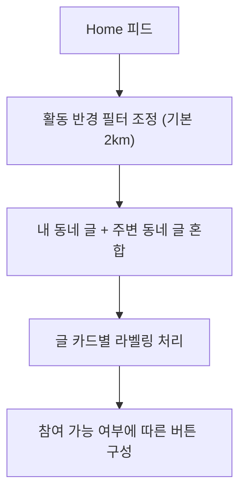

# 6_03. Bling_Local_Feed_Policy & To-Do 목록
# 

---

## ✅ Local Feed 개요

- Keluharan 기반 동네 소통 피드
    
- 모든 게시물 주소 표기는 Singkatan 사용 (Kel., Kec., Kab.)
    
- 작성자는 DropDown으로 Kabupaten → Kec. → Kel. 선택 후 RT/RW 옵션 선택 가능

---

## ✅ 핵심 카테고리

| 카테고리 | 설명 |
|--------------|----------------|
| 📍 공지/알림 | 마을 공지, 행사, 안전 경보 |
| 🐕 로스트 파운드 | 분실물, 유기동물 제보 |
| 🛠️ 일상/잡담 | 가벼운 동네 이야기 |
| 🛒 나눔/판매 | 무료 나눔, 소규모 중고판매 |
| 🚨 안전/신고 | 사건 제보, 수상한 활동 |
| 🏠 주거/이웃돕기 | 공동구매, 이웃 지원 |
| 🎉 Fun/Shorts | 유머 콘텐츠, 짧은 영상 공유 |
| 🏷️ 기타 | 자유 주제 태그 |

---

## ✅ 주요 기능 흐름

- Keluharan  인증 사용자만 글 작성 가능 (TrustLevel 적용)
- AI 자동 태그 추천 (예: ‘강아지 잃어버림’ → 로스트 파운드)
- 댓글, 좋아요, 공유 기능
- 공지/신고글 상단 고정
- 1:1 채팅으로 글쓴이와 직접 연결
- 판매글은 Marketplace 등록 양식으로 연동 전환 가능

---
## ✅ Feed 쿼리 흐름

- 기본: Kabupaten Equal 쿼리 → Kec. → Kel. → RT/RW (옵션)
    
- 반경 검색: GeoPoint + geohash 유지


## ✅ Firestore 기본 구조

| 컬렉션 | 설명 |
|---------|----------------|
| `posts` | Local Feed 기본 글 |
| `comments` | 글 하위 댓글 |
| `replies` | 댓글의 대댓글 |

- Post 필드: `likesCount`, `viewsCount`, `userId`, `createdAt`
- Comment 필드: `likesCount`, `isSecret`, `parentCommentId`, `userId`

---
## ✅ Firestore 구조 예시

```
{
  "kabupaten": "Kab. Tangerang",
  "kecamatan": "Kec. Cibodas",
  "kelurahan": "Kel. Panunggangan Barat",
  "rt": "RT.03",
  "rw": "RW.05"
}
```

## ✅ UI 흐름

- Feed 작성 시 DropDown 단계별로 선택
    
- 검색 필터도 단계별 옵션 적용
    
- 표시 주소는 항상 Singkatan 표기로 출력

---

## ✅ TODO & 개선 과제

- `users/{uid}` 에 작성 글, 댓글 연동
- 찜/좋아요/북마크는 `users/{uid}/wishlist` 구조로 통합 관리
- 다국어 `.json` 키 작성 & `easy_localization` 연계
- TrustLevel/위치 인증 필드 강화
- 댓글/대댓글 사용자 ID 매칭 → 내 정보 화면 연계

-  Firestore `posts` → `users/{uid}/posts` 연계 확인
    
-  카테고리+태그 필터링 쿼리 인덱스 완성
    
-  댓글/대댓글 구조 → `comments`, `replies` 컬렉션 정합성 확인
    
-  공지/신고글 상단 고정 로직 적용
    
-  AI 자동 태그 추천 모듈 연결 (추가)
    
-  다국어 JSON 키 완료 (`feed.post.title` 등)
    
-  공유 기능 (WhatsApp) CTA 연결

---

## ✅ 연계 문서

- [[2_01. Bling_Project_Overview]]
- [[2_04. Bling_MainScreen_Structure]]
- [[7_04. Bling_Marketplace_Policy]]
- [[4_21. User_Field_Standard]] → User 정보,  Keluharan(Kel.)  필드 준수
- [[3_18_2. TrustLevel_Policy]] → 작성/댓글 권한 조건
- `📌 Bling_Location_Singkat_And_Dropdown_Policy`
- Firestore: `posts`, `comments`, `replies`
---

## ✅ 결론
Bling Local Feed는 지역 Keluharan  기반 주민 소통 허브로,  
TrustLevel과 User 표준 필드를 그대로 따릅니다.

Bling Local Feed는 Keluharan  기반 주민 중심의 실시간 피드로,  
**소통, 공유, 거래**까지 하나로 연결됩니다.  
기본 구조는 이미 완성 단계이며, TrustLevel/다국어/사용자 히스토리와 함께  
추가 확장이 진행됩니다.


# 6_23. Feed_쿼리_구조_가이드
# 📌  Feed_쿼리_구조_가이드.md

## ✅ 목적

Bling는  Keluharan(Kel.) 기반 지역 SNS로
Firestore `posts` 컬렉션의 Feed 쿼리를
**위치, 카테고리, 태그**로 효율적으로 처리한다.

---

## ✅ 📄 posts 스키마 예시

|필드|설명|
|---|---|
|`postId: String`||
|`userId: String`|작성자 UID|
|`title: String`||
|`body: String`||
|`category: String`|고정 카테고리|
|`tags: List<String>`|자유 태그|
|`mediaUrl: String?`|이미지/영상|
|`mediaType: String?`|`image` or `video`|
|`rt, rw, kelurahan, kecamatan, kabupaten, province`|위치 계층|
|`location: GeoPoint`||
|`geohash: String`||
|`likesCount: int`||
|`commentsCount: int`||
|`createdAt: Timestamp`||


## 🔑 데이터 구조 예시

```json
{
  "postId": "abc123",
  "userId": "uid123",
  "title": "잃어버린 강아지 찾습니다",
  "body": "...",
  "category": "lostFound",
  "tags": ["강아지", "RT05"],
  "mediaUrl": "https://....jpg",
  "mediaType": "image",  // or "video"
  "rt": "RT.03",
  "rw": "RW.05",
  "kelurahan": "Panunggangan Barat",
  "kecamatan": "Cibodas",
  "kabupaten": "Kabupaten Tangerang",
  "province": "Banten",
  "location": GeoPoint,
  "geohash": "u6k2kq...",
  "createdAt": "...",
  "likesCount": 0,
  "commentsCount": 0
}
```

---

## ✅ Dart PostModel 예시

```dart
class PostModel {
  final String postId;
  final String userId;
  final String title;
  final String body;
  final String category; // e.g., 'funny', 'shorts'
  final List<String> tags;
  final String? mediaUrl;
  final String? mediaType; // 'image' or 'video'
  final String rt;
  final String rw;
  final String kelurahan;
  final String kecamatan;
  final String kabupaten;
  final String province;
  final GeoPoint location;
  final DateTime createdAt;
  final int likesCount;
  final int commentsCount;

  PostModel({
    required this.postId,
    required this.userId,
    required this.title,
    required this.body,
    required this.category,
    required this.tags,
    this.mediaUrl,
    this.mediaType,
    required this.rt,
    required this.rw,
    required this.kelurahan,
    required this.kecamatan,
    required this.kabupaten,
    required this.province,
    required this.location,
    required this.createdAt,
    this.likesCount = 0,
    this.commentsCount = 0,
  });

  Map<String, dynamic> toJson() => {
    "postId": postId,
    "userId": userId,
    "title": title,
    "body": body,
    "category": category,
    "tags": tags,
    "mediaUrl": mediaUrl,
    "mediaType": mediaType,
    "rt": rt,
    "rw": rw,
    "kelurahan": kelurahan,
    "kecamatan": kecamatan,
    "kabupaten": kabupaten,
    "province": province,
    "location": location,
    "createdAt": createdAt.toIso8601String(),
    "likesCount": likesCount,
    "commentsCount": commentsCount,
  };
}
```

## 🗂️ 필수 쿼리 조건

| 요소 | 설명                                      |
| ---- | --------------------------------------- |
| 위치 |  Keluharan(Kel.) , Kecamatan 또는 geohash |
| 카테고리 | 공지, 중고거래 등                              |
| 태그 | 사용자 태그                                  |
| 시간 | 최신순 `orderBy(createdAt, descending)`    |

---

## ✅ 권장 쿼리 예시

| 시나리오 | 쿼리 |
|----------|------|
| 카테고리만 | `where category == 'market'` |
| 위치+카테고리 | `where kecamatan == 'Cibodas' && category == 'lostFound'` |
| 태그 포함 | `where tags array-contains '강아지'` |
| 반경 쿼리 | `where geohash >= lower && geohash <= upper` |

---

## 🔑 반경 검색

- GeoPoint만으로 Range 쿼리 불가
- geohash 필드로 Range 쿼리 (`>= lowerBound` && `<= upperBound`)

---

## ✅ Firestore 인덱스 예시

| 조합 | 설명 |
|------|------|
| geohash + createdAt | 반경 + 최신순 |
| geohash + category + createdAt | 반경 + 카테고리 |
| kecamatan + category + createdAt | RT/RW 대신 상위 단위 |
| category + createdAt | 전역 인기글 |

---

## 🔑 쿼리 흐름

- 위치
- 카테고리
- 태그
- 시간 정렬

---

## ✅ 핵심 요약

✔️ RT/RW → Equal 쿼리  
✔️ 반경 → GeoPoint+geohash  
✔️ 카테고리+태그 → Feed 필터  
✔️ 복합 인덱스 필수

---

## 📎 연관 문서

- [[6_31. Post_카테고리+태그_구성]]
- [[5_29. Location_계층형_카테고리_구성]]
- [[34. Bling_user_Field_컬렉션_구조_제안]]

---

## ✅ 결론

Bling Feed는  
**위치 + 카테고리 + 태그 + 시간순** 조합으로  
지역성과 성능을 함께 확보한다.


# 6_25. Feed_Funny+Shorts_정책
# 🎉 Bling_Feed_Funny+Shorts_정책.md

## ✅ 목적

Bling은 Nextdoor의 지역 기반 정보 SNS 구조에  
**짧은 유머, 짤, 쇼츠(Shorts)** 등 가벼운 엔터테인먼트 콘텐츠를 혼합하여  
지역 피드의 체류시간과 확산성을 높인다.

---

## 📌 주요 특징

| 요소         | 설명                                 |
| ---------- | ---------------------------------- |
| 🎭 카테고리 추가 | `funny`, `shorts`                  |
| 🔗 지역성 연계  | Kelurahan, Kecamatan 필수 (RT/RW 옵션) |
| 📦 공유성     | WhatsApp 등으로 공유 유도                 |
| 🛡️ 신뢰조건   | 악성/음란 방지 → AI 필터 + TrustLevel 조건   |
| ✅ 검색성      | 태그(`tags[]`)로 확장                   |

---

## 🗂️ 고정 카테고리 목록 (추가)

| 코드 | 이름 | 설명 |
|------|------|------|
| funny | 유머/짤 | 웃긴 글, 짤방 |
| shorts | 쇼츠 | 짧은 영상 (TikTok 스타일) |

---

## 📂 혼합형 태그 예시

| 예시     | 설명       |
| ------ | -------- |
| #짤     | 밈 이미지    |
| #웃긴글   | 유머 글     |
| #RT05  | RT/RW 연계 |
| #반려동물밈 | 카테고리 세부화 |

---

## ✅ Feed/Post Firestore 구조 예시

```json
{
  "postId": "xyz123",
  "userId": "uid456",
  "title": "웃긴 강아지 짤 공유",
  "body": "우리 RT05 공유짤입니다 😂",
  "category": "funny",
  "tags": ["짤", "강아지", "RT05"],
  "mediaUrl": "https://....jpg",
  "mediaType": "image",  // or "video"
  "rt": "RT.03",
  "rw": "RW.05",
  "kelurahan": "Panunggangan Barat",
  "kecamatan": "Cibodas",
  "kabupaten": "Kabupaten Tangerang",
  "province": "Banten",
  "location": GeoPoint,
  "createdAt": "...",
  "likesCount": 0,
  "commentsCount": 0
}
```

---

## ✅ Dart PostModel 예시

```dart
class PostModel {
  final String postId;
  final String userId;
  final String title;
  final String body;
  final String category; // e.g., 'funny', 'shorts'
  final List<String> tags;
  final String? mediaUrl;
  final String? mediaType; // 'image' or 'video'
  final String rt;
  final String rw;
  final String kelurahan;
  final String kecamatan;
  final String kabupaten;
  final String province;
  final GeoPoint location;
  final DateTime createdAt;
  final int likesCount;
  final int commentsCount;

  PostModel({
    required this.postId,
    required this.userId,
    required this.title,
    required this.body,
    required this.category,
    required this.tags,
    this.mediaUrl,
    this.mediaType,
    required this.rt,
    required this.rw,
    required this.kelurahan,
    required this.kecamatan,
    required this.kabupaten,
    required this.province,
    required this.location,
    required this.createdAt,
    this.likesCount = 0,
    this.commentsCount = 0,
  });

  Map<String, dynamic> toJson() => {
    "postId": postId,
    "userId": userId,
    "title": title,
    "body": body,
    "category": category,
    "tags": tags,
    "mediaUrl": mediaUrl,
    "mediaType": mediaType,
    "rt": rt,
    "rw": rw,
    "kelurahan": kelurahan,
    "kecamatan": kecamatan,
    "kabupaten": kabupaten,
    "province": province,
    "location": location,
    "createdAt": createdAt.toIso8601String(),
    "likesCount": likesCount,
    "commentsCount": commentsCount,
  };
}
```

---

## ✅ UX 정책 요약

| 정책 | 설명                                   |
| ---------- | ------------------------------------ |
| 📌 카테고리 필수 | `funny` or `shorts` 선택 필수            |
| 🏷️ 태그 선택 | 자유 태그 + 추천 Keluharan(Kec.), RT/RW 태그 |
| 🛡️ 신뢰조건 | 특정 TrustLevel 이상만 업로드 허용             |
| 🤖 AI 필터 | 음란/혐오 자동 차단                          |
| 🔗 지역성 | Kelurahan + Kecamatan 필수 (RT/RW 옵션)  |

---

## 📎 연관 문서

- [[5_29. Location_계층형_카테고리_구성]]
- [[6_31. Post_카테고리+태그_구성]]
- [[34. Bling_user_Field_컬렉션_구조_제안]]

---

## ✅ 결론

Bling 는 지역 기반 피드에 유머/쇼츠를 안전하게 붙여  
체류시간과 공유성을 동시에 올리는 **혼합형 Keluharan(Kec.) SNS**를 실현한다.


# 6_26. Home+Nearby_통합구조_기획안
# 🏠 Bling_Home+Nearby_통합구조_기획안

## ✅ 목적

Bling앱에서 기존의 “Home (내 동네)”과 “Nearby (주변 동네)”를  
하나의 **통합 피드**로 구성하여,  
사용자 중심의 직관적인 UX를 제공하고, 지역 경계를 확장하되,  
소속감과 신뢰 구조를 유지하기 위한 정책/구조를 정의한다.

---

## 🧭 통합 구조 개요

| 기존 | 통합 후 |
|------|----------|
| Home 탭: 가입한 동네 피드 | Home 피드에서 내 동네 + 반경 설정된 주변 동네 모두 표시 |
| Nearby 탭: 주변 동네 보기 | ❌ 별도 탭 없이 Home에서 함께 탐색 가능 |

---

## 📍 활동 반경 기반 구조

| 기능 | 설명 |
|------|------|
| 🔧 반경 설정 필터 | 사용자가 직접 탐색 범위 설정 (기본 2km, 옵션: 1km~5km) |
| 📍 위치 기반 쿼리 | GeoPoint 기반으로 근거리 글만 조회 |
| 🧭 내 동네 + 인접 동네 혼합 표시 | 지역 라벨로 구분됨 (예: `RW 05 - Bekasi`) |

---

## 🧩 신뢰/구독 기반 카드 라벨링 정책

| 조건 | 라벨 표시 | 설명 |
|-------|------------|--------|
| ✅ 내 동네 가입 + TrustLevel: 인증회원 이상 | `🏠 내 동네` | 모든 기능 사용 가능 (댓글, 좋아요 등) |
| 🟡 주변 동네 (가입 안 함) | `📍 Nearby` | **읽기만 가능**, 활동 불가 / 가입 유도 버튼 표시 |
| 🟢 주변 동네 + 가입 완료 | `🏘️ 이웃 동네` | 제한 없이 활동 가능 |
| 🔒 비공개 커뮤니티 (지역/이웃 승인 필요) | `🔐 승인 필요` | 글 내용 일부만 미리보기 가능 |

---

## 📲 UI 흐름 요약



---

## 🧠 UX 장점 요약

| 항목                    | 설명                             |
| --------------------- | ------------------------------ |
| ✅ 탐색 흐름 단순화           | 하단탭이 간결해지고 피드 접근이 쉬움           |
| ✅ 콘텐츠 다양성 확보          | 내 동네 글이 적더라도 주변 글로 채워짐         |
| ✅ 자연스러운 커뮤니티 확장       | Nearby → 이웃 동네 → 가입 → 활동 유도 구조 |
| ✅ 신뢰등급 + 구독 상태 기반 필터링 | 권한/참여 구분이 명확함                  |

---

## ⚠️ UX/기술 리스크

| 항목                | 대응 방법                                         |
| ----------------- | --------------------------------------------- |
| 소속감 혼란            | 글 카드에 “지역 표시 라벨” 명확히 부착                       |
| 댓글/좋아요 불가 혼선      | 버튼 회색 처리 + 가입 유도 텍스트 표시                       |
| GeoPoint 쿼리 비용 증가 | `geohash` 기반 필터 도입 또는 미리 정제된 지역 컬렉션 활용        |
| 데이터 쿼리 중복         | 위치 캐싱 (최초 1회만 지역정보 호출 후 필드 저장 `locationName`) |

---

## 🛠️ 기술 구현 메모

- Firestore `posts` 필드 구조 예시:
```json
{
  "postId": "abc123",
  "location": GeoPoint,
  "locationName": "RW 06 - Bekasi",
  "isFromUserNeighborhood": true,
  "neighborhoodId": "neigh_xxx",
  "trustLevel": "verified",
  "distanceKm": 1.2
}
```

- 글 카드 위젯 분기 조건:
```dart
if (post.isFromUserNeighborhood) {
  showLabel("🏠 내 동네");
} else if (user.joinedNeighborhoods.contains(post.neighborhoodId)) {
  showLabel("🏘️ 이웃 동네");
} else {
  showLabel("📍 Nearby");
}
```

---

## ⛳ 향후 확장 방향

| 기능 | 설명 |
|------|------|
| 🔍 동네 범위 기반 검색 | “내 동네 내 검색” / “반경 2km 내 글 검색” 옵션 제공 |
| 🧱 지역별 관심도 분석 | 인기 동네, 대화 많은 동네 랭킹 표시 |
| 📎 탐색 기록 → 피드 추천 | 내가 자주 본 동네의 인기글 자동 추천

---

## 📁 관련 문서

- [[Bling_TrustLevel_정책_설계안]]
- [[Bling_Map_기능_및_개인정보보호정책]]
- [[Firestore_Post_데이터모델_구성]]


# 6_31. Post_카테고리+태그_구성
# 🏷️ Post_카테고리+태그_구성.md

## ✅ 목적

Bling 프로젝트의 Feed(게시물) 설계는  
Keluharan(Kec.) 기반 위치 계층과 함께 **고정형 카테고리 + 자유형 태그**를 혼합하여  
지역성, 주제성, 검색성을 모두 만족시킨다.

---

## 🔑 구조 구성

| 축           | 역할                                             | 예시                                        |
| ----------- | ---------------------------------------------- | ----------------------------------------- |
| 📍 위치 계층    | (RT/RW 옵션) → Kelurahan → Kecamatan → Kabupaten | RT.03/RW.05 - Panunggangan Barat, Cibodas |
| 🗂️ 고정 카테고리 | 사전 정의, 필수 선택                                   | market, lostFound, announcement 등         |
| 🏷️ 자유 태그   | 사용자 자율 선택, 추천 제공                               | #강아지, #RT05, #무료나눔                        |

---

## 📂 권장 고정 카테고리

| 코드 | 이름 | 설명 |
|------|------|------|
| announcement | 공지사항 | RT 공지, 마을 알림 |
| lostFound | 분실/습득 | 잃어버린 물건 찾기 |
| market | 중고거래 | 벼룩시장, 나눔 |
| help | 질문/요청 | 동네 질문, 도움 요청 |
| warning | 경고/신고 | 사건사고, 보안 |
| event | 모임/행사 | 커뮤니티 모임 |
| service | 지역 서비스 | 세탁, 수리 등 |
| recommendation | 추천/후기 | 가게, 음식점 |
| poll | 투표/설문 | RT 투표 |
| other | 기타 | 분류 불가 |

---

## 📂 혼합형 태그 설계

| 방식 | 특징 |
|------|------|
| 직접 입력 | 사용자 입력 태그 |
| 추천 태그 | RT번호 자동완성 (#RT05), 인기 태그 |
| 배열 저장 | Firestore `tags[]` 배열 |

---

## 📌 Firestore Post 예시 구조

```json
{
  "postId": "abc123",
  "userId": "uid123",
  "title": "잃어버린 강아지 찾습니다",
  "body": "...",
  "category": "lostFound",
  "tags": ["강아지", "RT05"],
  "rt": "RT.03",
  "rw": "RW.05",
  "kelurahan": "Panunggangan Barat",
  "kecamatan": "Cibodas",
  "kabupaten": "Kabupaten Tangerang",
  "province": "Banten",
  "location": GeoPoint,
  "createdAt": "...",
  "likesCount": 0,
  "commentsCount": 0
}
```

---

## 📌 권장 쿼리 예시

| 시나리오 | 쿼리 |
|----------|------|
| 카테고리만 | `where category == 'market'` |
| 위치 + 카테고리 | `where kecamatan == 'Cibodas' && category == 'lostFound'` |
| 태그 포함 | `where tags array-contains '강아지'` |

---

## 🔗 연관 문서

- [[5_29. Location_계층형_카테고리_구성]]
- [[34. Bling_user_Field_컬렉션_구조_제안]]
- [[Bling_Post_데이터_구조]]

---

## ✅ 결론

Ayo 게시물은  
**위치계층 + 고정 카테고리 + 자유 태그**의 혼합 구조로  
동네 SNS의 정확성과 검색성을 동시에 확보한다.


