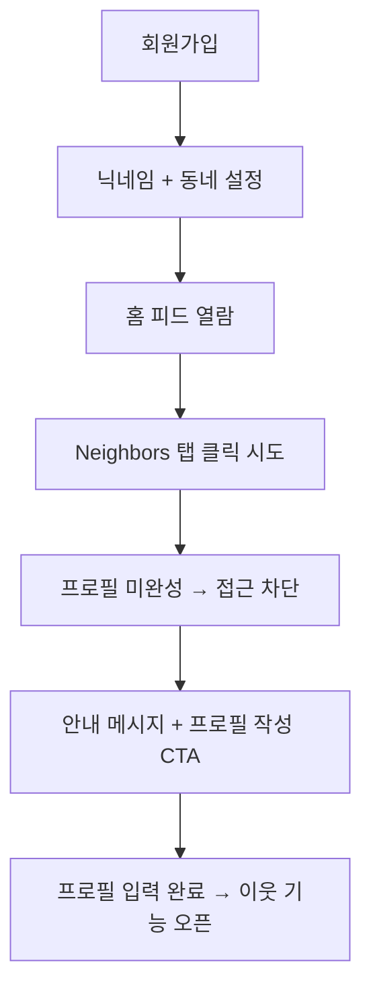
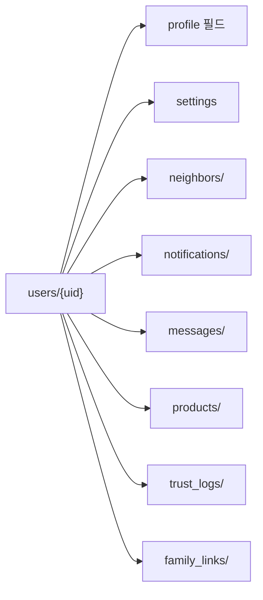

# 3_18_1. 지연된 프로필 활성화 정책(Delayed_Profile_Activation)

---

## ✅ 정책 개요

Bling은  Keluharan(Kel.) 기반 커뮤니티 신뢰 구조를 유지하면서도  
신규 사용자의 진입 장벽을 낮추기 위해  
**Delayed Profile Activation (지연된 프로필 활성화 정책)** 을 도입합니다.

---

## ✅ 핵심 개념

| 단계            | 설명                                |
| ------------- | --------------------------------- |
| 1️⃣ 가입 직후     | 닉네임 + 기본 동네만 입력 → 콘텐츠 열람 가능       |
| 2️⃣ 탐색 중심 사용  | 홈피드, 피드 콘텐츠 소비 가능 (댓글/좋아요는 제한)    |
| 3️⃣ 이웃 탐색 시도  | Neighbors 탭 클릭 시 조건 확인            |
| 4️⃣ 정보 미충족    | “이웃을 만나려면 본인 소개를 먼저 작성해주세요” 안내    |
| 5️⃣ 프로필 입력 유도 | 프로필 사진, 자기소개, 관심사 최소 1개           |
| 6️⃣ 이웃 기능 활성화 | 입력 완료 시 Neighbors, 친구찾기, DM 기능 해제 |

---

## ✅ UI 흐름 예시




## ✅ Firestore 필드 예시


```json
{
  "nickname": "Dika",
  "locationName": "RW 05 - Bekasi",
  "profileCompleted": false,
  "photoUrl": null,
  "bio": "",
  "interests": [],
  "trustLevel": "normal"
}
```


---

## ✅ 필수 입력 조건

|기능|조건|
|---|---|
|피드 열람|닉네임 + 동네|
|Neighbors 열람|프로필 사진 + 자기소개|
|친구찾기 추천|관심사 1개 이상|
|DM|TrustLevel ≥ verified|

---

## ✅ 장점

|항목|설명|
|---|---|
|🔄 자발적 정보 입력|강제 입력 대신 동기 부여|
|🧱 신뢰 정보 확장|공개 프로필로 신뢰 기반 강화|
|📊 행동 분석|입력 시점, 경로 분석 → 리텐션 데이터 확보|
|✅ 단계별 설계|기능 제한 → 작성 완료 → 해제 순서 명확|

---

## ✅ 리스크 & 대응

|리스크|대응 방안|
|---|---|
|이탈 위험|피드 탐색만은 자유롭게 허용|
|강제 입력 부담|“이웃 연결을 위해 필요한 최소 정보” 강조|
|UX 불편|관심사 자동완성, 이미지 빠른 업로드로 진입 장벽 최소화|

---

## ✅ 연계 문서

- [[4_21. User_Field_Standard]]
    
- [[3_18_2. TrustLevel_Policy]]
    
- [[24. Bling_MyProfile_Structure]]
    

---

## ✅ 결론

Bling은 지연된 프로필 활성화 정책으로  
**가입 → 탐색 → 정보 입력 → 이웃 연결** 단계를 자연스럽게 설계해   Keluharan(Kel.) 기반 지역 신뢰 구조를 유지하면서도  
신규 사용자의 이탈을 최소화합니다.

---

### ✅ 구성 핵심

- 단계별 흐름 → 회원가입 → 탐색 → 프로필 작성 → Neighbors 오픈
    
- Firestore 구조 → `profileCompleted` 플래그 활용
    
- Obsidian 연계 문서 링크 표준
    

---


# 3_18_2. TrustLevel_Policy
# ✅ TrustLevel_정책.md

---

## ✅ 목적

TrustLevel은  Keluharan(Kel.) 인증, 위치, 활동 지표로 자동 계산되어
게시글 작성 권한과 이웃 검색 가능 범위를 결정합니다.

---

## ✅ 자동 등급 정책

| 등급     | 조건                           |
| ------ | ---------------------------- |
| 🟢 일반  | 닉네임만 등록                      |
| 🟡 인증  | Keluharan(Kel.)  인증, 전화번호 인증 |
| 🔵 고신뢰 | 인증 + 활동점수 + 신고 없음            |

- 신고/활동내역으로 자동 하향/상향
- Dart 모델: `trustLevel` 필드 + `calculateTrustScore()` 로직 적용

---

## ✅ 프로필 지연 활성화

- 회원가입 후 즉시 프로필 100% 입력하지 않아도 기본 피드 열람 가능
- 이웃/검색/메시지 기능은 최소 TrustLevel 달성 후 활성화
- 단계별 프로필 작성 알림 제공

---

## ✅ 결론

TrustLevel 정책은 자동화 + 단계별 프로필 활성화로
안전한 동네 커뮤니티를 보장합니다.


# 3_19. User_Info_TrustLevel_Policy


## ✅ 사용자 정보 & 신뢰등급 정책 개요

Bling은  Keluharan(Kel.)  기반 슈퍼앱으로, 사용자 정보(User Info)와 TrustLevel은  
지역 커뮤니티의 **신뢰 구조를 유지하는 핵심 요소**입니다.

---

## ✅ 사용자(User) 필드 표준 구조

| 필드명              | 타입        | 설명                                             |
| ---------------- | --------- | ---------------------------------------------- |
| uid              | String    | Firebase UID                                   |
| nickname         | String    | 닉네임                                            |
| trustLevel       | String    | normal, verified, trusted                      |
| locationName     | String    | Singkatan 포함 전체 주소 표시 (예: Kel., Kec., Kab.)    |
| locationParts    | Map       | 단계별 주소 구조 (Kabupaten → Kec. → Kel. → RT/RW 옵션) |
| geoPoint         | GeoPoint  | 좌표                                             |
| photoUrl         | String    | 프로필 이미지                                        |
| bio              | String    | 자기소개                                           |
| interests        | List      | 관심사                                            |
| privacySettings  | Map       | 개인정보 공개 설정                                     |
| thanksReceived   | int       | 감사 수                                           |
| reportCount      | int       | 신고 수                                           |
| isBanned         | Boolean   | 정지 여부                                          |
| blockedUsers     | List      | 차단 목록                                          |
| profileCompleted | Boolean   | 지연 활성화 여부                                      |
| createdAt        | Timestamp | 가입일                                            |
|                  |           |                                                |

---

## ✅ TrustLevel 정책 구조

|등급| 조건                         |주요 특징|
| ----------- | -------------------------- | --------------------- |
|🟢 normal| 닉네임만 등록                    |기본 기능 사용|
|🟡 verified| Keluharan(Kec.) 인증 + 실명 등록 |댓글/이웃 탐색 활성화|
|🔵 trusted| 일정 활동점수 + 감사 + 무신고 상태      |Feed/Market 상단 노출 우선권|

- TrustLevel은 `trustScore`, `thanksReceived`, `reportCount` 등으로 자동 계산됩니다.
    
- 신고 누적 시 등급 자동 하향 가능.
    

---

## ✅ 등급 계산 예시 로직


functions-v2/index.js
```js
const functions = require("firebase-functions");
const admin = require("firebase-admin");
admin.initializeApp();

exports.calculateTrustScore = functions.firestore
    .document("users/{userId}")
    .onUpdate(async (change, context) => {
      const userData = change.after.data();
      const previousUserData = change.before.data();

      const mainFieldsUnchanged =
        userData.thanksReceived === previousUserData.thanksReceived &&
        userData.reportCount === previousUserData.reportCount &&
        userData.profileCompleted === previousUserData.profileCompleted &&
        userData.phoneNumber === previousUserData.phoneNumber &&
        JSON.stringify(userData.locationParts) ===
          JSON.stringify(previousUserData.locationParts);

      if (mainFieldsUnchanged) {
        functions.logger.info("No score-related changes, exiting.");
        return null;
      }

      let score = 0;
      if (userData.locationParts && userData.locationParts.kel) score += 50;
      if (userData.locationParts && userData.locationParts.rt) score += 50;
      if (userData.phoneNumber && userData.phoneNumber.length > 0) score += 100;
      if (userData.profileCompleted === true) score += 50;

      const thanksCount = userData.thanksReceived || 0;
      score += thanksCount * 10;

      const reportCount = userData.reportCount || 0;
      score -= reportCount * 50;

      const finalScore = Math.max(0, score);

      let level = "normal";
      if (finalScore > 500) {
        level = "trusted";
      } else if (finalScore > 100) {
        level = "verified";
      }

      if (
        finalScore !== userData.trustScore ||
        level !== userData.trustLevel
      ) {
        functions.logger.info(
            // eslint-disable-next-line max-len
            `Updating user ${context.params.userId}: New Score = ${finalScore}, New Level = ${level}`,
        );
        return change.after.ref.update({
          trustScore: finalScore,
          trustLevel: level,
        });
      }

      functions.logger.info("No score or level change needed.");
      return null;
    });

```


## ✅ 적용 흐름 요약

| 단계                                         | 설명  |
| ------------------------------------------ | --- |
| 1️⃣ 회원가입 → Keluharan(Kel.)  인증 → 닉네임 필수 등록 |     |
| 2️⃣ 활동 → 글/댓글/참여 기록 축적                     |     |
| 3️⃣ 감사 수신/신고 없음 → `trusted` 등급 자동 상승       |     |
| 4️⃣ 신고 누적 → 등급 자동 하향                       |     |
| 5️⃣ TrustLevel에 따라 기능/공개 범위 차등             |     |

---

## ✅ 연계 문서

- [[4_21. User_Field_Standard]]
    
- [[3_18_2. TrustLevel_Policy]]
    
- [[3_18_1. 지연된 프로필 활성화 정책(Delayed_Profile_Activation)]]
    

---

## ✅ 결론

Bling의 사용자 정보 & TrustLevel 정책은  
 Keluharan(Kel.)  인증 + 활동 지표 + 단계별 자동화**로  
지역 커뮤니티의 신뢰도를 유지하고,  
Feed, Marketplace, Club 등 모든 모듈과 연결됩니다.


---

### ✅ 구성 핵심

- 사용자 필드 구조 →  Keluharan(Kel.)  + Geo + 관심사까지 포함
    
- TrustLevel 단계별 조건과 자동 등급 로직 포함
    
- Obsidian 문서 연계로 `User_Field_Standard`, `TrustLevel_Policy`와 연결
    

---


# 3_20.  user_Field_컬렉션_구조_제안
# 📂  user_Field_컬렉션_구조_제안

## ✅ 목적

Ayo 프로젝트는 Nextdoor 구조를 현지화하여  
  Keluharan(Kel.) 기반 지역성, 이웃, 알림, 메시지, 마켓, 지도 노출 등을 통합한다.  
이를 위해 **Firestore 상위 컬렉션과 하위 컬렉션을 구분**하여  
검색 효율, 보안, 관리성을 최적화한다.

---

## 🔑 최상위 필드 (users/{uid})

## ✅ 사용자 필드 목록

| 필드명                    | 타입                      | 예시                                      | 설명                                                                  |
| ---------------------- | ----------------------- | --------------------------------------- | ------------------------------------------------------------------- |
| `uid`                  | `String`                | `"xyz123"`                              | Firebase Auth UID                                                   |
| `nickname`             | `String`                | `"Planner님"`                            | 사용자 닉네임                                                             |
| `email`                | `String`                | `"user@example.com"`                    | 사용자 이메일                                                             |
| `phoneNumber`          | `String?`               | `"0812-3456-7890"`                      | 전화번호 (인증 시 높은 신뢰 점수 획득)                                             |
| `photoUrl`             | `String?`               | `"https://..."`                         | 프로필 사진 URL                                                          |
| `bio`                  | `String?`               | `"간단한 소개"`                              | 자기소개                                                                |
| `trustLevel`           | `String`                | `"normal"` / `"verified"` / `"trusted"` | 신뢰 단계                                                               |
| `trustScore`           | `int`                   | `200`                                   | 신뢰 점수                                                               |
| `feedThanksReceived`   | `int`                   | `5`                                     | 피드 활동으로 받은 '감사' 횟수                                                  |
| `marketThanksReceived` | `int`                   | `3`                                     | 마켓 거래로 받은 '감사' 횟수                                                   |
| `locationName`         | `String?`               | `"Jakarta Selatan"`                     | 사용자 지역 이름                                                           |
| `locationParts`        | `Map<String, dynamic>?` | `{ "prov": "DKI", "kab": "Jakarta" }`   | 지역 단계별 파트                                                           |
| `geoPoint`             | `GeoPoint?`             | `{ "lat": -6.2, "lng": 106.8 }`         | 위도/경도                                                               |
| `interests`            | `List<String>?`         | `["음식", "여행"]`                          | 관심사                                                                 |
| `privacySettings`      | `Map<String, dynamic>?` | `{ "isMapVisible": true }`              | 공개 설정                                                               |
| `postIds`              | `List<String>?`         | `["post123"]`                           | 내가 작성한 글 ID 리스트                                                     |
| `productIds`           | `List<String>?`         | `["product123"]`                        | 내가 등록한 상품 ID 리스트                                                    |
| `bookmarkedPostIds`    | `List<String>?`         | `["post123"]`                           | 북마크한 글 ID                                                           |
| `bookmarkedProductIds` | `List<String>?`         | `["product123"]`                        | 북마크한 상품 ID                                                          |
| `thanksReceived`       | `int`                   | `4`                                     | 감사 횟수 (deprecated: feedThanksReceived, marketThanksReceived로 대체 권장) |
| `reportCount`          | `int`                   | `1`                                     | 신고 횟수                                                               |
| `isBanned`             | `bool`                  | `false`                                 | 계정 정지 여부                                                            |
| `blockedUsers`         | `List<String>?`         | `["uid123"]`                            | 차단한 사용자 리스트                                                         |
| `profileCompleted`     | `bool`                  | `true`                                  | 프로필 완성 여부                                                           |
| `matchProfile`         | `Map<String, dynamic>?` | `{ "gender": "M", "age": 33 }`          | 매칭용 프로필                                                             |
| `createdAt`            | `Timestamp`             | `"2025-07-08T14:00:00Z"`                | 생성일                                                                 |

---

## 🗂️ 하위 컬렉션

| 컬렉션 | 목적 | 예시 |
|--------|------|------|
| neighbors/ | 즐겨찾기/차단 관리 | `users/{uid}/neighbors/{neighborId}` |
| notifications/ | 알림 관리 | `users/{uid}/notifications/{notifId}` |
| messages/ | 채팅방 관리 | `users/{uid}/messages/{roomId}` |
| products/ | 마켓 판매글 | `users/{uid}/products/{productId}` |
| trust_logs/ | 신뢰도 변경 로그 | `users/{uid}/trust_logs/{logId}` |
| family_links/ | 가족 관계 | `users/{uid}/family_links/{linkedUid}` |
| settings | 알림 on/off 등 | `users/{uid}/settings` |

---

## 🔄 상위-하위 흐름 구조



---

## 🔍 쿼리 흐름 예시

| 시나리오 | 쿼리 |
|----------|------|
| Feed 게시물 작성자 정보 | `users/{uid}` → nickname, photoUrl |
| 댓글 작성자 정보 | `users/{uid}` |
| 이웃 목록 | `users/{uid}/neighbors/` |
| 알림 조회 | `users/{uid}/notifications/` |
| 메시지 목록 | `users/{uid}/messages/` |
| 판매상품 조회 | `users/{uid}/products/` |
| 가족 연결 확인 | `users/{uid}/family_links/` |

---

## 🔐 설계 원칙

- 핵심키(`uid`, `trustLevel`, `nickname`)는 최상위 → 쿼리/참조 필수
- 자주 추가/삭제되는 데이터는 하위 컬렉션으로 → Firestore 비용 최적화
- Cloud Function 또는 Transaction으로 UID 기반 동기화 유지

---

## 📌 적용 예시

| 예시 | 구조 |
|------|------|
| 이웃 즐겨찾기 추가 | `users/{uid}/neighbors/{neighborId}` |
| 알림 읽음 처리 | `users/{uid}/notifications/{notifId}` → `read: true` |
| 메시지 방 생성 | `users/{uid}/messages/{roomId}` |
| RT 공지 발송 | `users/{uid}/notifications/` + `locationName` 필드 기반 대상 필터링 |

---

## 🔄 필드-기능 매핑 예시

| 기능            | 관련 필드                                 |
| ------------- | ------------------------------------- |
| 이웃 즐겨찾기/차단    | neighbors/ + blockedUsers             |
| 알림 수신/읽음      | notifications/ + notificationSettings |
| 메시지 사용 조건     | messages/ + trustLevel + blockedUsers |
| TrustLevel 인증 | trustLevel + trust_logs/              |
| 가족 공유         | family_links/ + isMapVisible          |
| 지도 노출 범위      | isMapVisible + locationName           |
| 마켓 판매글 관리     | products/                             |

---
## 📁 연관 문서

- [[Bling_TrustLevel_정책_설계안]]
- [[Nextdoor_Profile_탭_분석_Ayo적용안]]
- [[30. Bling_Notifications_탭_현지화_구성안]]
- [[neighbors_screen_탐색UI_설계안]]

---

## 🔐 관리 원칙

- 상위는 UID, nickname, trustLevel 등 자주 참조 필수 값만.
- neighbors, notifications, messages는 하위 컬렉션으로 개별 관리.
- RT Pengumuman, Ketua RT 인증 등 현지 특화 흐름은 locationName 필드와 연계.

---
## ✅ 결론

Bling_user_Field_컬렉션_구조는  
**"상위 필수 키값 + 기능별 하위 컬렉션 + Obsidian 문서 연결 인덱스"**로  
모든 기능 흐름과 신뢰/보안/확장성을 연동한다.


# 4_21. User_Field_Standard

---

## ✅ User 필드 표준 개요

Bling은 Keluharan 기반 지역 슈퍼앱으로, 사용자(User) 정보는  
**위치 기반 인증, 신뢰 등급(TrustLevel), 관심사, 활동 히스토리**를 통합해  
모든 기능과 연동됩니다.

---
# 📌 Bling User Field Standard (Ver.0.4)

## ✅ 사용자 기본 필드 구조

## ✅ 사용자 필드 목록

| 필드명                    | 타입                      | 예시                                      | 설명                                                                  |
| ---------------------- | ----------------------- | --------------------------------------- | ------------------------------------------------------------------- |
| `uid`                  | `String`                | `"xyz123"`                              | Firebase Auth UID                                                   |
| `nickname`             | `String`                | `"Planner님"`                            | 사용자 닉네임                                                             |
| `email`                | `String`                | `"user@example.com"`                    | 사용자 이메일                                                             |
| `phoneNumber`          | `String?`               | `"0812-3456-7890"`                      | 전화번호 (인증 시 높은 신뢰 점수 획득)                                             |
| `photoUrl`             | `String?`               | `"https://..."`                         | 프로필 사진 URL                                                          |
| `bio`                  | `String?`               | `"간단한 소개"`                              | 자기소개                                                                |
| `trustLevel`           | `String`                | `"normal"` / `"verified"` / `"trusted"` | 신뢰 단계                                                               |
| `trustScore`           | `int`                   | `200`                                   | 신뢰 점수                                                               |
| `feedThanksReceived`   | `int`                   | `5`                                     | 피드 활동으로 받은 '감사' 횟수                                                  |
| `marketThanksReceived` | `int`                   | `3`                                     | 마켓 거래로 받은 '감사' 횟수                                                   |
| `locationName`         | `String?`               | `"Jakarta Selatan"`                     | 사용자 지역 이름                                                           |
| `locationParts`        | `Map<String, dynamic>?` | `{ "prov": "DKI", "kab": "Jakarta" }`   | 지역 단계별 파트                                                           |
| `geoPoint`             | `GeoPoint?`             | `{ "lat": -6.2, "lng": 106.8 }`         | 위도/경도                                                               |
| `interests`            | `List<String>?`         | `["음식", "여행"]`                          | 관심사                                                                 |
| `privacySettings`      | `Map<String, dynamic>?` | `{ "isMapVisible": true }`              | 공개 설정                                                               |
| `postIds`              | `List<String>?`         | `["post123"]`                           | 내가 작성한 글 ID 리스트                                                     |
| `productIds`           | `List<String>?`         | `["product123"]`                        | 내가 등록한 상품 ID 리스트                                                    |
| `bookmarkedPostIds`    | `List<String>?`         | `["post123"]`                           | 북마크한 글 ID                                                           |
| `bookmarkedProductIds` | `List<String>?`         | `["product123"]`                        | 북마크한 상품 ID                                                          |
| `thanksReceived`       | `int`                   | `4`                                     | 감사 횟수 (deprecated: feedThanksReceived, marketThanksReceived로 대체 권장) |
| `reportCount`          | `int`                   | `1`                                     | 신고 횟수                                                               |
| `isBanned`             | `bool`                  | `false`                                 | 계정 정지 여부                                                            |
| `blockedUsers`         | `List<String>?`         | `["uid123"]`                            | 차단한 사용자 리스트                                                         |
| `profileCompleted`     | `bool`                  | `true`                                  | 프로필 완성 여부                                                           |
| `matchProfile`         | `Map<String, dynamic>?` | `{ "gender": "M", "age": 33 }`          | 매칭용 프로필                                                             |
| `createdAt`            | `Timestamp`             | `"2025-07-08T14:00:00Z"`                | 생성일                                                                 |

## ✅ locationParts 저장 예시

```json
"locationParts": {
  "kabupaten": "Kab. Tangerang",
  "kecamatan": "Kec. Cibodas",
  "kelurahan": "Kel. Panunggangan Barat",
  "rt": "RT.03",
  "rw": "RW.05"
}
```

## ✅ 주소 표기 원칙

- 항상 Singkatan 적용 (Kel., Kec., Kab., Prov.)
    
- DropDown 흐름: Kabupaten → Kec. → Kel. → RT/RW (옵션)
    

## ✅ 연계 흐름

- 모든 Feed/Post/Marketplace는 locationName 기준으로 출력
    
- 쿼리 시작은 Kabupaten 기준
    
- RT/RW는 선택적 필터로만 사용
    

## ✅ 연계 문서

- `📌 Bling_Location_Singkat_And_Dropdown_Policy`
    
- `📌 Bling_Local_Feed_Policy`
    
- `📌 Bling_Development_Roadmap`


## ✅ 하위 컬렉션 구조

|컬렉션|내용|
|---|---|
|`posts`|사용자가 작성한 글|
|`comments`|사용자가 작성한 댓글|
|`wishlist`|찜한 상품/글|
|`auctions`|경매 등록/참여 기록|
|`shorts`|POM 쇼츠 업로드 기록|
|`jobs`|구인구직 공고 등록 기록|
|`shops`|소유한 상점|
|`clubs`|참여한 클럽|
|`neighbors`|즐겨찾기, 차단 목록|
|`notifications`|알림 수신 내역|
|`messages`|1:1 채팅 히스토리|

---

## ✅ 쿼리 & 인덱스 정책

| 쿼리 흐름                  | 설명                           |
| ---------------------- | ---------------------------- |
| `users/{uid}/posts`    | Feed 작성자 참조                  |
| `wishlist`             | Marketplace 연계               |
| Keluharan + TrustLevel | 위치 기반 쿼리 필수                  |
| 복합 인덱스                 | Keluharan + 관심사 + TrustLevel |

---

## ✅ 연계 흐름

- 모든 모듈은 `users/{uid}` 정보와 연결 (Feed, Marketplace, POM 등)
    
- TrustLevel은 `trustScore` + `thanksReceived` + `reportCount`로 자동 관리
    
- 관심사 기반 Matching → Find Friend, Club 추천
    

---

## ✅ 연계 문서

- [[3_19. User_Info_TrustLevel_Policy]]
    
- [[3_18_2. TrustLevel_Policy]]
    

---

## ✅ 결론

Bling User 필드 표준은 Keluharan 기반 지역성, 신뢰성, 개인화 추천까지  
모든 기능의 **기본 뼈대**로 사용됩니다.


### ✅ 핵심 구성

- User 필수 필드 + 하위 컬렉션 + 쿼리 인덱스 구조
    
- 모든 기능 연계 흐름 → Feed, Marketplace, Club, POM까지 일관 적용
    
- TrustLevel 자동화 흐름 포함


// lib/core/models/user_model.dart
// Bling App v0.4
// 새로운 구조의 작동 방식
// 초기 상태: 모든 사용자는 matchProfile 필드 없이 가입합니다.
// 기능 활성화: 사용자가 'Find Friend' 탭에서 데이팅 기능을 사용하기로 **동의(Opt-in)**하면, 앱은 성별, 연령대 등을 입력받아 matchProfile 맵을 생성하고, privacySettings에 { 'isDatingProfileActive': true } 와 같은 플래그를 저장합니다.
// 공개/비공개 제어: privacySettings의 플래그 값에 따라 데이팅 프로필의 노출 여부를 완벽하게 제어할 수 있습니다.
// 이처럼 UserModel을 수정하면, 보스께서 기획하신 유연한 프로필 공개/비공개 정책을 완벽하게 구현할 수 있습니다. 

// lib/core/models/user_model.dart
import 'package:cloud_firestore/cloud_firestore.dart';

class UserModel {
  final String uid;
  final String nickname;
  final String email;
  final String? photoUrl;
  final String? bio;
  final String trustLevel;
  final String? locationName;
  final Map<String, dynamic>? locationParts;
  final GeoPoint? geoPoint;
  final List<String>? interests;
  final Map<String, dynamic>? privacySettings;
  final List<String>? postIds;
  final List<String>? productIds;
  final List<String>? bookmarkedPostIds;
  final List<String>? bookmarkedProductIds;

  // --- Trust System Fields ---

  /// 최종 신뢰 점수 (Cloud Function에 의해 자동 계산됨)
  final int trustScore;

  /// 전화번호 (인증 시 높은 신뢰 점수 획득)
  final String? phoneNumber;

  /// 피드 활동으로 받은 '감사' 수
  final int feedThanksReceived;

  /// 마켓 거래로 받은 '감사' 수
  final int marketThanksReceived;

  /// 전체 '감사' 수 (feed + market, UI 표시용)
  final int thanksReceived;

  final int reportCount;
  final bool isBanned;
  final List<String>? blockedUsers;
  final bool profileCompleted;
  final Timestamp createdAt;
  final Map<String, dynamic>? matchProfile;

  UserModel({
    required this.uid,
    required this.nickname,
    required this.email,
    this.photoUrl,
    this.bio,
    this.trustLevel = 'normal',
    this.locationName,
    this.locationParts,
    this.geoPoint,
    this.interests,
    this.privacySettings,
    this.postIds,
    this.productIds,
    this.bookmarkedPostIds,
    this.bookmarkedProductIds,
    this.trustScore = 0,
    this.phoneNumber,
    this.feedThanksReceived = 0,
    this.marketThanksReceived = 0,
    this.thanksReceived = 0,
    this.reportCount = 0,
    this.isBanned = false,
    this.blockedUsers,
    this.profileCompleted = false,
    required this.createdAt,
    this.matchProfile,
  });

  factory UserModel.fromFirestore(DocumentSnapshot<Map<String, dynamic>> doc) {
    final data = doc.data() ?? {};
    return UserModel(
      uid: data['uid'] ?? '',
      nickname: data['nickname'] ?? '',
      email: data['email'] ?? '',
      photoUrl: data['photoUrl'],
      bio: data['bio'],
      trustLevel: data['trustLevel'] ?? 'normal',
      locationName: data['locationName'],
      locationParts: data['locationParts'] != null
          ? Map<String, dynamic>.from(data['locationParts'])
          : null,
      geoPoint: data['geoPoint'],
      interests: data['interests'] != null
          ? List<String>.from(data['interests'])
          : null,
      privacySettings: data['privacySettings'] != null
          ? Map<String, dynamic>.from(data['privacySettings'])
          : null,
      postIds:
          data['postIds'] != null ? List<String>.from(data['postIds']) : null,
      productIds: data['productIds'] != null
          ? List<String>.from(data['productIds'])
          : null,
      bookmarkedPostIds: data['bookmarkedPostIds'] != null
          ? List<String>.from(data['bookmarkedPostIds'])
          : null,
      bookmarkedProductIds: data['bookmarkedProductIds'] != null
          ? List<String>.from(data['bookmarkedProductIds'])
          : null,
      trustScore: data['trustScore'] ?? 0,
      phoneNumber: data['phoneNumber'],
      feedThanksReceived: data['feedThanksReceived'] ?? 0,
      marketThanksReceived: data['marketThanksReceived'] ?? 0,
      thanksReceived: data['thanksReceived'] ?? 0,
      reportCount: data['reportCount'] ?? 0,
      isBanned: data['isBanned'] ?? false,
      blockedUsers: data['blockedUsers'] != null
          ? List<String>.from(data['blockedUsers'])
          : null,
      profileCompleted: data['profileCompleted'] ?? false,
      createdAt: data['createdAt'] is Timestamp
          ? data['createdAt']
          : (data['createdAt'] != null ? Timestamp.fromMillisecondsSinceEpoch(data['createdAt']) : Timestamp.now()),
      matchProfile: data['matchProfile'] != null
          ? Map<String, dynamic>.from(data['matchProfile'])
          : null,
    );
  }

  Map<String, dynamic> toJson() {
    return {
      'uid': uid,
      'nickname': nickname,
      'email': email,
      'photoUrl': photoUrl,
      'bio': bio,
      'trustLevel': trustLevel,
      'locationName': locationName,
      'locationParts': locationParts,
      'geoPoint': geoPoint,
      'interests': interests,
      'privacySettings': privacySettings,
      'postIds': postIds,
      'productIds': productIds,
      'bookmarkedPostIds': bookmarkedPostIds,
      'bookmarkedProductIds': bookmarkedProductIds,
      'trustScore': trustScore,
      'phoneNumber': phoneNumber,
      'feedThanksReceived': feedThanksReceived,
      'marketThanksReceived': marketThanksReceived,
      'thanksReceived': thanksReceived,
      'reportCount': reportCount,
      'isBanned': isBanned,
      'blockedUsers': blockedUsers,
      'profileCompleted': profileCompleted,
      'createdAt': createdAt,
      'matchProfile': matchProfile,
    };
  }
}


---

### ## 📝 신뢰 점수 시스템 최종 수정안 (v2)

#### **반영된 주요 결정사항**

- **동네 인증 점수 세분화**:
    
    - **Kelurahan (마을) 인증 (+50점)**: 모든 커뮤니티 활동의 필수 조건으로, 기본 점수를 부여합니다.
        
    - **RT/RW (상세 주소) 인증 (+50점)**: 더 깊은 신뢰 관계 형성을 장려하기 위한 추가 보너스 점수를 부여합니다.
        
- **RT/RW 인증의 한계점 인지**: 보스 말씀대로, 현재 시스템에서 사용자가 입력한 RT/RW를 행정적으로 검증할 방법은 없습니다. 따라서, 초기에는 **'사용자의 자가 입력(self-declaration)에 기반한 신뢰 점수'**로 부여하고, 추후 '이웃들의 교차 인증' 같은 고도화된 기능으로 보완할 수 있습니다.
    

#### **수정된 신뢰 점수(`trustScore`) 계산 로직**

|항목|점수|설명|
|---|---|---|
|**(필수) 동네 인증 (Kelurahan)**|**+50**|커뮤니티 활동의 기본 조건.|
|**(선택) 상세 주소 인증 (RT/RW)**|**+50**|**[수정]** 더 깊은 신뢰도. 현재는 사용자 자가 입력을 기준으로 부여.|
|**(선택) 전화번호 인증**|**+100**|계정의 신뢰도를 대폭 향상시키는 핵심 인증.|
|**(필수) 프로필 완성**|**+50**|사진, 자기소개 등 기본 정보 입력 완료 시.|
|**(활동) 피드 감사 획득**|**+10**|유용한 정보 공유에 대한 보상.|
|**(활동) 마켓 감사 획득**|**+20**|신뢰도 높은 거래에 대한 강력한 보상.|
|**(페널티) 신고 받음**|**-50**|신뢰도를 깎는 가장 직접적인 요인.|

---


firebase functions 서버 index.js

```js
const functions = require("firebase-functions");
const admin = require("firebase-admin");
admin.initializeApp();

exports.calculateTrustScore = functions.firestore
    .document("users/{userId}")
    .onUpdate(async (change, context) => {
      const userData = change.after.data();
      const previousUserData = change.before.data();

      const mainFieldsUnchanged =
        userData.thanksReceived === previousUserData.thanksReceived &&
        userData.reportCount === previousUserData.reportCount &&
        userData.profileCompleted === previousUserData.profileCompleted &&
        userData.phoneNumber === previousUserData.phoneNumber &&
        JSON.stringify(userData.locationParts) ===
          JSON.stringify(previousUserData.locationParts);

      if (mainFieldsUnchanged) {
        functions.logger.info("No score-related changes, exiting.");
        return null;
      }

      let score = 0;
      if (userData.locationParts && userData.locationParts.kel) score += 50;
      if (userData.locationParts && userData.locationParts.rt) score += 50;
      if (userData.phoneNumber && userData.phoneNumber.length > 0) score += 100;
      if (userData.profileCompleted === true) score += 50;

      const thanksCount = userData.thanksReceived || 0;
      score += thanksCount * 10;

      const reportCount = userData.reportCount || 0;
      score -= reportCount * 50;

      const finalScore = Math.max(0, score);

      let level = "normal";
      if (finalScore > 500) {
        level = "trusted";
      } else if (finalScore > 100) {
        level = "verified";
      }

      if (
        finalScore !== userData.trustScore ||
        level !== userData.trustLevel
      ) {
        functions.logger.info(
            // eslint-disable-next-line max-len
            `Updating user ${context.params.userId}: New Score = ${finalScore}, New Level = ${level}`,
        );
        return change.after.ref.update({
          trustScore: finalScore,
          trustLevel: level,
        });
      }

      functions.logger.info("No score or level change needed.");
      return null;
    });


```