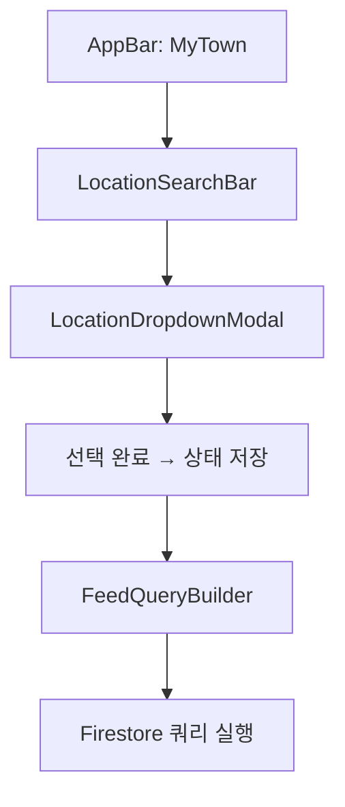
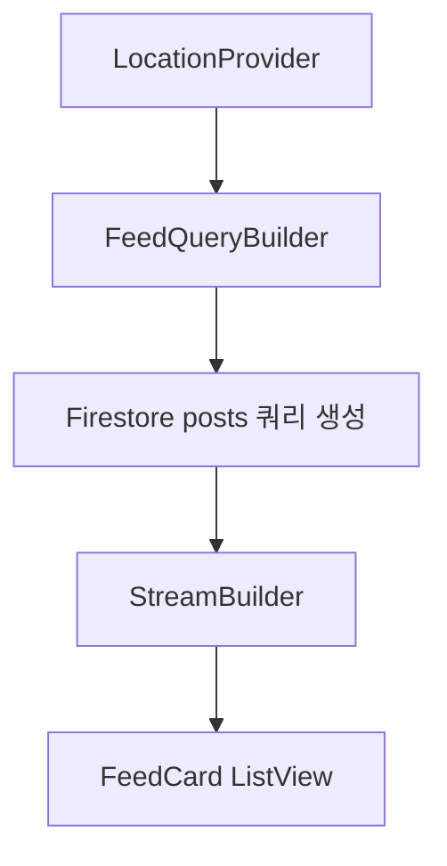
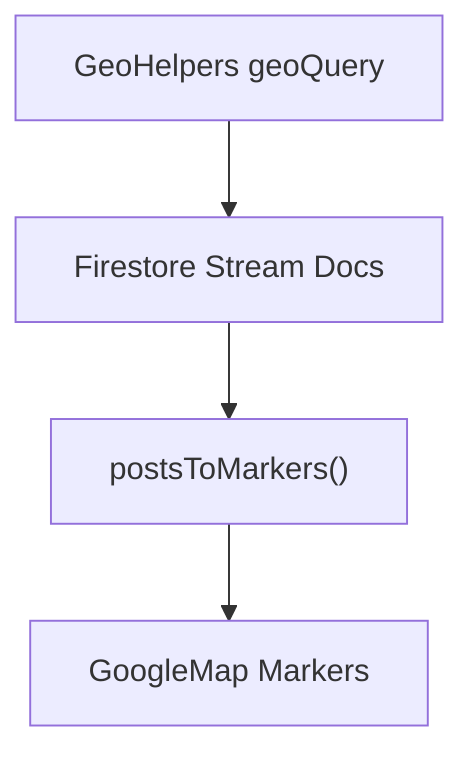

# 1_99. 📌 Bling 인도네시아 주소 표기 & DropDown 정책
# 📌 Bling 인도네시아 주소 표기 & DropDown 정책 (Ver.0.4)

## ✅ Singkatan(약어) 표기 원칙

모든 주소 표기는 인도네시아 공공 행정 표준 Singkatan(약어)을 사용합니다.

- Kecamatan → Kec.
    
- Kelurahan → Kel.
    
- Kabupaten → Kab.
    
- Provinsi → Prov.
    

예시:  
Kel. Panunggangan Barat, Kec. Cibodas, Kab. Tangerang, Prov. Banten

원칙 : ** 화면에 표시되는 피드 작성자 및 다른 사용자 주소는 "Kel.", "Kec."만 **

---

## ✅ 단계별 DropDown 흐름 (검색 & 등록)

1️⃣ 검색/등록 시작: **Kabupaten/Kota** 선택 (예: Kab. Tangerang)

2️⃣ 선택 단계:

- Kabupaten/Kota 선택 시 → 연관 Kecamatan 리스트 로드
    
- Kecamatan 선택 시 → Kelurahan 리스트 로드
    
- Kelurahan 선택 시 → RT/RW 리스트 제공 (옵션)
    

3️⃣ RT/RW:

- 필수 아님 (사용자가 원하는 경우에만 세부 선택)
    
- 등록/검색 설정에서 옵션으로 선택 가능
    

4️⃣ 저장 구조:

- `locationParts` 필드에 단계별로 Singkatan 표기로 저장
    
- `locationName`은 Singkatan을 포함한 풀 스트링으로 구성
    

Firestore 저장 예시:

```json
{
  "locationParts": {
    "kabupaten": "Kab. Tangerang",
    "kecamatan": "Kec. Cibodas",
    "kelurahan": "Kel. Panunggangan Barat",
    "rt": "RT.03",
    "rw": "RW.05"
  },
  "locationName": "Kel. Panunggangan Barat, Kec. Cibodas, Kab. Tangerang"
}
```

---

## ✅ Feed & 쿼리 구조 변경

- 기본 쿼리: `kabupaten` 기준으로 시작
    
- 단계별 옵션: `kecamatan` → `kelurahan` → RT/RW 리스트 정렬 옵션
    
- RT/RW Equal 쿼리는 선택 시에만 활성화
    
- 반경 검색은 GeoPoint + geohash 유지
    

Firestore 쿼리 예시:

```dart
query
  .where('kabupaten', isEqualTo: 'Kab. Tangerang')
  .where('kecamatan', isEqualTo: 'Kec. Cibodas')
  .where('kelurahan', isEqualTo: 'Kel. Panunggangan Barat')
  .where('rt', isEqualTo: 'RT.03') // 옵션
  .where('rw', isEqualTo: 'RW.05') // 옵션
```

---

## ✅ 적용 대상 문서 링크

- `📌 Bling_Project_Overview`
    
- `📌 Bling_User_Field_Standard`
    
- `📌 Bling_Local_Feed_Policy`
    
- `📌 Bling_TrustLevel_Policy`
    
- `📌 Bling_Development_Roadmap`


# 5_28. LocationName_UI_표시정책
# 📍 Bling_LocationName_UI_표시정책.md

## ✅ 목적

블링 프로젝트는 Keluharan(Kel.) 기반 지역 SNS의 특성상  
위치 정보가 필수지만, 모바일 화면에서 길이가 길어지는 것을 방지하기 위해  
**"풀주소 저장 + 단계별 축약 + 아이콘/Badge 표시"**를 표준 규칙으로 정의한다.

---

## 🔑 핵심 원칙

| 원칙           | 설명                                                            |
| ------------ | ------------------------------------------------------------- |
| 📦 DB        | 풀주소 (RT, RW, Kelurahan, Kecamatan, Kabupaten, Provinsi) 전체 저장 |
| 👀 UI        | 무조건 축약해 표시 Kel. Kec. Kab. Prov.                               |
| 🏷️ 표기       | 아이콘/Badge로 시각적으로 간결화                                          |
| 🔗 표준 Helper | Dart Helper 함수로 통일 관리                                         |
| ⚙️ Overflow  | Flutter `TextOverflow.ellipsis` 필수 적용                         |

---

## 🗂️ 화면별 표기 가이드

| 화면 | 표기 방식 | 예시 |
|------|------------|------|
| 📄 Feed 카드 | `RW` + Kelurahan | 🏘️ RW 05 - Panunggangan |
| 🧭 Nearby | `RW` + Kecamatan | 🏘️ RW 05 📍 Kec. Cibodas |
| 👤 Neighbors 리스트 | `RW` + Kecamatan | 🏘️ RW 05 📍 Kec. Cibodas |
| 🗺️ 지도 툴팁 | `RW`만 | 🏘️ RW 05 |
| 📌 상세화면 | 풀주소 | RT.03/RW.05 - Panunggangan Barat, Kec. Cibodas, Kab. Tangerang, Prov. Banten |

---

## 🔑 Badge/아이콘 표기 예시

| 요소 | 아이콘 | 텍스트 |
|------|--------|--------|
| RW | 🏘️ | RW 05 |
| Kecamatan | 📍 | Kec. Cibodas |
| Kabupaten | 🏙️ | Kab. Tangerang |

---

## ⚙️ Dart Helper 함수 예시

```dart
String formatShortLocation({
  required String rw,
  required String? kelurahan,
  String? kecamatan,
  int level = 2,
}) {
  if (level == 1) {
    return "🏘️ RW $rw";
  } else if (level == 2) {
    return "🏘️ RW $rw - $kelurahan";
  } else {
    return "🏘️ RW $rw 📍 Kec. $kecamatan";
  }
}
```

---

## 🗂️ Overflow 처리 예시

```dart
Text(
  formatShortLocation(rw: "05", kelurahan: "Panunggangan", kecamatan: "Cibodas"),
  maxLines: 1,
  overflow: TextOverflow.ellipsis,
)
```

---

## 📌 규칙 요약

1️⃣ **저장 → 풀주소**  
2️⃣ **노출 → 단계별 축약**  
3️⃣ **아이콘/Badge로 구분**  
4️⃣ **Dart Helper로 표준화**  
5️⃣ **Overflow 처리 필수**

---

## ✅ 적용 예시 JSON

```json
{
  "location": GeoPoint,
  "locationName": "RT.03/RW.05 - Panunggangan Barat, Kec. Cibodas, Kab. Tangerang, Prov. Banten",
  "locationParts": {
    "rt": "03",
    "rw": "05",
    "kelurahan": "Panunggangan Barat",
    "kecamatan": "Cibodas",
    "kabupaten": "Kabupaten Tangerang",
    "province": "Banten"
  }
}
```

---

## 📎 연관 문서

- [[34. Bling_user_Field_컬렉션_구조_제안]]
- [[Ayo_Location_저장_정책]]
- [[Ayo_Profile_구성]]

---

## ✅ 결론

Ayo 위치 표시는  
**"전체 저장 + 상황별 축약 + 아이콘/Badge 시각화"** 로  
지역성 가시성과 모바일 UX를 동시에 만족시킨다.


# 5_29. Location_계층형_카테고리_구성
# 🗂️ Bling_Location_계층형_카테고리_구성.md

## ✅ 목적

Bling 프로젝트는  Keluharan(Kel.) 기반 지역 SNS 특성상  
위치 정보의 신뢰성과 검색 효율성을 동시에 만족시키기 위해  
**RT/RW(옵션) → Kelurahan → Kecamatan → Kabupaten**의 계층형 카테고리 구조를 표준으로 적용한다.

---

## 🔑 계층 구조

| 단계             | 예시                  |
| -------------- | ------------------- |
| RT[]           | RT.03               |
| RW[]           | RW.05               |
| Kelurahan      | Panunggangan Barat  |
| Kecamatan      | Cibodas             |
| Kabupaten/Kota | Kabupaten Tangerang |
| Province       | Banten              |

---

## 🗂️ Firestore 구조 예시

```plaintext
kecamatan/{kecamatanId}
  kelurahan/{kelurahanId}
    rw/{rwId}
      rt/{rtId}
        posts/{postId}
```

또는

```plaintext
posts/{postId}
  필드:
    rt: RT.03
    rw: RW.05
    kelurahan: Panunggangan Barat
    kecamatan: Cibodas
    kabupaten: Kabupaten Tangerang
    province: Banten
```

---

## 📌 게시물 필드 구조

| 필드명 | 값 | 설명 |
|--------|-----|------|
| rt | RT.03 | RT |
| rw | RW.05 | RW |
| kelurahan | Panunggangan Barat | Kelurahan |
| kecamatan | Cibodas | Kecamatan |
| kabupaten | Kabupaten Tangerang | Kabupaten |
| province | Banten | Provinsi |
| locationName | RT.03/RW.05 - Panunggangan Barat, Kec. Cibodas | 표기 |
| location | GeoPoint | 반경 쿼리용 |

---

## 🔍 쿼리 흐름 예시

| 시나리오                 | 쿼리                                        |
| -------------------- | ----------------------------------------- |
| 내 Keluharan(Kec.) 글만 | 옵션 `where rt == 'RT.03' && rw == 'RW.05'` |
| Kelurahan 단위         | `where kelurahan == 'Panunggangan Barat'` |
| Kecamatan 단위         | `where kecamatan == 'Cibodas'`            |

---

## ✅ 데이터 입력 정책

1️⃣ **Kelurahan(Kec.) 는 사용자가 직접 선택 (RT/RW 옵션)**  
2️⃣ **Kelurahan, Kecamatan은 GPS Reverse Geocode로 자동 파악**  
3️⃣ **Kabupaten/Kota, Province는 자동 저장**

---

## 🔗 카테고리 혼합 구조

| 필드 | 예시 |
|------|------|
| category | lostFound, market, announcement 등 |
| rt, rw, kelurahan, kecamatan | 위치 계층 필드 |

---

## 📌 활용 예시

- Kelurahan(Kec.) 기반 커뮤니티 피드 → **내 동네**
- Kecamatan 기반 → **Nearby Feed**
- Kabupaten 단위 → **행정단위별 통계**

---

## 📂 **실제 Post 구조 샘플**

```
json

{
  "postId": "abc123",
  "userId": "uid123",
  "title": "잃어버린 강아지를 찾습니다",
  "body": "...",
  "category": "lostFound",           // 고정 카테고리
  "tags": ["강아지", "RT05"],         // 사용자 자유 태그
  "rt": "RT.03",
  "rw": "RW.05",
  "kelurahan": "Panunggangan Barat",
  "kecamatan": "Cibodas",
  "kabupaten": "Kabupaten Tangerang",
  "province": "Banten",
  "location": GeoPoint
}

```


# 피드 관련 위치 검색 규칙과 예시

**전체 피드 검색룰 (Kap. → Kec. → Kel. → RT/RW 자동 정렬)**을 **전담 처리하는 위젯 구조** 설계.  

문서들(`주소 DropDown 정책`, `UIUX Guide`, `Firestore 구조`, `메인화면 AppBar`)을 종합 단계별로 정리.

---

## ✅ 1️⃣ 핵심 요구사항 재정리

- **검색 시작 기준**: 무조건 _Kabupaten_ 단위 (`Kap.`).
    
- 그다음 **계층적 필터**: _Kecamatan → Kelurahan → RT/RW_ (RT/RW는 옵션, 선택 시 자동 정렬).
    
- Firestore 쿼리 조건: 단계별 `where` + `orderBy` + GeoQuery 혼합.
    
- DropDown 선택 시 상위 선택에 따라 하위 리스트 동적 로드.
    

---

## ✅ 2️⃣ 추천 위젯 구조

아래 3개 파트로 나눠 관리하세요.

### ✔️ (1) `LocationSearchBar` (AppBar 중앙)

- 역할: 현재 선택된 `Kap.` → `Kec.` → `Kel.` → `RT/RW`를 한 줄로 요약 표시.
    
- 클릭 시: `ModalBottomSheet`로 단계별 드롭다운 표시.
    
- 내부 로직: `FutureBuilder`로 선택 옵션 로드 → Firestore 또는 Local JSON.
    

### ✔️ (2) `LocationDropdownModal` (하위 단계 선택)

- 내용: `DropdownButton` or `ListTile` 단계별 스텝:
    
    - `Kabupaten` 선택 → `Kecamatan` 목록 동적 로드
        
    - `Kecamatan` 선택 → `Kelurahan` 목록 동적 로드
        
    - `Kelurahan` 선택 → RT/RW 선택 (옵션)
        
- 선택 완료 → `Provider` 또는 `Riverpod` 상태 갱신.
    

### ✔️ (3) `FeedQueryBuilder` (리스트 쿼리 컨트롤러)

- Firestore 쿼리 구성:
    
    ```dart
    query
      .where('kabupaten', isEqualTo: 'Kab. Tangerang')
      .where('kecamatan', isEqualTo: 'Kec. Cibodas')
      .where('kelurahan', isEqualTo: 'Kel. Panunggangan Barat')
      .orderBy('rw') // 옵션
    ```
    
- RT/RW가 선택되면 `where`에 추가, 미선택 시 전체 포함.
    
- GeoQuery도 병행 (반경 검색 등).
    

---

## ✅ 3️⃣ Firestore 구조 연동

> 📂 posts/{postId}
> 
> ```
> {
>   "kabupaten": "Kab. Tangerang",
>   "kecamatan": "Kec. Cibodas",
>   "kelurahan": "Kel. Panunggangan Barat",
>   "rt": "RT.03",
>   "rw": "RW.05"
>   ...
> }
> ```

- Firestore에 반드시 _Singkatan_ 표기로 저장!
    
- DropDown 선택 값도 Singkatan 표기 강제 적용.
    

---

## ✅ 4️⃣ UI 연계 흐름 (메인화면)



---

## ✅ 5️⃣ 핵심 기술 스택

- 상태관리: `Provider` or `Riverpod`
    
- Firestore 쿼리: `StreamBuilder` + `.where()` + `.orderBy()`
    
- 위치 목록 캐싱: `Local JSON` + `Firestore` 연동
    
- DropDown Modal: `showModalBottomSheet` or `showDialog`
    

---

## ✅ 6️⃣ 샘플 위젯 파일 구조 제안

```
lib/features/location/widgets/
  ├── location_search_bar.dart
  ├── location_dropdown_modal.dart
  ├── location_provider.dart
  ├── location_query_builder.dart
```

---

## ✅ ✅ 정리

이 흐름으로 가면:

- 🔍 **검색 정확도**: Kab. → Kec. → Kel. → RT/RW 완벽 분기
    
- ⚙️ **구현 난이도**: Flutter 기본 위젯으로 구성 가능
    
- 🔄 **확장성**: 반경 검색, GeoHash, Privacy 옵션 모두 대응 가능
    

 
##  location_provider.dart 설계 가이드   

이 파일은 **Kabupaten → Kecamatan → Kelurahan → RT/RW 선택 상태 + Firestore 쿼리용 기준**을 모두 관리하는 **상태 저장용 Provider**입니다.

---

## ✅ 1️⃣ 기본 역할

- `selectedKabupaten`, `selectedKecamatan`, `selectedKelurahan`, `selectedRT`, `selectedRW` 저장
    
- 단계별 선택 변경 시 **하위 단계 자동 초기화**
    
- `Map<String, String>` 형태로 Singkatan 포함 값 관리
    
- Firestore 쿼리에서 `where` 파라미터로 바로 사용 가능
    

---

## ✅ 2️⃣ 의존 패키지

```dart
import 'package:flutter/material.dart';
```

> Provider는 기본 `ChangeNotifier` 기반입니다. (Riverpod이면 별도 구조 필요)

---

## ✅ 3️⃣ 기본 구조 예시

```dart
// lib/features/location/controllers/location_provider.dart

import 'package:flutter/material.dart';

class LocationProvider with ChangeNotifier {
  String? selectedKabupaten; // Kap.
  String? selectedKecamatan; // Kec.
  String? selectedKelurahan; // Kel.
  String? selectedRT;        // RT (옵션)
  String? selectedRW;        // RW (옵션)

  /// Singkatan 표기 Map 예: {'kabupaten': 'Kab. Tangerang', ...}
  Map<String, String> get selectedLocationMap => {
    'kabupaten': selectedKabupaten ?? '',
    'kecamatan': selectedKecamatan ?? '',
    'kelurahan': selectedKelurahan ?? '',
    'rt': selectedRT ?? '',
    'rw': selectedRW ?? '',
  };

  /// 단계별 선택 함수
  void selectKabupaten(String kab) {
    selectedKabupaten = kab;
    // 상위 단계 바뀌면 하위 단계 초기화
    selectedKecamatan = null;
    selectedKelurahan = null;
    selectedRT = null;
    selectedRW = null;
    notifyListeners();
  }

  void selectKecamatan(String kec) {
    selectedKecamatan = kec;
    selectedKelurahan = null;
    selectedRT = null;
    selectedRW = null;
    notifyListeners();
  }

  void selectKelurahan(String kel) {
    selectedKelurahan = kel;
    selectedRT = null;
    selectedRW = null;
    notifyListeners();
  }

  void selectRT(String rt) {
    selectedRT = rt;
    notifyListeners();
  }

  void selectRW(String rw) {
    selectedRW = rw;
    notifyListeners();
  }

  /// 전체 초기화 (사용자 위치 변경 등)
  void resetLocation() {
    selectedKabupaten = null;
    selectedKecamatan = null;
    selectedKelurahan = null;
    selectedRT = null;
    selectedRW = null;
    notifyListeners();
  }

  /// Firestore 쿼리 파라미터로 사용할 Map
  Map<String, dynamic> get firestoreQueryParams {
    final map = <String, dynamic>{};
    if (selectedKabupaten != null) map['kabupaten'] = selectedKabupaten;
    if (selectedKecamatan != null) map['kecamatan'] = selectedKecamatan;
    if (selectedKelurahan != null) map['kelurahan'] = selectedKelurahan;
    if (selectedRT != null) map['rt'] = selectedRT;
    if (selectedRW != null) map['rw'] = selectedRW;
    return map;
  }
}
```

---

## ✅ 4️⃣ `main.dart` 또는 `provider.dart` 연결 예시

```dart
import 'package:provider/provider.dart';
import 'features/location/controllers/location_provider.dart';

void main() {
  runApp(
    MultiProvider(
      providers: [
        ChangeNotifierProvider(create: (_) => LocationProvider()),
        // 다른 Provider 추가
      ],
      child: MyApp(),
    ),
  );
}
```

---

## ✅ 5️⃣ `FeedQueryBuilder` 연동 예시

```dart
final locationProvider = Provider.of<LocationProvider>(context);
final queryParams = locationProvider.firestoreQueryParams;

Query postsQuery = FirebaseFirestore.instance.collection('posts');

queryParams.forEach((key, value) {
  if (value != null && value.toString().isNotEmpty) {
    postsQuery = postsQuery.where(key, isEqualTo: value);
  }
});

// 이후 StreamBuilder로 postsQuery 사용
```

---

## ✅ 핵심 요약

✅ 단계별 선택 → 자동 초기화  
✅ Singkatan 그대로 저장 → 쿼리 재사용  
✅ Firestore 쿼리 파라미터 생성 → 가볍게 적용

---

## location_dropdown_modal.dart**` 샘플

이 파일은 `LocationProvider`와 연결되어 **Kabupaten → Kecamatan → Kelurahan → RT/RW 단계 선택**을 **ModalBottomSheet**로 표시하고, 선택 시 상태를 바로 바꿉니다.

---

## ✅ 1️⃣ 파일 역할

- `LocationProvider`에서 현재 선택 값 읽음
    
- 상위 선택에 따라 하위 단계 옵션 로드 (`FutureBuilder` or `local JSON`)
    
- 선택 시 상태 변경 → 하위 단계 초기화
    
- 완료 버튼 → `Navigator.pop(context)`
    

---

## ✅ 2️⃣ 샘플 구조 예시

```dart
// lib/features/location/widgets/location_dropdown_modal.dart

import 'package:flutter/material.dart';
import 'package:provider/provider.dart';
import '../controllers/location_provider.dart';

class LocationDropdownModal extends StatelessWidget {
  const LocationDropdownModal({super.key});

  @override
  Widget build(BuildContext context) {
    final locationProvider = Provider.of<LocationProvider>(context);

    return SafeArea(
      child: Padding(
        padding: const EdgeInsets.all(16.0),
        child: Column(
          mainAxisSize: MainAxisSize.min,
          children: [
            const Text(
              '📍 위치 선택',
              style: TextStyle(fontSize: 18, fontWeight: FontWeight.bold),
            ),
            const SizedBox(height: 16),

            /// 1️⃣ Kabupaten 선택
            DropdownButtonFormField<String>(
              value: locationProvider.selectedKabupaten,
              hint: const Text('Kabupaten 선택'),
              items: _getKabupatenList().map((kab) {
                return DropdownMenuItem(value: kab, child: Text(kab));
              }).toList(),
              onChanged: (value) {
                if (value != null) {
                  locationProvider.selectKabupaten(value);
                }
              },
            ),
            const SizedBox(height: 12),

            /// 2️⃣ Kecamatan 선택
            DropdownButtonFormField<String>(
              value: locationProvider.selectedKecamatan,
              hint: const Text('Kecamatan 선택'),
              items: locationProvider.selectedKabupaten == null
                  ? []
                  : _getKecamatanList(locationProvider.selectedKabupaten!)
                      .map((kec) {
                      return DropdownMenuItem(value: kec, child: Text(kec));
                    }).toList(),
              onChanged: (value) {
                if (value != null) {
                  locationProvider.selectKecamatan(value);
                }
              },
            ),
            const SizedBox(height: 12),

            /// 3️⃣ Kelurahan 선택
            DropdownButtonFormField<String>(
              value: locationProvider.selectedKelurahan,
              hint: const Text('Kelurahan 선택'),
              items: locationProvider.selectedKecamatan == null
                  ? []
                  : _getKelurahanList(locationProvider.selectedKecamatan!)
                      .map((kel) {
                      return DropdownMenuItem(value: kel, child: Text(kel));
                    }).toList(),
              onChanged: (value) {
                if (value != null) {
                  locationProvider.selectKelurahan(value);
                }
              },
            ),
            const SizedBox(height: 12),

            /// 4️⃣ RT 선택 (옵션)
            DropdownButtonFormField<String>(
              value: locationProvider.selectedRT,
              hint: const Text('RT 선택 (옵션)'),
              items: _getRTList().map((rt) {
                return DropdownMenuItem(value: rt, child: Text(rt));
              }).toList(),
              onChanged: (value) {
                if (value != null) {
                  locationProvider.selectRT(value);
                }
              },
            ),
            const SizedBox(height: 12),

            /// 5️⃣ RW 선택 (옵션)
            DropdownButtonFormField<String>(
              value: locationProvider.selectedRW,
              hint: const Text('RW 선택 (옵션)'),
              items: _getRWList().map((rw) {
                return DropdownMenuItem(value: rw, child: Text(rw));
              }).toList(),
              onChanged: (value) {
                if (value != null) {
                  locationProvider.selectRW(value);
                }
              },
            ),

            const SizedBox(height: 20),
            ElevatedButton(
              onPressed: () => Navigator.pop(context),
              child: const Text('선택 완료'),
            ),
          ],
        ),
      ),
    );
  }

  /// 샘플 데이터: 실제로는 Firestore 또는 JSON Local 캐싱 사용!
  List<String> _getKabupatenList() {
    return ['Kab. Tangerang', 'Kab. Bekasi', 'Kab. Bogor'];
  }

  List<String> _getKecamatanList(String kabupaten) {
    switch (kabupaten) {
      case 'Kab. Tangerang':
        return ['Kec. Cibodas', 'Kec. Karawaci', 'Kec. Serpong'];
      case 'Kab. Bekasi':
        return ['Kec. Jatiasih', 'Kec. Pondokgede'];
      default:
        return [];
    }
  }

  List<String> _getKelurahanList(String kecamatan) {
    switch (kecamatan) {
      case 'Kec. Cibodas':
        return ['Kel. Panunggangan Barat', 'Kel. Poris'];
      case 'Kec. Karawaci':
        return ['Kel. Bojong Nangka', 'Kel. Binong'];
      default:
        return [];
    }
  }

  List<String> _getRTList() {
    return ['RT.01', 'RT.02', 'RT.03', 'RT.04', 'RT.05'];
  }

  List<String> _getRWList() {
    return ['RW.01', 'RW.02', 'RW.03', 'RW.04', 'RW.05'];
  }
}
```

---

## ✅ 3️⃣ 주요 포인트

- **단계별로 상위 값 없으면 드롭다운 비활성화** (`items: []`)
    
- **선택하면 하위 단계 자동 초기화** (`Provider` 로직에 따라)
    
- 실무에서는 `_getXList()` 대신 **Firestore → `FutureBuilder`**로 교체하면 됩니다.
    
- 선택 완료 시 `Navigator.pop()`으로 모달 닫음.
    

---

## ✅ 4️⃣ 실제 호출 예시 (AppBar 등에서)

```dart
InkWell(
  onTap: () {
    showModalBottomSheet(
      context: context,
      isScrollControlled: true,
      builder: (_) => const LocationDropdownModal(),
    );
  },
  child: Row(
    children: [
      Text('📍 내 동네 변경'),
      const Icon(Icons.arrow_drop_down),
    ],
  ),
)
```

---

## ✅ 이렇게 연결하면?

- 👉 메인화면 AppBar에서 한 줄 요약 주소 → 모달 열림
    
- 👉 단계별로 선택 → Provider 상태 갱신
    
- 👉 Firestore 쿼리는 `locationProvider.firestoreQueryParams` 사용
    

---


## FeedQueryBuilder 구조를 **`location_provider` + Firestore 쿼리**랑 바로 연결 예시

---

## ✅ 목표

- `LocationProvider`에서 선택된 주소 기준으로 `posts` 컬렉션 쿼리
    
- RT/RW 옵션이 있으면 포함, 없으면 상위만 적용
    
- GeoPoint 반경 검색과 `createdAt` 최신순 정렬까지 예시 포함
    

---

## ✅ 1️⃣ 기본 구조 예시

```dart
// lib/features/feed/data/feed_query_builder.dart

import 'package:cloud_firestore/cloud_firestore.dart';
import 'package:flutter/material.dart';
import 'package:provider/provider.dart';
import '../../location/controllers/location_provider.dart';

class FeedQueryBuilder extends StatelessWidget {
  final Widget Function(Query) builder;

  const FeedQueryBuilder({super.key, required this.builder});

  @override
  Widget build(BuildContext context) {
    final locationProvider = Provider.of<LocationProvider>(context);

    /// 선택된 위치 파라미터 가져오기
    final params = locationProvider.firestoreQueryParams;

    /// Firestore 쿼리 기본값 (posts)
    Query query = FirebaseFirestore.instance
        .collection('posts')
        .orderBy('createdAt', descending: true);

    /// 단계별 조건 추가
    if (params['kabupaten'] != null) {
      query = query.where('kabupaten', isEqualTo: params['kabupaten']);
    }
    if (params['kecamatan'] != null) {
      query = query.where('kecamatan', isEqualTo: params['kecamatan']);
    }
    if (params['kelurahan'] != null) {
      query = query.where('kelurahan', isEqualTo: params['kelurahan']);
    }
    if (params['rt'] != null && params['rt'].toString().isNotEmpty) {
      query = query.where('rt', isEqualTo: params['rt']);
    }
    if (params['rw'] != null && params['rw'].toString().isNotEmpty) {
      query = query.where('rw', isEqualTo: params['rw']);
    }

    /// 🔑 반경 검색 예시 (geohash)
    /// 필요하면 GeoQuery 추가
    // query = query.where('geohash', isGreaterThanOrEqualTo: lowerBound)
    //              .where('geohash', isLessThanOrEqualTo: upperBound);

    /// builder 콜백으로 StreamBuilder에서 사용
    return builder(query);
  }
}
```

---

## ✅ 2️⃣ `FeedScreen` 에서 사용하는 예시

```dart
// lib/features/feed/screens/feed_screen.dart

import 'package:flutter/material.dart';
import 'package:cloud_firestore/cloud_firestore.dart';
import '../data/feed_query_builder.dart';

class FeedScreen extends StatelessWidget {
  const FeedScreen({super.key});

  @override
  Widget build(BuildContext context) {
    return FeedQueryBuilder(
      builder: (query) {
        return StreamBuilder<QuerySnapshot>(
          stream: query.snapshots(),
          builder: (context, snapshot) {
            if (snapshot.hasError) {
              return const Center(child: Text('에러 발생'));
            }
            if (snapshot.connectionState == ConnectionState.waiting) {
              return const Center(child: CircularProgressIndicator());
            }

            final docs = snapshot.data!.docs;
            if (docs.isEmpty) {
              return const Center(child: Text('게시물이 없습니다.'));
            }

            return ListView.builder(
              itemCount: docs.length,
              itemBuilder: (context, index) {
                final data = docs[index].data() as Map<String, dynamic>;
                final title = data['title'] ?? '';
                final body = data['body'] ?? '';
                return ListTile(
                  title: Text(title),
                  subtitle: Text(body),
                );
              },
            );
          },
        );
      },
    );
  }
}
```

---

## ✅ 3️⃣ 핵심 흐름 정리

1️⃣ **`location_provider`** → 선택 값 (`kabupaten`, `kecamatan`, `kelurahan`, `rt`, `rw`) 관리  
2️⃣ **`FeedQueryBuilder`** → 쿼리 생성 → `where` 조건 붙여서 필터링  
3️⃣ **`FeedScreen`** → `StreamBuilder`로 실시간 게시물 출력  
4️⃣ 필요 시 **GeoPoint + geohash** 확장해서 반경 검색 가능

---

## ✅ 4️⃣ UI 연결 흐름 (요약)



---

## ✅   팁

✅ RT/RW는 필수 ❌ → 선택 시만 Equal 쿼리  
✅ 반경은 GeoPoint + geohash → `where` Range + 인덱스 필수  
✅ Singkatan 표기(`Kab.`, `Kec.`, `Kel.`) → DB에 저장된 표기와 동일하게 매칭

---


## **Geo 반경 검색 쿼리  전담 geo_helpers.dart 예시  : 
Firestore + geohash 기반 
---

## ✅ 1️⃣ 핵심 역할

- 사용자가 위치 설정 (GeoPoint)
    
- 반경 (예: 1~5km) 지정
    
- `geohash` 범위로 `where` 쿼리 자동 생성
    
- Firestore `>=` `<=` 비교로 반경 필터링
    

---

## ✅ 2️⃣ 의존 패키지

- `geoflutterfire2` (권장)
    
- 또는 `geohash` 계산 직접 구현
    

실전에서는 `geoflutterfire2`가 유지보수 편합니다.

```yaml
dependencies:
  geoflutterfire2: ^2.3.15
  cloud_firestore: ^4.15.0
```

---

## ✅ 3️⃣ 샘플 `geo_helpers.dart`

```dart
// lib/core/utils/geo_helpers.dart

import 'package:cloud_firestore/cloud_firestore.dart';
import 'package:geoflutterfire2/geoflutterfire2.dart';

class GeoHelpers {
  final geo = GeoFlutterFire();

  /// GeoPoint + 반경 (km) → geohash Bounds 반환
  List<List<String>> getGeohashBounds(GeoPoint center, double radiusInKm) {
    final geoFirePoint = geo.point(
      latitude: center.latitude,
      longitude: center.longitude,
    );
    final bounds = geoFirePoint.data['geohash'];
    return [[bounds, bounds]]; // 이건 단일로는 무의미, 아래 Query에 쓰임
  }

  /// GeoPoint + 반경 쿼리 생성 (Firestore Query)
  Stream<List<DocumentSnapshot>> geoRadiusQuery({
    required String collectionName,
    required GeoPoint center,
    required double radiusInKm,
  }) {
    final collectionRef = FirebaseFirestore.instance.collection(collectionName);
    final geoRef = geo.collection(collectionRef);

    final geoFirePoint = geo.point(
      latitude: center.latitude,
      longitude: center.longitude,
    );

    return geoRef.within(
      center: geoFirePoint,
      radius: radiusInKm,
      field: 'location', // Firestore 문서의 GeoPoint 필드명
    );
  }
}
```

---

## ✅ 4️⃣ FeedQueryBuilder에서 사용하는 패턴 예시

```dart
import 'package:cloud_firestore/cloud_firestore.dart';
import '../../../core/utils/geo_helpers.dart';

final geoHelpers = GeoHelpers();

final geoQueryStream = geoHelpers.geoRadiusQuery(
  collectionName: 'posts',
  center: GeoPoint(-6.2, 106.8), // 사용자 중심 좌표
  radiusInKm: 3.0, // 반경 3km
);
```

이렇게 하면 `geoQueryStream`은 `Stream<List<DocumentSnapshot>>`로 실시간으로 반경 내 문서를 가져옵니다.

---

## ✅ 5️⃣ 실무 추천 필드 구성

`posts` 문서 구조:

```json
{
  "location": GeoPoint,
  "geohash": "u6k2kq..."
}
```

> 📌 주의: `geoflutterfire2`는 `geohash`를 직접 넣지 않고 GeoPoint만 있으면 자동으로 계산!

---

## ✅ 6️⃣ Geo 반경과 단계별 Equal 쿼리 병행하려면?

> 예: 반경 + `kabupaten`, `kecamatan` 같이 쓰기

```dart
final geoQueryStream = geoHelpers.geoRadiusQuery(
  collectionName: 'posts',
  center: GeoPoint(-6.2, 106.8),
  radiusInKm: 3.0,
);

geoQueryStream.listen((docs) {
  final filteredDocs = docs.where((doc) {
    final data = doc.data() as Map<String, dynamic>;
    return data['kabupaten'] == 'Kab. Tangerang'
        && data['kecamatan'] == 'Kec. Cibodas';
  }).toList();

  // filteredDocs → 원하는 리스트
});
```

---

## ✅ 7️⃣ Flow 요약 (반경 + 단계별)

```mermaid
flowchart TD
  A[GeoPoint + 반경] --> B[geohash Bounds 계산]
  B --> C[geoflutterfire2 within()]
  C --> D[Firestore posts 스트림]
  D --> E[조건: kabupaten, kecamatan filter where]
  E --> F[최종 Feed List]
```

---

## ✅ 8️⃣ 실전 주의점

✅ 반경 쿼리는 반드시 **GeoPoint 필드명 `location`** 일치  
✅ RT/RW는 Equal 쿼리로 추가 → 반경 내 RT 필터  
✅ 반경 쿼리는 **복합 인덱스 필요**: `geohash` + `createdAt`

---

## ✅ 여기까지 세트 완성!

이제:

- `location_provider.dart` → 위치 선택
    
- `location_dropdown_modal.dart` → UI 드롭다운
    
- `feed_query_builder.dart` → 단계별 + 반경 쿼리
    
- `geo_helpers.dart` → GeoPoint + geohash 반경
    

---

##  Geo 쿼리 유닛 테스트 예시 + Firestore 복합 인덱스 구성 + 지도 Marker 연계 흐름 예시.

---

## ✅ 1️⃣ Geo 쿼리 Unit Test 예시

테스트는 `flutter_test` + `cloud_firestore_mocks`로 진행합니다.  
Firestore 직접 Mock 할 수도 있고, 실제 Firestore 에뮬레이터를 추천합니다.

```dart
// test/geo_helpers_test.dart

import 'package:flutter_test/flutter_test.dart';
import 'package:cloud_firestore/cloud_firestore.dart';
import 'package:geoflutterfire2/geoflutterfire2.dart';
import 'package:your_project/core/utils/geo_helpers.dart';

void main() {
  test('GeoHelpers - geohash 쿼리 정상 동작', () async {
    final geoHelpers = GeoHelpers();
    final geo = GeoFlutterFire();

    final center = GeoPoint(-6.2, 106.8);
    final geoFirePoint = geo.point(latitude: center.latitude, longitude: center.longitude);

    // 샘플 Firestore 쿼리
    final queryStream = geoHelpers.geoRadiusQuery(
      collectionName: 'posts',
      center: center,
      radiusInKm: 1.0,
    );

    expect(queryStream, isNotNull);
  });
}
```

✅ 핵심: 에뮬레이터 환경에서 `posts` 컬렉션에 `location` 필드가 있는 더미 문서를 넣고 실행 → 반경 내 검색 결과를 비교.

---

## ✅ 2️⃣ Firestore 복합 인덱스 구성

> 📌 _Geo 반경 쿼리 + 단계별 Equal 쿼리 = 복합 인덱스 필요_

예:

```
Collection: posts
Fields: kabupaten == 'Kab. Tangerang' AND kecamatan == 'Kec. Cibodas' AND geohash
```

**Firestore Console에서 인덱스 등록:**  
1️⃣ Firestore → 인덱스 → 새 복합 인덱스 추가  
2️⃣ Collection: `posts`  
3️⃣ 필드:

- `kabupaten` : Ascending
    
- `kecamatan` : Ascending
    
- `geohash` : Ascending
    
- `createdAt` : Descending (정렬용)
    

4️⃣ 저장 → 인덱스 생성까지 약 2~5분 소요.

---

## ✅ 3️⃣ 지도 Marker 연계 흐름 (Google Maps 예시)

```dart
import 'package:google_maps_flutter/google_maps_flutter.dart';

/// Firestore 문서 → Marker 변환
Set<Marker> postsToMarkers(List<DocumentSnapshot> docs) {
  final markers = <Marker>{};

  for (final doc in docs) {
    final data = doc.data() as Map<String, dynamic>;
    final geo = data['location'] as GeoPoint;
    final title = data['title'] ?? '';

    markers.add(
      Marker(
        markerId: MarkerId(doc.id),
        position: LatLng(geo.latitude, geo.longitude),
        infoWindow: InfoWindow(title: title),
      ),
    );
  }

  return markers;
}
```

✅ `geoQueryStream.listen()` 결과를 `Set<Marker>`로 변환 → `GoogleMap` 위에 `markers: postsToMarkers(docs)`로 렌더링.

---

## ✅ 4️⃣ 실무 Map 연동 Flow



---

## ✅ 5️⃣ 예시: Map 위 반경 Circle 표시

```dart
Circle(
  circleId: const CircleId('search_radius'),
  center: LatLng(center.latitude, center.longitude),
  radius: radiusInKm * 1000, // km → meters
  fillColor: Colors.blue.withOpacity(0.1),
  strokeColor: Colors.blue,
  strokeWidth: 2,
);
```

---

## ✅ 6️⃣ 정리: Bling용 실전 흐름 세트

1️⃣ `location_provider.dart` → 단계별 주소 상태  
2️⃣ `location_dropdown_modal.dart` → 단계별 선택 UI  
3️⃣ `feed_query_builder.dart` → Firestore + Geo 쿼리  
4️⃣ `geo_helpers.dart` → 반경 검색 + geohash  
5️⃣ Unit Test → 에뮬레이터로 쿼리 QA  
6️⃣ Firestore 인덱스 → geohash + Equal 복합 인덱스  
7️⃣ Google Maps → Marker + Circle 렌더링

---

## ✅ 이렇게 하면 Planner님 프로젝트가

- 📌 **Kabupaten → Kec. → Kel. → RT/RW + 반경** 동시 지원
    
- 🔍 **TrustLevel 필터**, **AI Verified 필터** 같은 추가 조건도 쉽게 결합 가능
    
- 📊 **지도 기반 UX** + **Feed 리스트** 동기화 가능
    

---

## 🔥  최종 세트  **반경 슬라이더 + 지도 + Feed 연동  `main.dart` 통합 샘플 

---

## ✅ 1️⃣ 흐름 목표

- 지도 위에 사용자 중심 GeoPoint → 반경 Circle
    
- 반경 슬라이더로 실시간 반경 조정
    
- Firestore 반경 쿼리 → Marker 표시 + Feed 리스트 동기화
    
- 위치 드롭다운(주소 단계)로 Equal 쿼리 같이 적용
    

---

## ✅ 2️⃣ `main.dart` 구조 예시

```dart
// lib/main.dart

import 'package:flutter/material.dart';
import 'package:provider/provider.dart';
import 'package:cloud_firestore/cloud_firestore.dart';
import 'package:google_maps_flutter/google_maps_flutter.dart';

import 'features/location/controllers/location_provider.dart';
import 'core/utils/geo_helpers.dart';
import 'features/feed/data/feed_query_builder.dart';

void main() {
  runApp(
    MultiProvider(
      providers: [
        ChangeNotifierProvider(create: (_) => LocationProvider()),
      ],
      child: const MyApp(),
    ),
  );
}

class MyApp extends StatelessWidget {
  const MyApp({super.key});
  @override
  Widget build(BuildContext context) {
    return const MaterialApp(
      home: MapFeedScreen(),
    );
  }
}

class MapFeedScreen extends StatefulWidget {
  const MapFeedScreen({super.key});

  @override
  State<MapFeedScreen> createState() => _MapFeedScreenState();
}

class _MapFeedScreenState extends State<MapFeedScreen> {
  final GeoHelpers geoHelpers = GeoHelpers();
  GeoPoint center = const GeoPoint(-6.2, 106.8);
  double radiusInKm = 3.0;
  Set<Marker> markers = {};

  @override
  Widget build(BuildContext context) {
    final locationProvider = Provider.of<LocationProvider>(context);

    return Scaffold(
      appBar: AppBar(
        title: const Text('Bling Map + Feed'),
        actions: [
          IconButton(
            icon: const Icon(Icons.location_on),
            onPressed: () {
              showModalBottomSheet(
                context: context,
                isScrollControlled: true,
                builder: (_) => const LocationDropdownModal(),
              );
            },
          ),
        ],
      ),
      body: Column(
        children: [
          /// 지도 영역
          SizedBox(
            height: 300,
            child: StreamBuilder<List<DocumentSnapshot>>(
              stream: geoHelpers.geoRadiusQuery(
                collectionName: 'posts',
                center: center,
                radiusInKm: radiusInKm,
              ),
              builder: (context, snapshot) {
                if (snapshot.hasData) {
                  final docs = snapshot.data!;
                  // 단계별 필터 같이 적용
                  final filteredDocs = docs.where((doc) {
                    final data = doc.data() as Map<String, dynamic>;
                    final params = locationProvider.firestoreQueryParams;
                    bool matches = true;
                    params.forEach((key, value) {
                      if (value != null &&
                          value.toString().isNotEmpty &&
                          data[key] != value) {
                        matches = false;
                      }
                    });
                    return matches;
                  }).toList();

                  // Marker로 변환
                  markers = postsToMarkers(filteredDocs);

                  return GoogleMap(
                    initialCameraPosition: CameraPosition(
                      target: LatLng(center.latitude, center.longitude),
                      zoom: 14,
                    ),
                    markers: markers,
                    circles: {
                      Circle(
                        circleId: const CircleId('search_radius'),
                        center: LatLng(center.latitude, center.longitude),
                        radius: radiusInKm * 1000,
                        fillColor: Colors.blue.withOpacity(0.1),
                        strokeColor: Colors.blue,
                        strokeWidth: 2,
                      ),
                    },
                  );
                }
                return const Center(child: CircularProgressIndicator());
              },
            ),
          ),

          /// 반경 슬라이더
          Padding(
            padding: const EdgeInsets.all(8.0),
            child: Row(
              children: [
                const Text('반경:'),
                Expanded(
                  child: Slider(
                    value: radiusInKm,
                    min: 1.0,
                    max: 10.0,
                    divisions: 9,
                    label: '${radiusInKm.toStringAsFixed(1)} km',
                    onChanged: (value) {
                      setState(() {
                        radiusInKm = value;
                      });
                    },
                  ),
                ),
              ],
            ),
          ),

          const Divider(),

          /// Feed 리스트
          Expanded(
            child: FeedQueryBuilder(
              builder: (query) {
                return StreamBuilder<QuerySnapshot>(
                  stream: query.snapshots(),
                  builder: (context, snapshot) {
                    if (snapshot.hasData) {
                      final docs = snapshot.data!.docs;
                      return ListView.builder(
                        itemCount: docs.length,
                        itemBuilder: (context, index) {
                          final data =
                              docs[index].data() as Map<String, dynamic>;
                          return ListTile(
                            title: Text(data['title'] ?? ''),
                            subtitle: Text(data['body'] ?? ''),
                          );
                        },
                      );
                    }
                    return const Center(child: CircularProgressIndicator());
                  },
                );
              },
            ),
          ),
        ],
      ),
    );
  }

  /// Marker Helper
  Set<Marker> postsToMarkers(List<DocumentSnapshot> docs) {
    final markers = <Marker>{};
    for (final doc in docs) {
      final data = doc.data() as Map<String, dynamic>;
      final geo = data['location'] as GeoPoint;
      final title = data['title'] ?? '';
      markers.add(
        Marker(
          markerId: MarkerId(doc.id),
          position: LatLng(geo.latitude, geo.longitude),
          infoWindow: InfoWindow(title: title),
        ),
      );
    }
    return markers;
  }
}
```

---

## ✅ 3️⃣ 핵심 흐름 요약

1️⃣ `GeoHelpers` → 반경 쿼리 Stream  
2️⃣ 단계별 주소 필터 Equal → `.where`로 추가 필터링  
3️⃣ 지도: 반경 Circle + Marker  
4️⃣ FeedQueryBuilder: 같은 파라미터로 리스트 출력  
5️⃣ 슬라이더로 반경 조정 시 setState → 실시간 갱신

---

## ✅ 4️⃣ 인덱스 연계 체크

Firestore Console:

```
posts:
  - geohash
  - kabupaten
  - kecamatan
  - kelurahan
  - createdAt
```

> `geohash` + Equal + 정렬 필드는 하나의 복합 인덱스로 묶으세요.

---

## ✅ 5️⃣ UI 팁

- `GoogleMap`은 API 키 등록 필수.
    
- 슬라이더 → 반경 실시간 반영.
    
- `ModalBottomSheet` → 단계별 DropDown 변경 즉시 Feed + Map 반영.
    

---

## ✅ 이렇게 하면 완전체!

✅ **위치 DropDown → 단계별 Singkatan Equal**  
✅ **Geo 반경 → Circle + Marker**  
✅ **Feed Query → Firestore StreamBuilder 동기화**  
✅ **슬라이더로 반경 조정 → 즉시 쿼리 재갱신**

---


 
# 📌 Bling_Location_GeoQuery_Structure.md

---
## **반경 + 단계별 주소 + 지도 + Feed 쿼리 연동 흐름**


## ✅ 목적

Bling 앱의 **전체 피드/마켓/이웃 검색**은  
**Kabupaten → Kecamatan → Kelurahan → RT/RW + 반경 GeoPoint** 구조로  
최적화됩니다. 이 문서는 Flutter + Firestore + Geo 쿼리 + Map 연동 전체 흐름을 정리합니다.

---

## ✅ 단계별 DropDown 흐름

| 단계 | 설명 |
| ---- | ---- |
| Kabupaten | 검색 시작 기준 (필수) |
| Kecamatan | Kabupaten 선택 시 활성화 |
| Kelurahan | Kecamatan 선택 시 활성화 |
| RT/RW | 옵션 단계 (선택 시 Equal Filter) |

- Singkatan 표기 필수: Kab., Kec., Kel., RT., RW.
- 선택 시 상위 단계가 바뀌면 하위 단계는 자동 초기화.

---

## ✅ Geo 반경 검색

- 중심점: 사용자 GeoPoint
- 반경: 1~10km (슬라이더로 조정)
- Firestore 쿼리: `geohash` + `location` + 단계별 Equal 혼합
- `geoflutterfire2` 패키지 사용

---

## ✅ 파일 구조 제안

```

lib/  
├── core/  
│ ├── utils/  
│ │ └── geo_helpers.dart  
├── features/  
│ ├── location/  
│ │ ├── controllers/location_provider.dart  
│ │ ├── widgets/location_dropdown_modal.dart  
│ ├── feed/  
│ │ ├── data/feed_query_builder.dart  
│ │ ├── screens/feed_screen.dart

````

---

## ✅ 핵심 위젯 & 로직

### 📂 `location_provider.dart`

- 단계별 선택 값 (`selectedKabupaten`, `selectedKecamatan` 등) 저장
- 단계별 변경 시 하위 초기화
- `firestoreQueryParams`로 Equal 파라미터 Map 제공

---

### 📂 `location_dropdown_modal.dart`

- `ModalBottomSheet`에 DropDown 단계별 표시
- 선택 → Provider 값 갱신 → 하위 단계 초기화
- 완료 시 `Navigator.pop()`

---

### 📂 `geo_helpers.dart`

- `GeoFlutterFire`로 GeoPoint + 반경 → Firestore 쿼리
- `within()` 사용 → 반경 내 문서 실시간 Stream
- `geohash` + Equal 조건 혼합 필터

---

### 📂 `feed_query_builder.dart`

- `LocationProvider` Equal 파라미터와 Geo 반경 Stream 결합
- 단계별 Equal → `.where()`  
- Geo 반경 → `GeoHelpers` within() 사용
- Feed, Map Marker, Circle 동기화

---

### 📂 `MapFeedScreen` (예시)

- GoogleMap 위에 반경 Circle + Marker
- Feed 리스트 `StreamBuilder`로 동일 문서 출력
- 반경 슬라이더 → `setState`로 반경 재조정 → 쿼리 실시간 재실행
- DropDown 변경 → Equal 쿼리 갱신

---

## ✅ Firestore 필드 구조

| 필드명 | 예시 | 설명 |
| --- | --- | --- |
| kabupaten | Kab. Tangerang | Singkatan |
| kecamatan | Kec. Cibodas | Singkatan |
| kelurahan | Kel. Panunggangan Barat | Singkatan |
| rt | RT.03 | 옵션 |
| rw | RW.05 | 옵션 |
| location | GeoPoint | 중심 좌표 |
| geohash | u6k2kq... | 반경 검색용 |
| createdAt | Timestamp | 정렬 |

---

## ✅ 필수 Firestore 복합 인덱스

| 필드 | 설정 |
| --- | --- |
| kabupaten | Ascending |
| kecamatan | Ascending |
| geohash | Ascending |
| createdAt | Descending |

---

## ✅ 지도 Marker + Circle 연계

```dart
Marker(
  markerId: MarkerId(doc.id),
  position: LatLng(geo.latitude, geo.longitude),
  infoWindow: InfoWindow(title: title),
);

Circle(
  circleId: CircleId('radius'),
  center: LatLng(center.latitude, center.longitude),
  radius: radiusInKm * 1000,
);
````

---

## ✅ QA 체크리스트

-  단계별 DropDown Singkatan 일치 여부
    
-  GeoPoint 저장 시 geohash 포함 여부
    
-  반경 쿼리 + Equal 쿼리 동시 적용
    
-  복합 인덱스 구성
    
-  Google Maps API Key 활성화
    

---

## ✅ 결론

이 구조로 Bling은 **Kab. → Kec. → Kel. → RT/RW + Geo 반경** 흐름을  
단일 Provider & 쿼리로 관리하고, Feed/지도/슬라이더가 연동됩니다.


---
