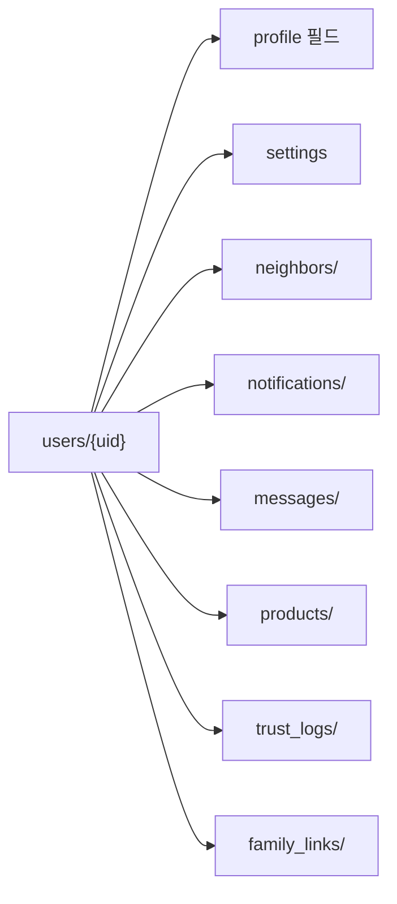

# 2_19. Repo_README 1

---

## ✅ Bling Repo 개요

이 저장소는 **Bling 슈퍼앱 프로젝트**의 모든 코드, 설계, 정책 문서를 관리하는  
 Keluharan(Kel.)  기반 Nextdoor + Gojek 하이브리드 로컬 슈퍼앱**의 메인 Repo입니다.

---

## ✅ 핵심 컨셉

- Kelurahan(Kec.)  기반 TrustLevel 시스템
    
- Local Feed, Marketplace, Find Friend, Club, Jobs 등 지역 모듈
    
- AI 검수, 다국어(Localization) 통합
    
- Gojek 스타일 런처 UX → 상단 슬라이드 탭 구성
      
- 모든 주소 표기는 인도네시아 공공 행정 표준 Singkatan(약어)을 사용합니다.
    
- Kecamatan → Kec.
    
- Kelurahan → Kel.
    
- Kabupaten → Kab.
    
- Provinsi → Prov.

---

## ✅ 폴더 구조 요약

```plaintext
lib
├── core
│   ├── constants/
│   ├── models/
├── features/
│   ├── feed/
│   ├── marketplace/
│   ├── find_friends/
│   ├── clubs/
│   ├── jobs/
│   ├── pom/
│   ├── auction/
│   ├── chat/
│   ├── auth/
│   ├── community/
│   ├── location/
│   ├── main_screen/
│   ├── my_bling/
│   ├── admin/
│   ├── categories/
│   ├── shared/
assets/
├── icons/
├── lang/
├── sounds/
```


---

## ✅ Firestore 핵심 컬렉션

|컬렉션|설명|
|---|---|
|`posts`|Local Feed|
|`products`|Marketplace|
|`shorts`|POM (쇼츠)|
|`auctions`|Auction 경매|
|`jobs`|구인구직|
|`shops`|Local Shops|
|`clubs`|Club 모임|
|`users`|사용자 정보|
|`chats`|공통 채팅|
|`notifications`|알림|

---

## ✅ 주요 정책 문서

- 📄 Bling_Project_Overview.md
    
- 📄 Bling_MainScreen_Structure.md
    
- 📄 Bling_Local_Feed_Policy.md
    
- 📄 Bling_Marketplace_Policy.md
    
- 📄 Bling_Find_Friend_Policy.md
    
- 📄 Bling_Club_Policy.md
    
- 📄 Bling_Jobs_Policy.md
    
- 📄 Bling_LocalShops_Policy.md
    
- 📄 Bling_Auction_Policy.md
    
- 📄 Bling_POM_Policy.md
    
- 📄 Bling_User_Field_Standard.md
    
- 📄 Bling_TrustLevel_Policy.md
    
- 📄 Bling_Localization_Policy.md
    
- 📄 Bling_Design_Guide.md
    
- 📄 Bling_UIUX_Guide.md
    
- 📄 Bling_Development_Step_Plan.md
    
- 📄 Bling_Development_Checklist.md
    
- 📄 Bling_Project_FolderTree.md
     
- 📄[[1_99. 📌 Bling 인도네시아 주소 표기 & DropDown 정책]].md
-


---

## ✅ DevOps & AI 협업 흐름

|도구|역할|
|---|---|
|**GitHub**|정책/코드 버전 관리|
|**Obsidian**|`.md` 정책 문서 관리|
|**GPT**|설계/정책 구조화|
|**Copilot**|Flutter/Dart 코드 자동화|
|**Gemini**|코드 Diff & 대안 검증|

---

## ✅ 연계 문서

- [[2_01. Bling_Project_Overview]]
    
- [[2_02. Project_FolderTree]]
    
- [[4_21. User_Field_Standard]]
    

---

## ✅ 결론

**Bling-Repo**는  Keluharan(Kel.)  기반 지역 커뮤니티 신뢰 구조와  
슈퍼앱 런처 UX, 다국어, AI 검수를 하나로 통합한  
**인도네시아형 로컬 슈퍼앱 프로젝트**의 표준 저장소입니다.

---

### ✅ 구성 핵심

- Repo 목적 + 폴더 구조 + Firestore 컬렉션 표준
    
- 핵심 `.md` 정책 연결 목록
    
- GPT + Copilot + Gemini 연계 DevOps 흐름까지 포함
    

---


# 2_99. Bling 공통 기능(로직) 카테고리 (필수) 1

---

## ✅ 📌 Bling 공통 기능(로직) 카테고리 (필수)

|구분| 설명                                                                 |
|---|---|
|**등록 (Create)**| 글/상품/경매/구인공고/클럽/쇼츠 등 새 데이터 Firestore에 저장                           |
|**수정 (Update)**| 작성한 글/상품/프로필/공고 내용 변경                                              |
|**조회 (Read)**| 목록/상세/필터링/반경 검색                                                    |
|**삭제 (Delete)**| 내가 쓴 글/상품/공고/댓글 삭제                                                 |
|**댓글 + 대댓글 (Comment + Reply)**| Feed/Shorts/Club 내 댓글/대댓글                                          |
|**채팅 (Chat)**| 1:1 메시지 (Feed, Marketplace, Find Friend 등)                         |
|**Wishlist (찜)**| 상품/게시물/상점 등 찜/북마크/좋아요                                              |
|**좋아요 (Like)**| 게시글/댓글/쇼츠 좋아요, 찜과 별도로 카운트                                          |
|**신고/차단 (Report/Block)**| 사용자/게시글/댓글 신고, 사용자 차단                                              |
|**알림 (Notification)**| 실시간 푸시 & In-App 알림                                                 |
|**검색/필터 (Search/Filter)**| 키워드, 위치, 카테고리, 해시태그 필터                                             |
|**TrustLevel/인증 흐름**|  Keluharan(Kel.)  인증/실명/활동 신뢰등급 자동 로직                              |
|**프로필/Privacy 제어**| 내 정보 공개범위, 지도 노출 여부                                                |
|**Opt-in/Opt-out**| 지도 공개/데이팅 프로필/히트맵 동의/철회                                            |
|**다국어 처리 (i18n)**| `.json` Key 관리, `easy_localization`                                |
|**AI 검수**| 이미지/텍스트/영상 AI 태깅 & 필터링                                             |
|**통계/카운트**| 조회수, 댓글수, 좋아요수, 신뢰점수 등 자동 카운팅                                      |
|**활동 히스토리**| `users/{uid}/` 하위 컬렉션 (`posts`, `comments`, `wishlist`, `chats` 등) |

---

## ✅ 📌 Planner님이 언급한 핵심 흐름 요약

✔️ CRUD (등록/수정/조회/삭제) ➜ **기본 뼈대**

✔️ 채팅, 댓글, 찜 ➜ **상호작용 핵심**

✔️ TrustLevel, 신고/차단, Privacy ➜ **안전/신뢰 핵심**

✔️ AI 검수 ➜ **질관리 핵심**

✔️ 알림 ➜ **사용자 연결성 핵심**

---

## ✅ 🔑 결론

Planner님 말씀처럼 실제 Bling은  
“**CRUD + 상호작용(댓글/찜/좋아요/채팅) + TrustLevel + 알림 + AI 검수**”  
이 5대 공통 흐름으로 모든 Feature가 재활용가능.

---

## ✅ 📌 Bling 공통 모듈화 예시

---

### 🗂️ 1️⃣ `core/` : _전역 공통 로직/데이터 규칙_

```plaintext
lib/
 ├── core/
 │    ├── constants/           # 앱 공통 상수, 컬러, 카테고리
 │    │    ├── app_colors.dart
 │    │    ├── app_categories.dart
 │    │    ├── trust_level.dart
 │    │    └── app_strings.dart (기본 고정 텍스트)
 │    ├── models/              # 전역 데이터 모델
 │    │    ├── user_model.dart
 │    │    ├── post_model.dart
 │    │    ├── product_model.dart
 │    │    ├── comment_model.dart
 │    │    ├── chat_model.dart
 │    │    ├── notification_model.dart
 │    │    └── trust_log_model.dart
 │    ├── utils/               # 공통 Helper & Validator
 │    │    ├── firestore_helpers.dart
 │    │    ├── geo_helpers.dart
 │    │    ├── trust_level_utils.dart
 │    │    ├── ai_check_utils.dart
 │    │    ├── validators.dart
 │    │    └── i18n_helper.dart
 │    ├── services/            # 외부 연계 서비스 로직
 │    │    ├── firebase_service.dart
 │    │    ├── notification_service.dart
 │    │    ├── chat_service.dart
 │    │    ├── report_service.dart
 │    │    ├── ai_moderation_service.dart
 │    │    └── analytics_service.dart
```

---

### 🗂️ 2️⃣ `shared/` : _반복 UI, Controller, 공통 위젯_

```plaintext
lib/
 ├── features/
 │    ├── shared/
 │    │    ├── controllers/                # 공용 상태 관리자
 │    │    │    ├── locale_controller.dart
 │    │    │    ├── auth_controller.dart
 │    │    │    ├── notification_controller.dart
 │    │    │    ├── chat_controller.dart
 │    │    │    ├── wishlist_controller.dart
 │    │    │    └── trustlevel_controller.dart
 │    │    ├── widgets/                    # 공통 위젯
 │    │    │    ├── custom_button.dart
 │    │    │    ├── custom_dialog.dart
 │    │    │    ├── confirm_modal.dart
 │    │    │    ├── icon_badge.dart
 │    │    │    ├── profile_avatar.dart
 │    │    │    └── loading_spinner.dart
 │    │    ├── guards/                     # 인증/권한 가드
 │    │    │    ├── trustlevel_guard.dart
 │    │    │    ├── message_permission_guard.dart
 │    │    │    ├── blocklist_guard.dart
 │    │    │    └── ai_verified_guard.dart
```

---

## ✅ 🔑 실무 포인트

✔️ **`core/`는 데이터 + 서비스 로직**

- Dart 모델, Firestore 쿼리 Helper, AI 검수 로직, TrustLevel 자동계산 전부 여기 포함.
    

✔️ **`shared/`는 공통 UI + 상태관리 + 조건 가드**

- 반복되는 버튼, 프로필 위젯, 권한 제한 모듈, Locale/Notification 전역 Controller.
    

---

## ✅ 🔍 예시 흐름

- ✔️ `features/local_news` → `PostModel`(core/models) → `firestore_helpers.dart`로 쿼리
    
- ✔️ `features/post` → `validators.dart` → 작성폼 유효성 체크
    
- ✔️ `features/chat` → `chat_service.dart` → Firestore 채팅방 생성
    
- ✔️ `features/marketplace` → `wishlist_controller.dart`로 찜 기능
    
- ✔️ TrustLevel 조건 → `trustlevel_guard.dart`로 메시지 권한 차단
    

---

## ✅ 📎 확장성

필요하다면 `services/` 아래에:

- WhatsApp 공유 모듈 (`share_service.dart`)
    
- 반경 검색 전용 모듈 (`geo_query_service.dart`)
    

같이 붙여서 **실무에서 모듈 쪼갤 수 있음**.

---

## ✅ 결론

이렇게 하면 Bling의 모든 Feature는:

- **CRUD + 댓글 + 찜 + 채팅 + 신고 + 알림 + TrustLevel + AI 검수**  
    ➡️ 전부 `core/`와 `shared/`에서 재사용 ➜ **코드 중복 0%**.
    

---

```json
{
    "lib": {
        "core": {
            "constants": [
                "app_colors.dart",
                "app_categories.dart",
                "trust_level.dart",
                "app_strings.dart"
            ],
            "models": [
                "user_model.dart",
                "post_model.dart",
                "product_model.dart",
                "comment_model.dart",
                "chat_model.dart",
                "notification_model.dart",
                "trust_log_model.dart"
            ],
            "utils": [
                "firestore_helpers.dart",
                "geo_helpers.dart",
                "trust_level_utils.dart",
                "ai_check_utils.dart",
                "validators.dart",
                "i18n_helper.dart"
            ],
            "services": [
                "firebase_service.dart",
                "notification_service.dart",
                "chat_service.dart",
                "report_service.dart",
                "ai_moderation_service.dart",
                "analytics_service.dart"
            ]
        },
        "features": {
            "shared": {
                "controllers": [
                    "locale_controller.dart",
                    "auth_controller.dart",
                    "notification_controller.dart",
                    "chat_controller.dart",
                    "wishlist_controller.dart",
                    "trustlevel_controller.dart"
                ],
                "widgets": [
                    "custom_button.dart",
                    "custom_dialog.dart",
                    "confirm_modal.dart",
                    "icon_badge.dart",
                    "profile_avatar.dart",
                    "loading_spinner.dart"
                ],
                "guards": [
                    "trustlevel_guard.dart",
                    "message_permission_guard.dart",
                    "blocklist_guard.dart",
                    "ai_verified_guard.dart"
                ]
            }
        }
    }
}
```


# 3_20.  user_Field_컬렉션_구조_제안 1
# 📂  user_Field_컬렉션_구조_제안

## ✅ 목적

Ayo 프로젝트는 Nextdoor 구조를 현지화하여  
  Keluharan(Kel.) 기반 지역성, 이웃, 알림, 메시지, 마켓, 지도 노출 등을 통합한다.  
이를 위해 **Firestore 상위 컬렉션과 하위 컬렉션을 구분**하여  
검색 효율, 보안, 관리성을 최적화한다.

---

## 🔑 최상위 필드 (users/{uid})

| 필드명 | 설명                                     |
|--------|------|
| uid | 고유 Firebase Auth UID                   |
| nickname | 닉네임                                    |
| trustLevel | regular / verified / trusted / flagged |
| createdAt | 가입 시각                                  |
| lastActive | 마지막 활동 시각                              |
| locationName | Keluharan(Kel.) + Kecamatan            |
| photoUrl | 프로필 사진                                 |
| bio | 한 줄 소개                                 |
| interests | 관심사                                    |
| isProfilePublic | 프로필 공개 여부                              |
| isMapVisible | 지도 공개 여부                               |

---

## 🗂️ 하위 컬렉션

| 컬렉션 | 목적 | 예시 |
|--------|------|------|
| neighbors/ | 즐겨찾기/차단 관리 | `users/{uid}/neighbors/{neighborId}` |
| notifications/ | 알림 관리 | `users/{uid}/notifications/{notifId}` |
| messages/ | 채팅방 관리 | `users/{uid}/messages/{roomId}` |
| products/ | 마켓 판매글 | `users/{uid}/products/{productId}` |
| trust_logs/ | 신뢰도 변경 로그 | `users/{uid}/trust_logs/{logId}` |
| family_links/ | 가족 관계 | `users/{uid}/family_links/{linkedUid}` |
| settings | 알림 on/off 등 | `users/{uid}/settings` |

---

## 🔄 상위-하위 흐름 구조



---

## 🔍 쿼리 흐름 예시

| 시나리오 | 쿼리 |
|----------|------|
| Feed 게시물 작성자 정보 | `users/{uid}` → nickname, photoUrl |
| 댓글 작성자 정보 | `users/{uid}` |
| 이웃 목록 | `users/{uid}/neighbors/` |
| 알림 조회 | `users/{uid}/notifications/` |
| 메시지 목록 | `users/{uid}/messages/` |
| 판매상품 조회 | `users/{uid}/products/` |
| 가족 연결 확인 | `users/{uid}/family_links/` |

---

## 🔐 설계 원칙

- 핵심키(`uid`, `trustLevel`, `nickname`)는 최상위 → 쿼리/참조 필수
- 자주 추가/삭제되는 데이터는 하위 컬렉션으로 → Firestore 비용 최적화
- Cloud Function 또는 Transaction으로 UID 기반 동기화 유지

---

## 📌 적용 예시

| 예시 | 구조 |
|------|------|
| 이웃 즐겨찾기 추가 | `users/{uid}/neighbors/{neighborId}` |
| 알림 읽음 처리 | `users/{uid}/notifications/{notifId}` → `read: true` |
| 메시지 방 생성 | `users/{uid}/messages/{roomId}` |
| RT 공지 발송 | `users/{uid}/notifications/` + `locationName` 필드 기반 대상 필터링 |

---

## 🔄 필드-기능 매핑 예시

| 기능            | 관련 필드                                 |
| ------------- | ------------------------------------- |
| 이웃 즐겨찾기/차단    | neighbors/ + blockedUsers             |
| 알림 수신/읽음      | notifications/ + notificationSettings |
| 메시지 사용 조건     | messages/ + trustLevel + blockedUsers |
| TrustLevel 인증 | trustLevel + trust_logs/              |
| 가족 공유         | family_links/ + isMapVisible          |
| 지도 노출 범위      | isMapVisible + locationName           |
| 마켓 판매글 관리     | products/                             |

---
## 📁 연관 문서

- [[Bling_TrustLevel_정책_설계안]]
- [[Nextdoor_Profile_탭_분석_Ayo적용안]]
- [[30. Bling_Notifications_탭_현지화_구성안]]
- [[neighbors_screen_탐색UI_설계안]]

---

## 🔐 관리 원칙

- 상위는 UID, nickname, trustLevel 등 자주 참조 필수 값만.
- neighbors, notifications, messages는 하위 컬렉션으로 개별 관리.
- RT Pengumuman, Ketua RT 인증 등 현지 특화 흐름은 locationName 필드와 연계.

---
## ✅ 결론

Bling_user_Field_컬렉션_구조는  
**"상위 필수 키값 + 기능별 하위 컬렉션 + Obsidian 문서 연결 인덱스"**로  
모든 기능 흐름과 신뢰/보안/확장성을 연동한다.


# 5_32. Privacy_Map_정책
# 🗺️ Privacy_Map_정책.md

---

## ✅ 목적

Bling는 Kelurahan(Kec.) 기반 슈퍼앱으로,
위치 정보(지도 기반 히트맵)와 사용자 개인정보 보호를 동시에 보장해야 합니다.

---

## ✅ 지도 기능

- Kelurahan(Kec.)  기반 사용자 밀집도 HeatMap
- 좌표 직접 노출 불가
- 지도 기반 범위: Kelurahan → Kecamatan → Kabupaten → Province
- Opt-in: 사용자 동의 후 노출

---

## ✅ 옵트인 & Privacy Center

- "지도에 내 이름/프로필 표시 허용" 옵션 제공
- 동의 철회 즉시 히트맵/검색에서 제외
- `users/{uid}` → `privacySettings` 필드
- 개인정보센터 메뉴:  Keluharan(Kel.) , Geo, TrustLevel 동의 상태 관리

---

## ✅ 법적 기준

- 인도네시아 PDP 법 준수
- KTP 직접 촬영/전체 저장 금지
- Kelurahan(Kec.)  인증은 공공 주소 인증만 허용

---

## ✅ 결론

블링 지도 기능은 **히트맵 + 옵트인 + Privacy Center**로
안전성과 지역성을 모두 유지합니다.


