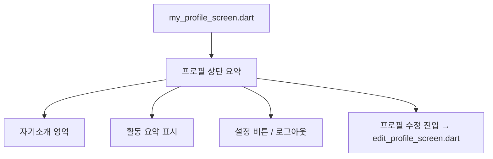

# 4_24. my_profile_screen_구조
# 👤 my_profile_screen_구조

## ✅ 목적

사용자가 자신의 정보를 관리하고,  
TrustLevel, 활동 정보, 공개 범위 등을 확인 및 수정할 수 있는  
Ayo 앱 내 개인 프로필 화면 구조를 설계한다.

---

## 🧩 주요 기능 및 구성

| 영역 | 설명 | 연결 기능 |
|------|------|-----------|
| 프로필 상단 요약 | 사진, 닉네임, 동네, TrustLevel 표시 | - |
| 자기소개 | 한 줄 소개 또는 관심사 요약 | bio 필드 |
| 활동 요약 | 게시글 수, 좋아요 수, 이웃 수 | postCount, likesCount |
| 공개 범위 제어 | 프로필 전체 공개 여부, 지도 노출 여부 등 | isProfilePublic, isMapVisible |
| 프로필 수정 버튼 | 수정 화면으로 진입 | edit_profile_screen.dart |
| TrustLevel 안내 | 신뢰등급 조건 및 다음 등급 가이드 | trust_level_info_modal.dart |
| 설정 접근 | 계정, 알림, 로그아웃 등 | settings_screen.dart |

---

## 🧭 UI 구성 흐름



---

## 🔍 데이터 구조 예시

```json
{
  "nickname": "Dika",
  "photoUrl": "https://firebaseapp.com/uid/profile.jpg",
  "locationName": "RW 05 - Jakarta",
  "bio": "Suka jalan-jalan dan kopi.",
  "trustLevel": "verified",
  "postCount": 12,
  "likesCount": 32,
  "isProfilePublic": true,
  "isMapVisible": false
}
```

---

## 🛠️ 컴포넌트 분리 제안

- `ProfileSummaryWidget`
- `ProfileActivitySummaryWidget`
- `ProfileTrustLevelBadge`
- `EditProfileCTA`
- `ProfilePrivacyToggle`

---

## 📎 연결 문서

- [[Bling_TrustLevel_정책_설계안]]
- [[18. Bling_지연된_프로필_활성화_정책]]
- [[my_profile_screen_설계안]]


```dart

// lib/features/my_bling/screens/my_bling_screen.dart

import 'package:cloud_firestore/cloud_firestore.dart';
import 'package:firebase_auth/firebase_auth.dart';
import 'package:flutter/material.dart';
import 'package:google_fonts/google_fonts.dart';
import 'package:easy_localization/easy_localization.dart';

import '../../../core/models/user_model.dart';
import '../widgets/user_post_list.dart';
import '../widgets/user_product_list.dart';
import '../widgets/user_bookmark_list.dart';

class MyBlingScreen extends StatefulWidget {
  const MyBlingScreen({super.key});

  @override
  State<MyBlingScreen> createState() => _MyBlingScreenState();
}

class _MyBlingScreenState extends State<MyBlingScreen>
    with SingleTickerProviderStateMixin {
  late final TabController _tabController;

  @override
  void initState() {
    super.initState();
    _tabController = TabController(length: 3, vsync: this);
  }

  @override
  void dispose() {
    _tabController.dispose();
    super.dispose();
  }

  @override
  Widget build(BuildContext context) {
    final myUid = FirebaseAuth.instance.currentUser?.uid;

    if (myUid == null) {
      return Scaffold(
          body: Center(child: Text('main.errors.loginRequired'.tr())));
    }

    return Scaffold(
      appBar: AppBar(
        title: Text('myBling.title'.tr()),
        actions: [
          IconButton(
            icon: const Icon(Icons.edit_outlined),
            onPressed: () {/* 프로필 수정 화면으로 이동 */},
            tooltip: 'myBling.editProfile'.tr(),
          ),
          IconButton(
            icon: const Icon(Icons.settings_outlined),
            onPressed: () {/* 설정 화면으로 이동 */},
            tooltip: 'myBling.settings'.tr(),
          ),
        ],
      ),
      body: StreamBuilder<DocumentSnapshot<Map<String, dynamic>>>(
        stream: FirebaseFirestore.instance
            .collection('users')
            .doc(myUid)
            .snapshots(),
        builder: (context, snapshot) {
          if (snapshot.connectionState == ConnectionState.waiting) {
            return const Center(child: CircularProgressIndicator());
          }
          if (!snapshot.hasData || !snapshot.data!.exists) {
            return Center(child: Text('main.errors.userNotFound'.tr()));
          }

          final user = UserModel.fromFirestore(snapshot.data!);

          return NestedScrollView(
            headerSliverBuilder: (context, innerBoxIsScrolled) {
              return [
                SliverToBoxAdapter(
                  child: _buildProfileHeader(context, user),
                ),
              ];
            },
            body: _buildProfileTabs(user),
          );
        },
      ),
    );
  }

  /// 프로필 상단 헤더 UI 위젯
  Widget _buildProfileHeader(BuildContext context, UserModel user) {
    return Padding(
      padding: const EdgeInsets.all(20.0),
      child: Column(
        children: [
          Row(
            children: [
              CircleAvatar(
                radius: 40,
                backgroundImage:
                    (user.photoUrl != null && user.photoUrl!.startsWith('http'))
                        ? NetworkImage(user.photoUrl!)
                        : null,
                child: (user.photoUrl == null ||
                        !user.photoUrl!.startsWith('http'))
                    ? const Icon(Icons.person, size: 40)
                    : null,
              ),
              const SizedBox(width: 20),
              Expanded(
                child: IntrinsicHeight(
                  child: Row(
                    mainAxisAlignment: MainAxisAlignment.spaceAround,
                    children: [
                      _buildStatColumn(
                          'myBling.stats.posts', '12'), // TODO: 실제 데이터 연동
                      _buildStatColumn('myBling.stats.followers', '128'),
                      const VerticalDivider(width: 20, thickness: 1),
                      _buildStatColumn('myBling.stats.neighbors', '34'),
                      _buildStatColumn('myBling.stats.friends', '5'),
                    ],
                  ),
                ),
              ),
            ],
          ),
          const SizedBox(height: 16),
          Align(
            alignment: Alignment.centerLeft,
            child: Column(
              crossAxisAlignment: CrossAxisAlignment.start,
              children: [
                Row(
                  children: [
                    Text(
                      user.nickname,
                      style: GoogleFonts.inter(
                          fontWeight: FontWeight.bold, fontSize: 18),
                    ),
                    const SizedBox(width: 6),
                    _buildTrustLevelBadge(user.trustLevel),
                  ],
                ),
                const SizedBox(height: 6),
                if (user.bio != null && user.bio!.isNotEmpty)
                  Text(
                    user.bio!,
                    style: GoogleFonts.inter(color: Colors.grey[700]),
                  ),
                const SizedBox(height: 6),
                if (user.locationName != null)
                  Row(
                    children: [
                      Icon(Icons.location_on_outlined,
                          size: 16, color: Colors.grey[600]),
                      const SizedBox(width: 4),
                      Text(
                        user.locationName!,
                        style: GoogleFonts.inter(color: Colors.grey[600]),
                      ),
                    ],
                  ),
              ],
            ),
          ),
        ],
      ),
    );
  }

  /// 프로필 하단 탭 UI 위젯
  Widget _buildProfileTabs(UserModel user) {
    // TODO: 추후 user.privacySettings 값에 따라 공개 여부 결정 로직 추가
    return Column(
      children: [
        TabBar(
          controller: _tabController,
          labelColor: const Color(0xFF00A66C),
          unselectedLabelColor: const Color(0xFF616161),
          indicatorColor: const Color(0xFF00A66C),
          tabs: [
            Tab(text: 'myBling.tabs.posts'.tr()),
            Tab(text: 'myBling.tabs.products'.tr()),
            Tab(text: 'myBling.tabs.bookmarks'.tr()),
          ],
        ),
        Expanded(
          child: TabBarView(
            controller: _tabController,
            children: const [
              // Center(child: Text('내가 쓴 게시물이 표시될 영역')),
              // ▼▼▼▼▼ '내 게시물' 탭에 새로운 위젯 적용 ▼▼▼▼▼
              UserPostList(),
              // Center(child: Text('내 판매상품이 표시될 영역')),
              // ▼▼▼▼▼ '내 판매상품' 탭에 새로운 위젯 적용 ▼▼▼▼▼
              UserProductList(),
              UserBookmarkList(),
            ],
          ),
        ),
      ],
    );
  }

  /// 프로필 통계 정보 표시 위젯
  Widget _buildStatColumn(String labelKey, String count) {
    return Column(
      mainAxisAlignment: MainAxisAlignment.center,
      children: [
        Text(count,
            style:
                GoogleFonts.inter(fontSize: 18, fontWeight: FontWeight.bold)),
        const SizedBox(height: 2),
        Text(labelKey.tr(),
            style: GoogleFonts.inter(color: Colors.grey, fontSize: 12)),
      ],
    );
  }

  /// TrustLevel 뱃지 위젯
  Widget _buildTrustLevelBadge(String trustLevel) {
    IconData icon;
    Color color;
    switch (trustLevel) {
      case 'verified':
        icon = Icons.verified;
        color = Colors.blue;
        break;
      case 'trusted':
        icon = Icons.shield;
        color = const Color(0xFF00A66C); // Primary Color
        break;
      default: // normal
        return const SizedBox.shrink(); // 일반 등급은 표시 안 함
    }
    return Icon(icon, color: color, size: 18);
  }
}

```
 


# 4_25. 📂Bling Firestore 통합 스키마 예시

---

## ✅ 📂 Bling Firestore 통합 스키마 (v0.3 ~ v1.0 기준)

| 필드명              | 타입        | 설명                                             |
| ---------------- | --------- | ---------------------------------------------- |
| uid              | String    | Firebase UID                                   |
| nickname         | String    | 닉네임                                            |
| trustLevel       | String    | normal, verified, trusted                      |
| locationName     | String    | Singkatan 포함 전체 주소 표시 (예: Kel., Kec., Kab.)    |
| locationParts    | Map       | 단계별 주소 구조 (Kabupaten → Kec. → Kel. → RT/RW 옵션) |
| geoPoint         | GeoPoint  | 좌표                                             |
| photoUrl         | String    | 프로필 이미지                                        |
| bio              | String    | 자기소개                                           |
| interests        | List      | 관심사                                            |
| privacySettings  | Map       | 개인정보 공개 설정                                     |
| thanksReceived   | int       | 감사 수                                           |
| reportCount      | int       | 신고 수                                           |
| isBanned         | Boolean   | 정지 여부                                          |
| blockedUsers     | List      | 차단 목록                                          |
| profileCompleted | Boolean   | 지연 활성화 여부                                      |
| createdAt        | Timestamp | 가입일                                            |
|                  |           |                                                |

---

### ✅ 하위 컬렉션

| 기타  컬렉션          | 내용         |
| ---------------- | ---------- |
| `posts/`         | 내가 쓴 게시물   |
| `comments/`      | 내가 쓴 댓글    |
| `wishlist/`      | 찜한 상품/게시물  |
| `auctions/`      | 경매 등록/참여   |
| `shorts/`        | 쇼츠 업로드     |
| `jobs/`          | 구인공고 등록    |
| `shops/`         | 소유 상점      |
| `clubs/`         | 참여한 클럽     |
| `neighbors/`     | 즐겨찾기/차단 이웃 |
| `notifications/` | 알림         |
| `messages/`      | 1:1 채팅     |


---

## ✅ 📄 posts

|필드|설명|
|---|---|
|`postId: String`||
|`userId: String`|작성자 UID|
|`title: String`||
|`body: String`||
|`category: String`|고정 카테고리|
|`tags: List<String>`|자유 태그|
|`mediaUrl: String?`|이미지/영상|
|`mediaType: String?`|`image` or `video`|
|`rt, rw, kelurahan, kecamatan, kabupaten, province`|위치 계층|
|`location: GeoPoint`||
|`geohash: String`||
|`likesCount: int`||
|`commentsCount: int`||
|`createdAt: Timestamp`||

---

## ✅ 📄 comments (posts/{postId}/comments)

|필드|설명|
|---|---|
|`commentId: String`||
|`userId: String`|작성자 UID|
|`body: String`||
|`likesCount: int`||
|`isSecret: bool`||
|`parentCommentId: String?`|대댓글 경우|
|`createdAt: Timestamp`||

---

## ✅ 📄 products (Marketplace)

|필드|설명|
|---|---|
|`productId: String`||
|`userId: String`|판매자 UID|
|`title, description, price`||
|`images: List<String>`||
|`categoryId: String`||
|`negotiable: bool`|가격 흥정 가능|
|`address: String`||
|`geo: Map`|GeoPoint|
|`transactionPlace: String?`|거래장소|
|`status: String`|`selling`, `sold`|
|`isAiVerified: bool`|AI 검수 여부|
|`likesCount, chatsCount, viewsCount`||
|`createdAt, updatedAt: Timestamp`||

---

## ✅ 📄 auctions

|필드| 설명      |
|---|---|
|`auctionId: String`|         |
|`title, description`|         |
|`images: List<String>`|         |
|`startPrice: int`|         |
|`currentBid: int`|         |
|`bidHistory: List<Map>`|         |
|`ownerId: String`| 판매자 UID |
|`location, geoPoint`|         |
|`trustLevelVerified: bool`|         |
|`isAiVerified: bool`|         |
|`startAt, endAt: Timestamp`|         |

---

## ✅ 📄 shorts (POM)

|필드|설명|
|---|---|
|`shortId: String`||
|`userId: String`||
|`title, description`||
|`videoUrl, thumbnailUrl`||
|`tags: List<String>`||
|`location, geoPoint`||
|`likesCount, viewsCount`||
|`trustLevelVerified, isAiVerified: bool`||
|`createdAt: Timestamp`||

---

## ✅ 📄 jobs

|필드| 설명                |
| ----------------------------- | ----------------- |
|`jobId: String`|                   |
|`title, description`|                   |
|`category: String`| 업종                |
|`location, geoPoint`|   Keluharan(Kel.) |
|`userId: String`| 작성자 UID           |
|`trustLevelRequired: String`|                   |
|`viewsCount, likesCount: int`|                   |
|`isPaidListing: bool`|                   |
|`createdAt: Timestamp`|                   |

---

## ✅ 📄 shops

|필드| 설명                |
| ----------------------------- | ----------------- |
|`shopId: String`|                   |
|`name, description`|                   |
|`ownerId: String`|                   |
|`location, geoPoint`|   Keluharan(Kel.) |
|`products: List<Map>`| 간단 제품 리스트         |
|`contactNumber: String`|                   |
|`openHours: String`|                   |
|`trustLevelVerified: bool`|                   |
|`viewsCount, likesCount: int`|                   |
|`createdAt: Timestamp`|                   |

---

## ✅ 📄 clubs

|필드|설명|
|---|---|
|`clubId: String`||
|`title, description`||
|`ownerId: String`||
|`location, geoPoint`||
|`interests: List<String>`||
|`membersCount: int`||
|`isPrivate: bool`||
|`trustLevelRequired: String`||
|`createdAt: Timestamp`||

---

## ✅ 📄 notifications

|필드|설명|
|---|---|
|`notifId: String`||
|`type: String`|댓글, 좋아요, RT 공지 등|
|`fromUserId: String`||
|`message: String`||
|`relatedId: String`|관련 Post ID 등|
|`timestamp: Timestamp`||
|`read: bool`||
|`priority: String`|`high` 등|

---

## ✅ 📄 reports

|필드|설명|
|---|---|
|`reportId: String`||
|`reporterId: String`||
|`targetId: String`||
|`targetType: String`|post, comment, user|
|`reason: String`||
|`createdAt: Timestamp`||

---

## ✅ 📄 chats

|필드|설명|
|---|---|
|`chatId: String`||
|`participants: List<String>`||
|`messages: SubCollection`||
|`lastMessage: String`||
|`unreadCounts: Map`|UID별 안읽은 수|

---

## ✅ 권장 연계 흐름

- 모든 컬렉션 → `users/{uid}`로 참여/작성 기록 연계.
    
-   Keluharan(Kel.), TrustLevel → 인증 조건 필드 유지.
    
- AI 검수 → `isAiVerified`.
    
- 다국어 → `.json` 키명 기준 필드.
    
- 신고/차단 → `reports` + `blockedUsers`.
    

---


# 4_30. MyBlign 화면 구성도
`MyBlingScreen` UI 화면 구성도 (ASCII Art)

+-----------------------------------------------------+
| [AppBar]                                                                 |
|   나의 Bling                 [수정 아이콘] [설정 아이콘]    [설정 아이콘]  |
+-----------------------------------------------------+
| [Profile Header]                                                     |
|                                                                               |
|    /-------\                                                              |
|   |            |      게시물       팔로워       팔로잉            |
|   | (사진)  |       12           128          89                     |
|   |            |      이웃          00명                                |
|    \-------/      친구          00명                                | 
|                                                                              |
|   Nickname 🛡️ (TrustLevel Badge)                        |
|   자기소개(Bio)가 여기에 표시됩니다.                      |
|   📍 지역 이름 (LocationName)                               |
|                                                                               |
+-----------------------------------------------------+
| [TabBar]                                                                  |
|                                                                               |
|  [게시물]  |  [판매상품]  |  [관심목록]                       |
|___________|______________|__________________________|
|                                                                              |
|                                                                              |
|                                                                              |
|        (선택된 탭의 내용이 여기에 표시됩니다)          |
|            (예: 내가 쓴 게시물 목록)                             |
|                                                                              |
|                                                                              |
|                                                                               |
+-----------------------------------------------------+

이곳 첫 화면이 이웃에게 또는 로그인한 신용등급 일반인까지는 공개되는 프로필과  이하 게시물 관련탭은 이웃/친구 또는 등급 공개여부 설정가능했으면 함. 
팔로워/팔로잉은 게시물 관련이며
이웃수은 로컬 근접 지역 서로 이웃관계 설정이며
친구수는 친구찾기(or 로컬데이팅) 관련 설정임.   
추후 관련 DB 설계 염두바람.


// lib/core/models/user_model.dart
// Bling App v0.4
// 새로운 구조의 작동 방식
// 초기 상태: 모든 사용자는 matchProfile 필드 없이 가입합니다.
// 기능 활성화: 사용자가 'Find Friend' 탭에서 데이팅 기능을 사용하기로 **동의(Opt-in)**하면, 앱은 성별, 연령대 등을 입력받아 matchProfile 맵을 생성하고, privacySettings에 { 'isDatingProfileActive': true } 와 같은 플래그를 저장합니다.
// 공개/비공개 제어: privacySettings의 플래그 값에 따라 데이팅 프로필의 노출 여부를 완벽하게 제어할 수 있습니다.

import 'package:cloud_firestore/cloud_firestore.dart';

class UserModel {
  final String uid;
  final String nickname;
  final String email;
  final String? photoUrl;
  final String? bio;
  final String trustLevel;
  final String? locationName;
  final Map<String, dynamic>? locationParts;
  final GeoPoint? geoPoint;
  final List<String>? interests;
  final Map<String, dynamic>? privacySettings;
  final List<String>? postIds;
  final List<String>? productIds;
  final List<String>? bookmarkedPostIds;
  // ▼▼▼▼▼ 찜한 상품 ID 목록을 저장할 필드 추가 ▼▼▼▼▼
  final List<String>? bookmarkedProductIds;
  final int thanksReceived;
  final int reportCount;
  final bool isBanned;
  final List<String>? blockedUsers;
  final bool profileCompleted;
  final Timestamp createdAt;
  final Map<String, dynamic>? matchProfile;

  UserModel({
    required this.uid,
    required this.nickname,
    required this.email,
    this.photoUrl,
    this.bio,
    this.trustLevel = 'normal',
    this.locationName,
    this.locationParts,
    this.geoPoint,
    this.interests,
    this.privacySettings,
    this.postIds,
    this.productIds,
    this.bookmarkedPostIds,
    this.bookmarkedProductIds, // 생성자에 추가
    this.thanksReceived = 0,
    this.reportCount = 0,
    this.isBanned = false,
    this.blockedUsers,
    this.profileCompleted = false,
    required this.createdAt,
    this.matchProfile,
  });

  factory UserModel.fromFirestore(DocumentSnapshot<Map<String, dynamic>> doc) {
    final data = doc.data()!;
    return UserModel(
      uid: data['uid'] ?? '',
      nickname: data['nickname'] ?? '',
      email: data['email'] ?? '',
      photoUrl: data['photoUrl'],
      bio: data['bio'],
      trustLevel: data['trustLevel'] ?? 'normal',
      locationName: data['locationName'],
      locationParts: data['locationParts'] != null
          ? Map<String, dynamic>.from(data['locationParts'])
          : null,
      geoPoint: data['geoPoint'],
      interests: data['interests'] != null
          ? List<String>.from(data['interests'])
          : null,
      privacySettings: data['privacySettings'] != null
          ? Map<String, dynamic>.from(data['privacySettings'])
          : null,
      postIds:
          data['postIds'] != null ? List<String>.from(data['postIds']) : null,
      productIds: data['productIds'] != null
          ? List<String>.from(data['productIds'])
          : null,
      bookmarkedPostIds: data['bookmarkedPostIds'] != null
          ? List<String>.from(data['bookmarkedPostIds'])
          : null,
      bookmarkedProductIds: data['bookmarkedProductIds'] != null
          ? List<String>.from(data['bookmarkedProductIds'])
          : null, // 데이터 변환 로직 추가
      thanksReceived: data['thanksReceived'] ?? 0,
      reportCount: data['reportCount'] ?? 0,
      isBanned: data['isBanned'] ?? false,
      blockedUsers: data['blockedUsers'] != null
          ? List<String>.from(data['blockedUsers'])
          : null,
      profileCompleted: data['profileCompleted'] ?? false,
      createdAt: data['createdAt'] ?? Timestamp.now(),
      matchProfile: data['matchProfile'] != null
          ? Map<String, dynamic>.from(data['matchProfile'])
          : null,
    );
  }

  Map<String, dynamic> toJson() {
    return {
      'uid': uid,
      'nickname': nickname,
      'email': email,
      'photoUrl': photoUrl,
      'bio': bio,
      'trustLevel': trustLevel,
      'locationName': locationName,
      'locationParts': locationParts,
      'geoPoint': geoPoint,
      'interests': interests,
      'privacySettings': privacySettings,
      'postIds': postIds,
      'productIds': productIds,
      'bookmarkedPostIds': bookmarkedPostIds,
      'bookmarkedProductIds': bookmarkedProductIds, // 직렬화에 추가
      'thanksReceived': thanksReceived,
      'reportCount': reportCount,
      'isBanned': isBanned,
      'blockedUsers': blockedUsers,
      'profileCompleted': profileCompleted,
      'createdAt': createdAt,
      'matchProfile': matchProfile,
    };
  }
}
